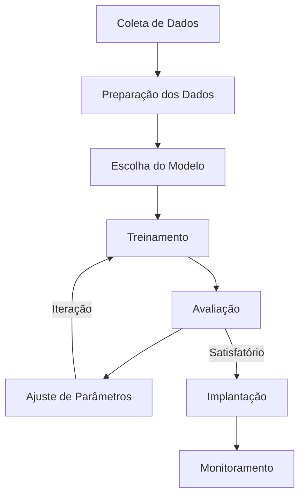
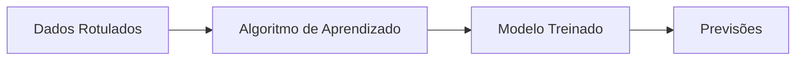
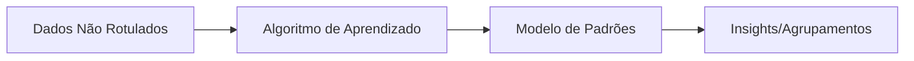
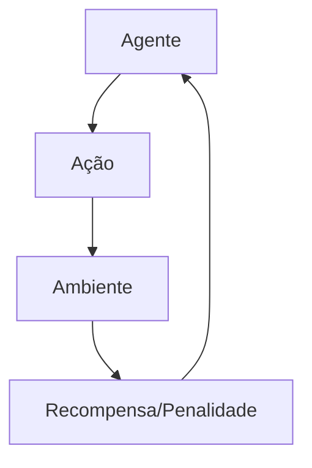

# 🤖 Machine Learning

Machine Learning (ML) é um subconjunto da Inteligência Artificial que fornece aos sistemas a capacidade de aprender e melhorar automaticamente a partir da experiência, sem serem explicitamente programados para cada tarefa.

## 📑 Definição

Machine Learning utiliza algoritmos para analisar dados, aprender com eles e fazer previsões ou decisões baseadas nesse aprendizado. O foco está em desenvolver algoritmos que possam receber dados de entrada e usar análise estatística para prever um valor de saída aceitável dentro de um intervalo específico.

## 🔄 Como Funciona

1. **Coleta de Dados**: Agregar dados relevantes para o problema
2. **Preparação dos Dados**: Limpeza, normalização e divisão em conjuntos de treinamento e teste
3. **Escolha do Modelo**: Selecionar o algoritmo apropriado para o problema
4. **Treinamento**: Alimentar o modelo com dados de treinamento para aprender padrões
5. **Avaliação**: Testar o modelo com dados não vistos
6. **Ajuste de Parâmetros**: Refinar o modelo para melhorar o desempenho
7. **Implantação**: Colocar o modelo em produção
8. **Monitoramento**: Acompanhar o desempenho e atualizar quando necessário

## 🔍 Tipos Principais

### Aprendizado Supervisionado

O modelo aprende a partir de dados rotulados, estabelecendo uma relação entre entradas e saídas conhecidas.

### Aprendizado Não-Supervisionado

O modelo identifica padrões em dados não rotulados, descobrindo estruturas ocultas.

### Aprendizado por Reforço

O modelo aprende por tentativa e erro, recebendo recompensas ou penalidades pelas ações tomadas.

## 📊 Algoritmos Comuns

- **Regressão Linear**: Para problemas de previsão de valores contínuos
- **Regressão Logística**: Para classificação binária
- **Árvores de Decisão**: Para classificação e regressão
- **Random Forest**: Ensemble de árvores de decisão
- **Support Vector Machines (SVM)**: Para classificação e regressão
- **K-Means**: Para agrupamento não supervisionado
- **Redes Neurais**: Para problemas complexos de padrões

## 🔗 Casos de Uso

- [Previsão de Churn de Clientes](./use-case-churn-prediction.md)
- [Detecção de Fraudes em Transações](./use-case-fraud-detection.md)

## 📚 Métricas de Avaliação

- **Acurácia**: Proporção de previsões corretas
- **Precisão**: Proporção de previsões positivas corretas
- **Recall**: Proporção de positivos reais identificados corretamente
- **F1-Score**: Média harmônica entre precisão e recall
- **ROC/AUC**: Capacidade de discriminação do modelo
- **MSE/RMSE**: Erro médio para problemas de regressão