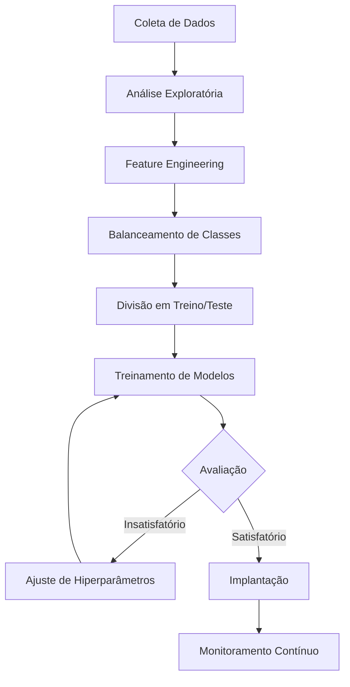

# 📉 Caso de Uso: Previsão de Churn de Clientes

## 🎯 Objetivo

Desenvolver um modelo de machine learning que identifique clientes com alta probabilidade de cancelamento (churn), permitindo que a empresa tome medidas proativas para retê-los.

## 🔍 Problema de Negócio

O churn (cancelamento) de clientes representa um desafio significativo para muitas empresas, especialmente aquelas com modelos de assinatura. Cada cliente perdido impacta diretamente a receita. Antecipar quais clientes estão em risco de cancelamento permite que equipes de retenção intervenham com ofertas personalizadas ou melhorias no serviço.

## 📊 Dados Necessários

- Histórico de uso do serviço
- Informações demográficas dos clientes
- Histórico de pagamentos
- Interações com suporte ao cliente
- Feedback e avaliações do serviço
- Histórico de cancelamentos anteriores

## 🛠️ Abordagem de Machine Learning



### 1. Preparação dos Dados
- Lidar com valores ausentes
- Transformar variáveis categóricas
- Normalizar/padronizar dados numéricos
- Identificar e tratar outliers

### 2. Feature Engineering
- Criar atributos de recência, frequência e valor (RFM)
- Calcular métricas de engajamento
- Desenvolver indicadores de satisfação
- Extrair padrões temporais de uso

### 3. Escolha dos Algoritmos
- **Random Forest**: Bom para lidar com diferentes tipos de atributos
- **Gradient Boosting**: Alta performance em problemas de classificação
- **Regressão Logística**: Para interpretabilidade
- **Redes Neurais**: Para relações complexas entre atributos

## 📏 Métricas de Avaliação

- **Recall**: Fundamental para capturar a maior porcentagem possível de clientes que vão cancelar
- **AUC-ROC**: Avalia a capacidade do modelo de distinguir entre clientes que vão cancelar ou não
- **Precisão**: Importante para evitar falsos alarmes que levem a ações desnecessárias
- **F1-Score**: Equilíbrio entre precisão e recall

## 💻 Exemplo de Implementação

```python
import pandas as pd
import numpy as np
from sklearn.model_selection import train_test_split
from sklearn.ensemble import RandomForestClassifier
from sklearn.metrics import classification_report, roc_auc_score
from sklearn.preprocessing import StandardScaler

# Carregamento de dados
df = pd.read_csv('customer_data.csv')

# Processamento de dados
# Lidar com valores ausentes
df.fillna(df.mean(), inplace=True)

# Feature engineering
df['inactive_days'] = (pd.Timestamp.now() - pd.to_datetime(df['last_activity'])).dt.days
df['payment_issues'] = df['payment_failures'] > 0
df['support_contacts_30d'] = df['support_contacts'].rolling(window=30).sum()

# Preparar features e target
X = df.drop(['customer_id', 'churn'], axis=1)
y = df['churn']

# Dividir dados
X_train, X_test, y_train, y_test = train_test_split(X, y, test_size=0.2, random_state=42)

# Normalizar dados
scaler = StandardScaler()
X_train_scaled = scaler.fit_transform(X_train)
X_test_scaled = scaler.transform(X_test)

# Treinar modelo
model = RandomForestClassifier(n_estimators=100, random_state=42)
model.fit(X_train_scaled, y_train)

# Avaliar modelo
y_pred = model.predict(X_test_scaled)
y_prob = model.predict_proba(X_test_scaled)[:, 1]

print(classification_report(y_test, y_pred))
print(f"AUC-ROC: {roc_auc_score(y_test, y_prob)}")

# Identificar atributos mais importantes
feature_importance = pd.DataFrame({
    'feature': X.columns,
    'importance': model.feature_importances_
}).sort_values('importance', ascending=False)

print(feature_importance.head(10))
```

## 🔄 Implementação em Produção

1. **API de Pontuação**: Integrar o modelo para pontuar todos os clientes diariamente
2. **Dashboard de Risco**: Visualização para equipes de suporte e vendas
3. **Automação de Retenção**: Gatilhos automatizados para ofertas personalizadas

## 📈 Resultados Esperados

- Redução de 20-30% na taxa de churn
- Aumento do LTV (Lifetime Value) dos clientes
- Melhor ROI em campanhas de retenção
- Insights para melhorias no produto

## 🔍 Desafios Comuns

- Garantir equilíbrio entre precisão e recall
- Lidar com dados desbalanceados (geralmente poucos casos de churn)
- Adaptar o modelo a mudanças no comportamento do cliente
- Incorporar feedback das ações de retenção