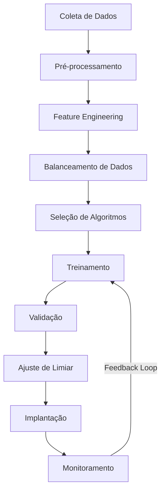
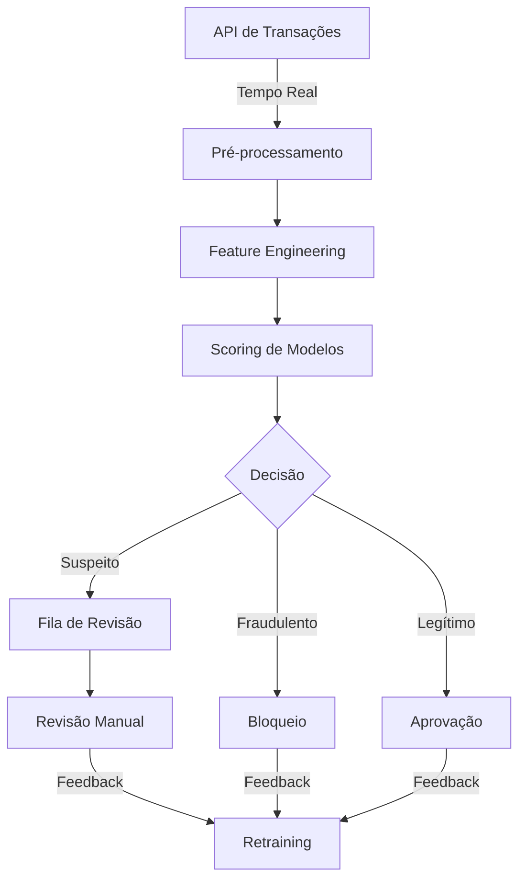

# 🔍 Caso de Uso: Detecção de Fraudes em Transações

## 🎯 Objetivo

Desenvolver um sistema de machine learning que identifique transações fraudulentas em tempo real, maximizando a detecção de fraudes enquanto minimiza falsos positivos que poderiam afetar negativamente a experiência de usuários legítimos.

## 🔍 Problema de Negócio

Fraudes financeiras representam perdas significativas para instituições financeiras e causam transtornos para clientes. Métodos tradicionais baseados em regras não conseguem acompanhar as técnicas cada vez mais sofisticadas utilizadas por fraudadores. Um sistema de detecção baseado em machine learning pode identificar padrões sutis e adaptar-se às novas estratégias de fraude.

## 📊 Dados Necessários

- Histórico de transações (valor, data/hora, localização, tipo)
- Informações do dispositivo (IP, navegador, sistema operacional)
- Comportamento do usuário (padrões de navegação, velocidade de digitação)
- Histórico de autenticação
- Dados demográficos dos clientes
- Transações marcadas como fraudulentas ou legítimas (para treinamento)

## 🛠️ Abordagem de Machine Learning



### 1. Desafios Específicos
- **Dados Desbalanceados**: Transações fraudulentas são raras (geralmente <1% do total)
- **Custo Assimétrico de Erros**: Falsos negativos (fraudes não detectadas) custam mais que falsos positivos
- **Necessidade de Tempo Real**: Decisões precisam ser tomadas em milissegundos
- **Adaptação Constante**: Fraudadores mudam táticas frequentemente

### 2. Feature Engineering
- Criar atributos de velocidade (tempo entre transações)
- Calcular distância geográfica entre transações
- Desenvolver perfis de comportamento normal para cada cliente
- Extrair padrões de sazonalidade e comportamento temporal

### 3. Escolha dos Algoritmos
- **Isolation Forest**: Eficiente para detecção de anomalias
- **XGBoost**: Alto desempenho e capacidade de lidar com dados desbalanceados
- **Redes Neurais**: Para capturar relações complexas nos dados
- **Ensemble de Modelos**: Combinação de algoritmos para maior robustez

## 📏 Métricas de Avaliação

- **Recall (Sensibilidade)**: Capacidade de detectar fraudes reais
- **Precisão**: Minimizar falsos alarmes
- **AUC-ROC**: Desempenho geral do classificador
- **AUPRC (Area Under Precision-Recall Curve)**: Mais adequado para dados desbalanceados
- **Tempo médio de processamento**: Garantir decisões em tempo real

## 💻 Exemplo de Implementação

```python
import pandas as pd
import numpy as np
from sklearn.model_selection import train_test_split
from sklearn.ensemble import RandomForestClassifier, IsolationForest
from sklearn.metrics import classification_report, confusion_matrix, roc_auc_score, precision_recall_curve
from imblearn.over_sampling import SMOTE
import xgboost as xgb
import time

# Carregar dados
transactions = pd.read_csv('transactions.csv')

# Feature engineering
transactions['hour_of_day'] = pd.to_datetime(transactions['timestamp']).dt.hour
transactions['day_of_week'] = pd.to_datetime(transactions['timestamp']).dt.dayofweek

# Calcular características baseadas em comportamento do usuário
user_profiles = transactions.groupby('user_id').agg({
    'amount': ['mean', 'std', 'max'],
    'merchant_category': 'nunique',
    'transaction_id': 'count'
}).reset_index()

user_profiles.columns = ['user_id', 'avg_amount', 'std_amount', 'max_amount', 'unique_merchants', 'transaction_count']
transactions = transactions.merge(user_profiles, on='user_id', how='left')

# Criar feature de desvio do padrão
transactions['amount_deviation'] = abs(transactions['amount'] - transactions['avg_amount']) / transactions['std_amount']

# Separar features e target
X = transactions.drop(['transaction_id', 'user_id', 'timestamp', 'is_fraud'], axis=1)
y = transactions['is_fraud']

# Dividir em treino e teste
X_train, X_test, y_train, y_test = train_test_split(X, y, test_size=0.2, random_state=42, stratify=y)

# Lidar com dados desbalanceados usando SMOTE
smote = SMOTE(random_state=42)
X_train_balanced, y_train_balanced = smote.fit_resample(X_train, y_train)

# Treinar modelo XGBoost
start_time = time.time()
model = xgb.XGBClassifier(
    scale_pos_weight=len(y_train_balanced) / sum(y_train_balanced),
    learning_rate=0.1,
    n_estimators=100,
    max_depth=5,
    random_state=42
)
model.fit(X_train_balanced, y_train_balanced)
training_time = time.time() - start_time

# Avaliar modelo
start_time = time.time()
y_pred = model.predict(X_test)
y_prob = model.predict_proba(X_test)[:, 1]
inference_time = (time.time() - start_time) / len(X_test)

print(f"Tempo médio de inferência: {inference_time*1000:.2f} ms")
print("\nMatrix de confusão:")
print(confusion_matrix(y_test, y_pred))

print("\nRelatório de classificação:")
print(classification_report(y_test, y_pred))

print(f"AUC-ROC: {roc_auc_score(y_test, y_prob):.4f}")

# Análise de importância de features
feature_importance = pd.DataFrame({
    'feature': X.columns,
    'importance': model.feature_importances_
}).sort_values('importance', ascending=False)

print("\nTop 10 features mais importantes:")
print(feature_importance.head(10))
```

## 🔄 Arquitetura de Sistema



## 📈 Resultados Esperados

- Redução de 60-80% nas perdas por fraude
- Tempo de detecção menor que 100ms
- Taxa de falsos positivos abaixo de 1%
- Sistema adaptativo que melhora com o tempo

## 🔍 Considerações Adicionais

- **Interpretabilidade**: Capacidade de explicar por que uma transação foi marcada como suspeita
- **Compliance**: Garantir que o sistema atenda aos requisitos regulatórios
- **Privacidade**: Tratamento adequado de dados sensíveis
- **Monitoramento de Deriva**: Detectar quando o modelo começa a perder eficácia
- **Atualização Contínua**: Pipeline para retreinamento periódico com novos dados
- **Estratégia em Camadas**: Combinação de regras simples para casos óbvios e ML para casos complexos

## 🌐 Aplicações em Diferentes Setores

### Setor Bancário
- Detecção de fraudes em cartões de crédito/débito
- Prevenção de fraudes em transferências eletrônicas
- Identificação de contas falsas

### E-commerce
- Proteção contra fraudes de pagamento
- Detecção de atividades suspeitas de contas
- Identificação de padrões anômalos de compra

### Seguros
- Detecção de reclamações fraudulentas
- Identificação de padrões suspeitos em sinistros
- Análise de redes de fraude organizada