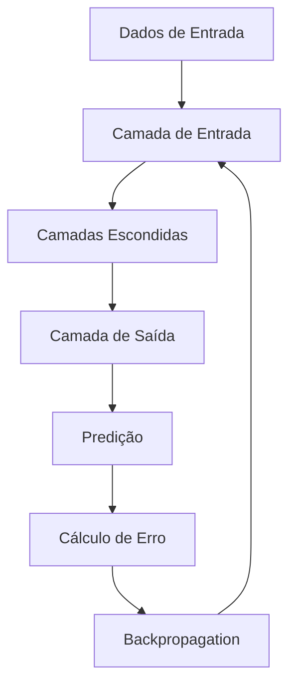
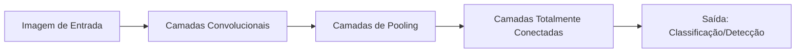
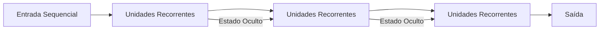
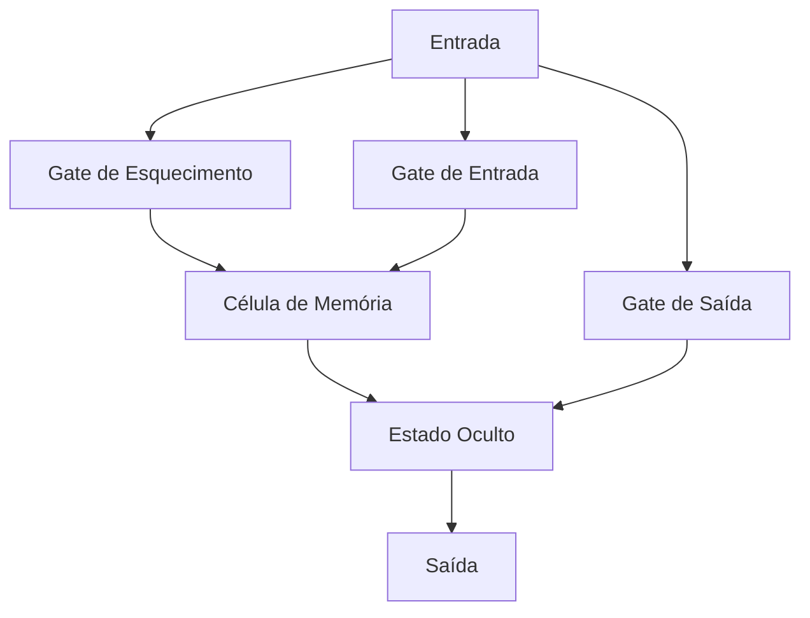
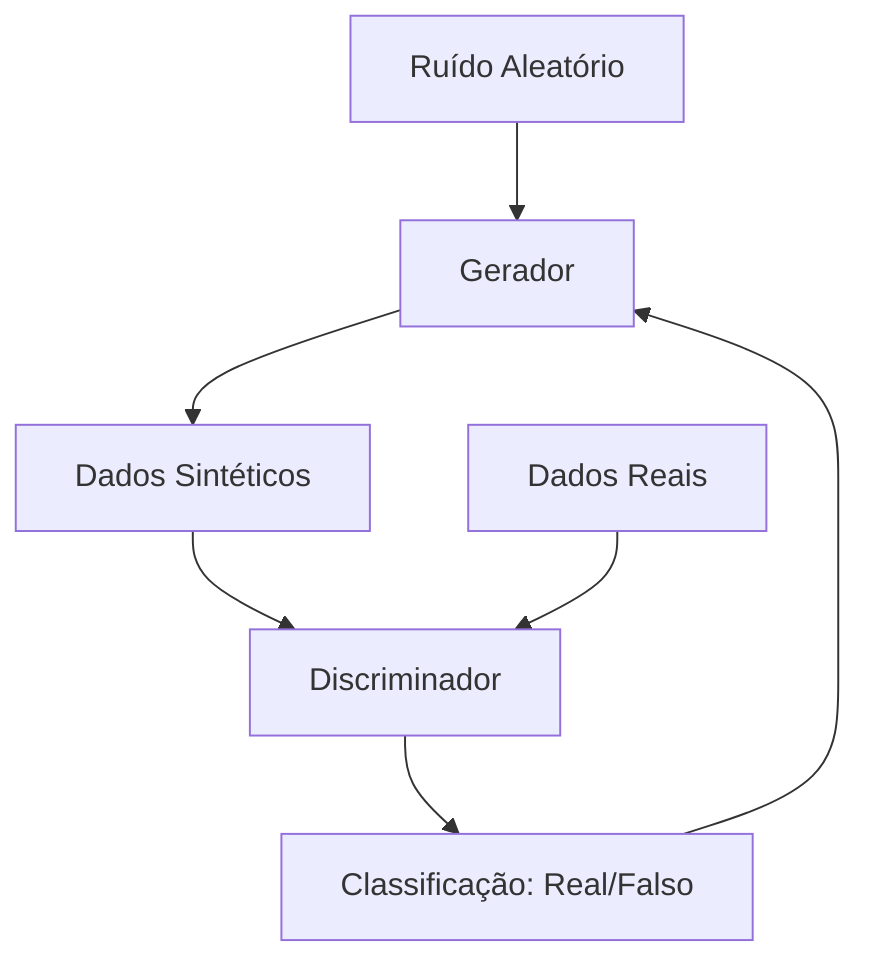
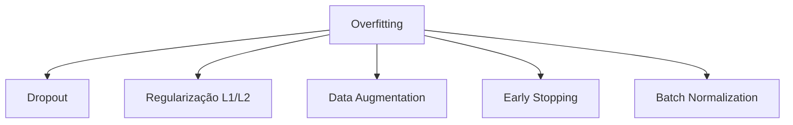
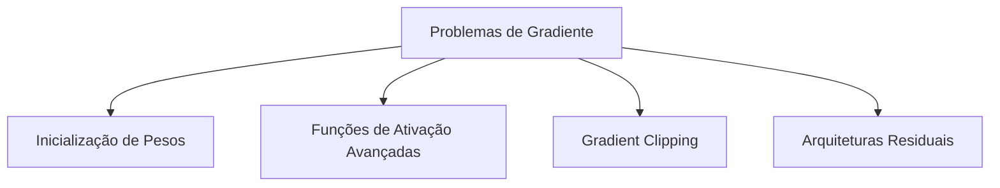

# 🔄 Deep Learning

Deep Learning é um subconjunto do Machine Learning que utiliza redes neurais artificiais com múltiplas camadas (daí o termo "deep" ou profundo) para modelar abstrações de alto nível em dados.

## 📑 Definição

O Deep Learning utiliza redes neurais de múltiplas camadas para aprender representações hierárquicas de dados. Diferente do Machine Learning tradicional, que muitas vezes requer feature engineering manual, o Deep Learning pode automaticamente descobrir as representações necessárias para detecção ou classificação a partir de dados brutos.

## 🔄 Como Funciona

1. **Alimentação Forward**: Os dados passam pela rede da entrada para a saída
2. **Cálculo de Erro**: A diferença entre a saída prevista e a real é calculada
3. **Backpropagation**: O erro é propagado de volta através da rede
4. **Ajuste de Pesos**: Os pesos das conexões são atualizados para minimizar o erro
5. **Iteração**: Este processo é repetido até que o modelo atinja um desempenho aceitável

## 🏗️ Arquiteturas Comuns

### Redes Neurais Convolucionais (CNN)

Ideal para processamento de imagens e dados dispostos em grade.

### Redes Neurais Recorrentes (RNN)

Especializada em dados sequenciais como texto ou séries temporais.

### Long Short-Term Memory (LSTM)

Uma forma especial de RNN que resolve o problema de dependências de longo prazo.

### Redes Generativas Adversárias (GAN)

Consiste em duas redes que competem entre si, uma gerando conteúdo e outra discriminando entre real e gerado.

## 🛠️ Desafios e Técnicas

### Overfitting

### Vanishing/Exploding Gradients

## 📊 Frameworks Populares

- **TensorFlow**: Desenvolvido pelo Google, oferece flexibilidade e suporte a produção
- **PyTorch**: Criado pelo Facebook, conhecido pela interface pythônica e facilidade de depuração
- **Keras**: API de alto nível que roda sobre TensorFlow, simples e amigável para iniciantes
- **JAX**: Nova biblioteca do Google focada em diferenciação automática e computação acelerada

## 🔗 Casos de Uso

- [Reconhecimento de Imagens Médicas](./use-case-medical-imaging.md)
- [Tradução Automática Neural](./use-case-neural-translation.md)

## 🚀 Tendências Recentes

- **Arquiteturas Transformer**: Revolucionaram o NLP e estão se expandindo para visão e áudio
- **Aprendizado Auto-Supervisionado**: Reduz dependência de dados rotulados
- **Modelos Multimodais**: Integrando diferentes tipos de dados (texto, imagem, áudio)
- **Neural Architecture Search (NAS)**: Automatização do design de arquiteturas
- **Modelos de Fundação**: Modelos grandes pré-treinados que podem ser ajustados para tarefas específicas