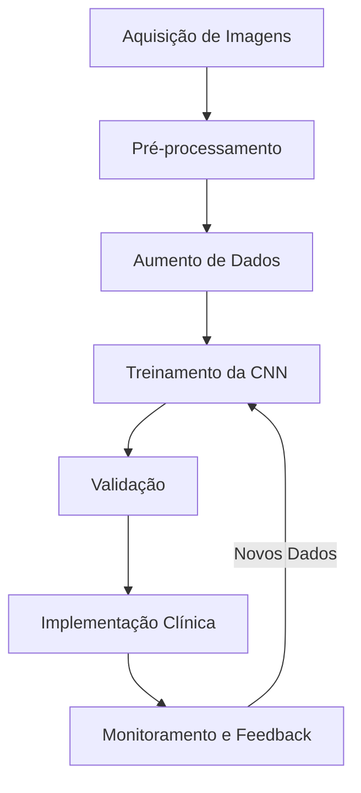
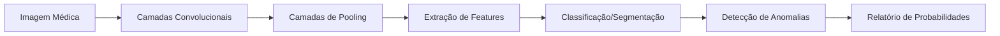
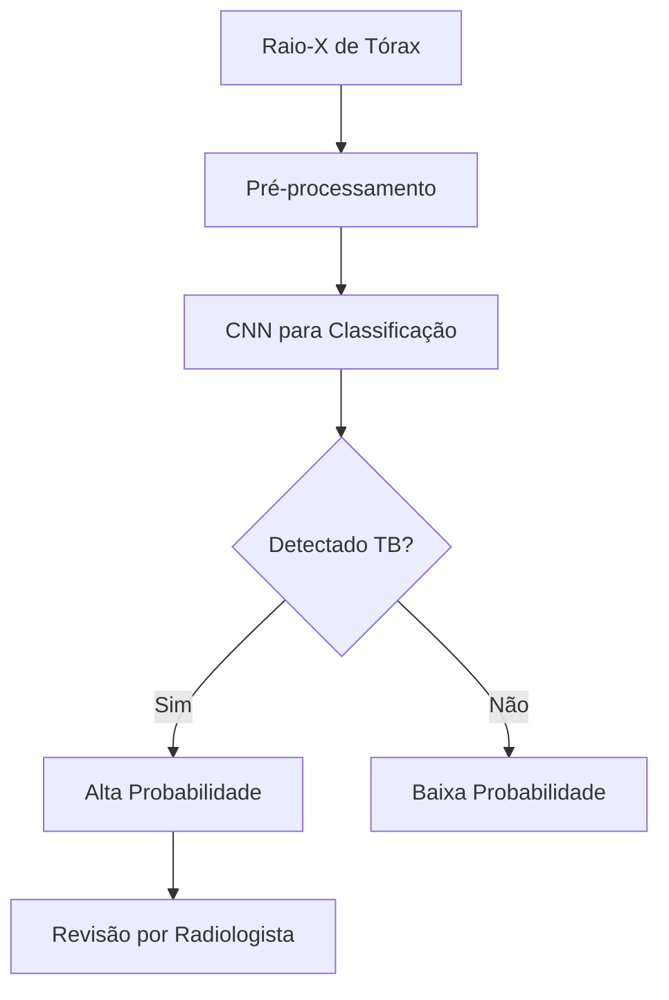
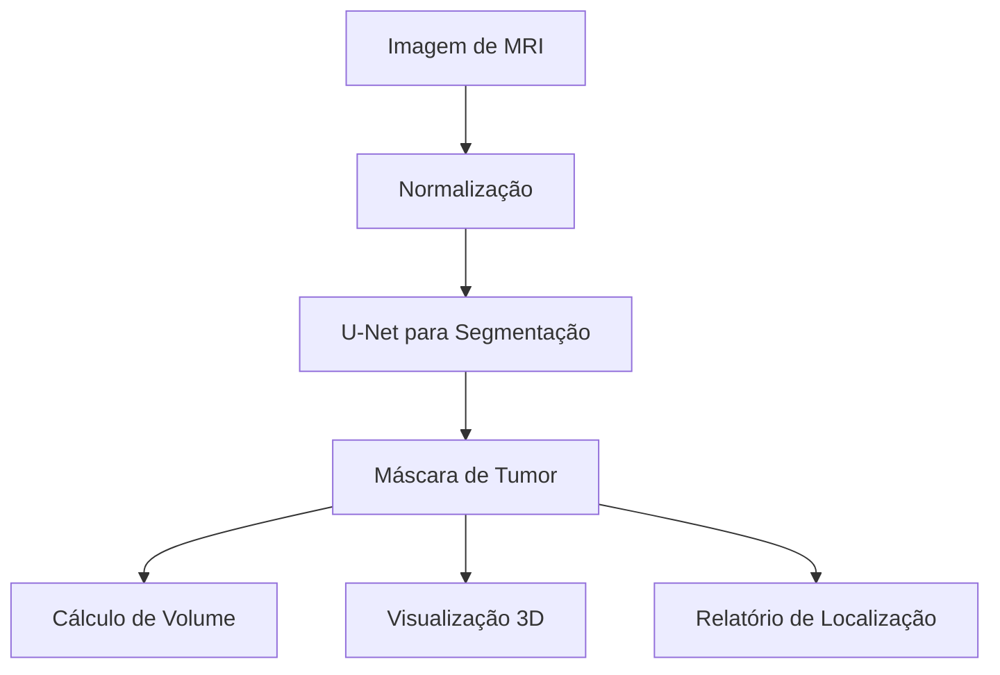
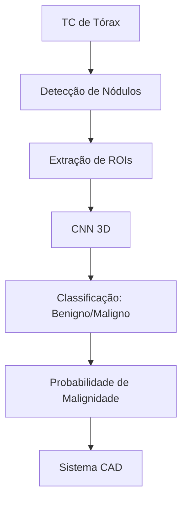

# 🏥 Caso de Uso: Reconhecimento de Imagens Médicas

## 🎯 Objetivo

Desenvolver um sistema de Deep Learning para análise automática de imagens médicas, auxiliando radiologistas na detecção precoce e classificação de anomalias em exames de imagem como raio-X, tomografias e ressonâncias magnéticas.

## 🔍 Problema de Negócio

O diagnóstico por imagem é fundamental na medicina moderna, mas enfrenta desafios como:
- Volume crescente de exames que sobrecarregam especialistas
- Variabilidade na interpretação entre diferentes radiologistas
- Necessidade de detecção precoce para melhorar prognósticos
- Escassez de especialistas em certas regiões geográficas

Um sistema de suporte baseado em Deep Learning pode aumentar a precisão, reduzir o tempo de diagnóstico e garantir maior consistência nas análises.

## 📊 Dados Necessários

- Grandes conjuntos de imagens médicas rotuladas (raio-X, TC, RM)
- Anotações detalhadas feitas por especialistas
- Relatórios médicos associados às imagens
- Metadados dos exames (tipo de equipamento, parâmetros de aquisição)
- Histórico médico dos pacientes (quando relevante e anonimizado)

## 🛠️ Abordagem de Deep Learning



### 1. Arquitetura de Rede Neural



- **Redes Neurais Convolucionais (CNN)**: Base da maioria dos sistemas de análise de imagens médicas
- **U-Net**: Arquitetura especializada para segmentação de estruturas em imagens médicas
- **DenseNet/ResNet**: Redes profundas para classificação com conexões residuais
- **Modelos de Atenção**: Para focar em regiões específicas de interesse

### 2. Técnicas Essenciais

- **Transfer Learning**: Utilização de modelos pré-treinados adaptados para imagens médicas
- **Augmentação de Dados**: Rotação, zoom, flip para aumentar o conjunto de treinamento
- **Treinamento com Pesos Diferentes**: Para lidar com classes desbalanceadas
- **Ensembles de Modelos**: Combinação de múltiplas redes para maior robustez

## 📏 Métricas de Avaliação

- **Sensibilidade/Recall**: Crucial para minimizar falsos negativos (condições não detectadas)
- **Especificidade**: Capacidade de evitar falsos alarmes
- **AUC-ROC**: Desempenho geral do classificador
- **Coeficiente Dice**: Para avaliar qualidade de segmentação
- **Comparação com Consenso de Especialistas**: Alinhamento com diagnósticos humanos

## 💻 Exemplo de Implementação

```python
import os
import numpy as np
import tensorflow as tf
from tensorflow.keras.models import Model
from tensorflow.keras.layers import Input, Conv2D, MaxPooling2D, Dropout, Conv2DTranspose, concatenate
from tensorflow.keras.optimizers import Adam
from tensorflow.keras.callbacks import ModelCheckpoint, EarlyStopping
from sklearn.model_selection import train_test_split

# Implementação de uma U-Net para segmentação de tumores cerebrais
def create_unet(input_shape, num_classes):
    inputs = Input(input_shape)
    
    # Encoder (Caminho de Contração)
    c1 = Conv2D(16, (3, 3), activation='relu', kernel_initializer='he_normal', padding='same')(inputs)
    c1 = Conv2D(16, (3, 3), activation='relu', kernel_initializer='he_normal', padding='same')(c1)
    p1 = MaxPooling2D((2, 2))(c1)
    
    c2 = Conv2D(32, (3, 3), activation='relu', kernel_initializer='he_normal', padding='same')(p1)
    c2 = Conv2D(32, (3, 3), activation='relu', kernel_initializer='he_normal', padding='same')(c2)
    p2 = MaxPooling2D((2, 2))(c2)
    
    c3 = Conv2D(64, (3, 3), activation='relu', kernel_initializer='he_normal', padding='same')(p2)
    c3 = Conv2D(64, (3, 3), activation='relu', kernel_initializer='he_normal', padding='same')(c3)
    p3 = MaxPooling2D((2, 2))(c3)
    
    c4 = Conv2D(128, (3, 3), activation='relu', kernel_initializer='he_normal', padding='same')(p3)
    c4 = Conv2D(128, (3, 3), activation='relu', kernel_initializer='he_normal', padding='same')(c4)
    p4 = MaxPooling2D((2, 2))(c4)
    
    # Bottleneck
    c5 = Conv2D(256, (3, 3), activation='relu', kernel_initializer='he_normal', padding='same')(p4)
    c5 = Conv2D(256, (3, 3), activation='relu', kernel_initializer='he_normal', padding='same')(c5)
    
    # Decoder (Caminho de Expansão)
    u6 = Conv2DTranspose(128, (2, 2), strides=(2, 2), padding='same')(c5)
    u6 = concatenate([u6, c4])
    c6 = Conv2D(128, (3, 3), activation='relu', kernel_initializer='he_normal', padding='same')(u6)
    c6 = Conv2D(128, (3, 3), activation='relu', kernel_initializer='he_normal', padding='same')(c6)
    
    u7 = Conv2DTranspose(64, (2, 2), strides=(2, 2), padding='same')(c6)
    u7 = concatenate([u7, c3])
    c7 = Conv2D(64, (3, 3), activation='relu', kernel_initializer='he_normal', padding='same')(u7)
    c7 = Conv2D(64, (3, 3), activation='relu', kernel_initializer='he_normal', padding='same')(c7)
    
    u8 = Conv2DTranspose(32, (2, 2), strides=(2, 2), padding='same')(c7)
    u8 = concatenate([u8, c2])
    c8 = Conv2D(32, (3, 3), activation='relu', kernel_initializer='he_normal', padding='same')(u8)
    c8 = Conv2D(32, (3, 3), activation='relu', kernel_initializer='he_normal', padding='same')(c8)
    
    u9 = Conv2DTranspose(16, (2, 2), strides=(2, 2), padding='same')(c8)
    u9 = concatenate([u9, c1], axis=3)
    c9 = Conv2D(16, (3, 3), activation='relu', kernel_initializer='he_normal', padding='same')(u9)
    c9 = Conv2D(16, (3, 3), activation='relu', kernel_initializer='he_normal', padding='same')(c9)
    
    # Camada de saída
    outputs = Conv2D(num_classes, (1, 1), activation='sigmoid')(c9)
    
    model = Model(inputs=[inputs], outputs=[outputs])
    model.compile(optimizer=Adam(learning_rate=1e-4), loss='binary_crossentropy', metrics=['accuracy', tf.keras.metrics.Recall(), tf.keras.metrics.Precision()])
    
    return model

# Treinamento do modelo
def train_model(model, X_train, y_train, X_val, y_val, batch_size=16, epochs=100):
    model_checkpoint = ModelCheckpoint('brain_tumor_segmentation.h5', monitor='val_loss', save_best_only=True)
    early_stopping = EarlyStopping(monitor='val_loss', patience=10, restore_best_weights=True)
    
    history = model.fit(
        X_train, y_train,
        batch_size=batch_size,
        epochs=epochs,
        validation_data=(X_val, y_val),
        callbacks=[model_checkpoint, early_stopping]
    )
    
    return history

# Função para avaliar o modelo com métricas específicas para segmentação médica
def evaluate_model(model, X_test, y_test):
    y_pred = model.predict(X_test)
    y_pred_binary = (y_pred > 0.5).astype(np.uint8)
    
    # Calcular métricas como Dice, IoU, etc.
    dice = calculate_dice(y_test, y_pred_binary)
    iou = calculate_iou(y_test, y_pred_binary)
    
    print(f"Dice Coefficient: {dice}")
    print(f"IoU: {iou}")
    
    return dice, iou
```

## 🌟 Aplicações Específicas

### 1. Detecção de Tuberculose em Raio-X de Tórax



### 2. Segmentação de Tumores Cerebrais em MRI



### 3. Classificação de Nódulos Pulmonares em TC



## 📈 Resultados Esperados

- Redução de 30-40% no tempo de leitura para radiologistas
- Aumento de 15-20% na detecção precoce de anomalias
- Diminuição de variabilidade inter-observador
- Auxílio em áreas com escassez de especialistas
- Priorização de casos urgentes na fila de trabalho

## 🔍 Desafios e Considerações

- **Dados Limitados**: Necessidade de técnicas para treinamento com conjuntos pequenos
- **Interpretabilidade**: Explicabilidade das decisões para confiança dos médicos
- **Aprovação Regulatória**: Conformidade com FDA, CE, ANVISA, etc.
- **Integração**: Compatibilidade com sistemas PACS/RIS existentes
- **Validação Clínica**: Estudos controlados antes da implementação ampla
- **Ética e Privacidade**: Gerenciamento seguro de dados sensíveis