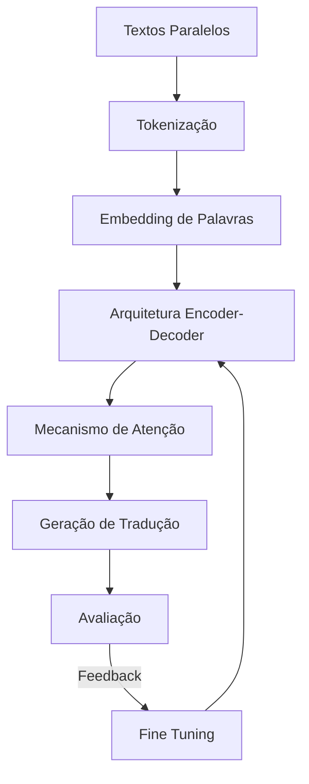
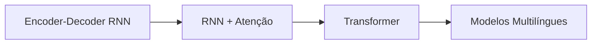
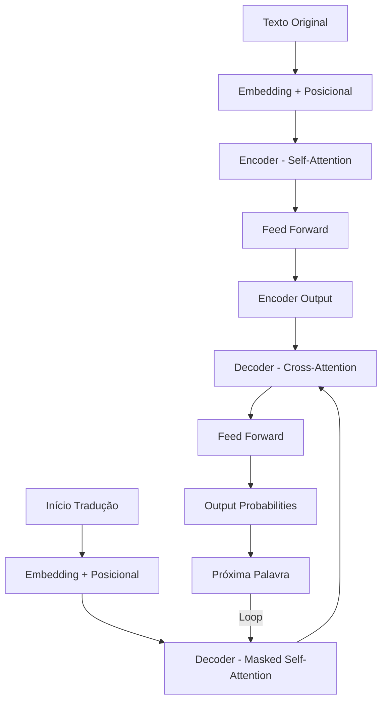
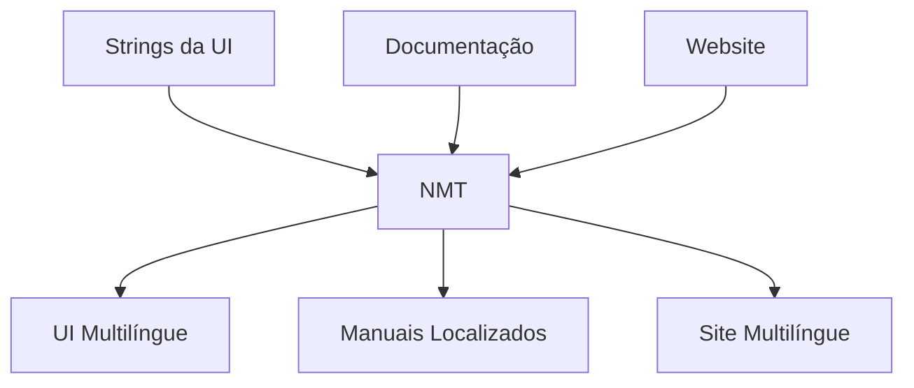
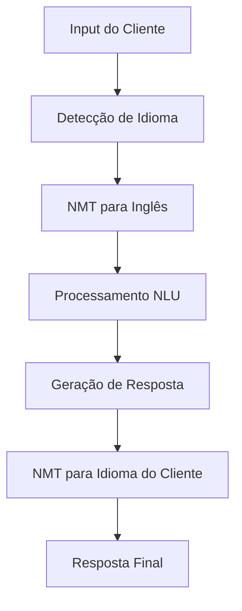
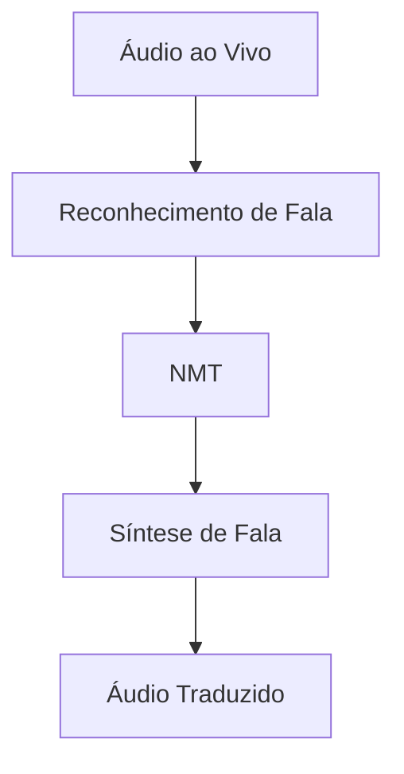

# 🌐 Caso de Uso: Tradução Automática Neural

## 🎯 Objetivo

Desenvolver um sistema de tradução automática neural (NMT - Neural Machine Translation) capaz de traduzir texto entre múltiplos idiomas com alta qualidade, preservando nuances contextuais, culturais e semânticas.

## 🔍 Problema de Negócio

A comunicação em um mundo globalizado exige tradução rápida e precisa de conteúdo entre idiomas. Os sistemas tradicionais de tradução estatística apresentam limitações na qualidade, especialmente para idiomas com estruturas gramaticais diferentes ou expressões idiomáticas. Um sistema NMT pode:

- Facilitar comunicação entre equipes multinacionais
- Expandir alcance de conteúdo para mercados globais
- Possibilitar atendimento ao cliente em múltiplos idiomas
- Reduzir custos com tradução humana para volumes grandes de conteúdo

## 📊 Dados Necessários

- Corpus paralelos (mesmo texto em múltiplos idiomas)
- Textos monolíngues para treinamento não supervisionado
- Dicionários especializados para terminologias técnicas
- Avaliações de tradução para refinamento
- Dados contextuais (domínio, estilo, formalidade)

## 🛠️ Abordagem de Deep Learning



### 1. Evolução das Arquiteturas NMT



### 2. Arquitetura Transformer para NMT



## 📏 Métricas de Avaliação

- **BLEU (Bilingual Evaluation Understudy)**: Compara tradução automática com referências humanas
- **METEOR**: Avalia correspondência semântica e sinonímia
- **TER (Translation Error Rate)**: Mede esforço de edição necessário para corrigir a tradução
- **COMET**: Métrica baseada em modelos neurais que avalia qualidade semântica
- **Avaliação Humana**: Crucial para capturar nuances culturais e fluência

## 💻 Exemplo de Implementação

```python
import tensorflow as tf
from tensorflow.keras.layers import Input, Dense, LayerNormalization, MultiHeadAttention
from tensorflow.keras.models import Model
import tensorflow_datasets as tfds

# Carregar dataset
examples, metadata = tfds.load('ted_hrlr_translate/pt_to_en', with_info=True, as_supervised=True)
train_examples, val_examples = examples['train'], examples['validation']

# Processadores de texto
tokenizer_pt = tfds.deprecated.text.SubwordTextEncoder.build_from_corpus(
    (pt.numpy() for pt, en in train_examples), target_vocab_size=2**13)
tokenizer_en = tfds.deprecated.text.SubwordTextEncoder.build_from_corpus(
    (en.numpy() for pt, en in train_examples), target_vocab_size=2**13)

# Parâmetros
BUFFER_SIZE = 20000
BATCH_SIZE = 64
MAX_LENGTH = 40
D_MODEL = 128
NUM_LAYERS = 4
NUM_HEADS = 8
UNITS = 512
DROPOUT = 0.1

# Função para codificar e preparar os pares para treinamento
def encode(lang1, lang2):
    lang1 = [tokenizer_pt.vocab_size] + tokenizer_pt.encode(lang1.numpy()) + [tokenizer_pt.vocab_size+1]
    lang2 = [tokenizer_en.vocab_size] + tokenizer_en.encode(lang2.numpy()) + [tokenizer_en.vocab_size+1]
    return lang1, lang2

# Função para filtrar por comprimento
def filter_max_length(x, y):
    return tf.logical_and(tf.size(x) <= MAX_LENGTH, tf.size(y) <= MAX_LENGTH)

# Preparar dataset
def make_batches(ds):
    return (
        ds
        .map(lambda pt, en: tf.py_function(encode, [pt, en], [tf.int64, tf.int64]))
        .filter(filter_max_length)
        .cache()
        .shuffle(BUFFER_SIZE)
        .padded_batch(BATCH_SIZE, padded_shapes=([MAX_LENGTH], [MAX_LENGTH]))
        .prefetch(tf.data.experimental.AUTOTUNE)
    )

train_batches = make_batches(train_examples)
val_batches = make_batches(val_examples)

# Definir camada de embedding posicional
class PositionalEncoding(tf.keras.layers.Layer):
    def __init__(self, position, d_model):
        super(PositionalEncoding, self).__init__()
        self.pos_encoding = self.positional_encoding(position, d_model)
    
    def get_angles(self, position, i, d_model):
        angles = 1 / tf.pow(10000, (2 * (i // 2)) / tf.cast(d_model, tf.float32))
        return position * angles
    
    def positional_encoding(self, position, d_model):
        angle_rads = self.get_angles(
            position=tf.range(position, dtype=tf.float32)[:, tf.newaxis],
            i=tf.range(d_model, dtype=tf.float32)[tf.newaxis, :],
            d_model=d_model)
        
        # Aplicar seno às posições pares
        sines = tf.math.sin(angle_rads[:, 0::2])
        # Aplicar cosseno às posições ímpares
        cosines = tf.math.cos(angle_rads[:, 1::2])
        
        pos_encoding = tf.concat([sines, cosines], axis=-1)
        pos_encoding = pos_encoding[tf.newaxis, ...]
        
        return tf.cast(pos_encoding, tf.float32)
    
    def call(self, inputs):
        return inputs + self.pos_encoding[:, :tf.shape(inputs)[1], :]

# Máscara de padding para sequências de tamanhos diferentes
def create_padding_mask(seq):
    seq = tf.cast(tf.math.equal(seq, 0), tf.float32)
    return seq[:, tf.newaxis, tf.newaxis, :]

# Máscara look-ahead para decoder
def create_look_ahead_mask(size):
    mask = 1 - tf.linalg.band_part(tf.ones((size, size)), -1, 0)
    return mask

# Camada de encoder
def encoder_layer(units, d_model, num_heads, dropout):
    inputs = Input(shape=(None, d_model))
    padding_mask = Input(shape=(1, 1, None))
    
    attention = MultiHeadAttention(num_heads=num_heads, key_dim=d_model)(
        inputs, inputs, inputs, attention_mask=padding_mask)
    attention = tf.keras.layers.Dropout(dropout)(attention)
    attention = LayerNormalization(epsilon=1e-6)(inputs + attention)
    
    outputs = Dense(units, activation='relu')(attention)
    outputs = Dense(d_model)(outputs)
    outputs = tf.keras.layers.Dropout(dropout)(outputs)
    outputs = LayerNormalization(epsilon=1e-6)(attention + outputs)
    
    return Model(inputs=[inputs, padding_mask], outputs=outputs)

# Bloco completo de encoder
def encoder(vocab_size, num_layers, units, d_model, num_heads, dropout, max_length):
    inputs = Input(shape=(None,))
    padding_mask = Input(shape=(1, 1, None))
    
    # Embeddings
    embeddings = tf.keras.layers.Embedding(vocab_size, d_model)(inputs)
    embeddings *= tf.math.sqrt(tf.cast(d_model, tf.float32))
    embeddings = PositionalEncoding(max_length, d_model)(embeddings)
    
    outputs = tf.keras.layers.Dropout(dropout)(embeddings)
    
    # Camadas de encoder
    for i in range(num_layers):
        outputs = encoder_layer(units, d_model, num_heads, dropout)(
            [outputs, padding_mask])
    
    return Model(inputs=[inputs, padding_mask], outputs=outputs)

# Camada de decoder
def decoder_layer(units, d_model, num_heads, dropout):
    inputs = Input(shape=(None, d_model))
    enc_outputs = Input(shape=(None, d_model))
    look_ahead_mask = Input(shape=(1, None, None))
    padding_mask = Input(shape=(1, 1, None))
    
    # Self attention
    attention1 = MultiHeadAttention(num_heads=num_heads, key_dim=d_model)(
        inputs, inputs, inputs, attention_mask=look_ahead_mask)
    attention1 = tf.keras.layers.Dropout(dropout)(attention1)
    attention1 = LayerNormalization(epsilon=1e-6)(inputs + attention1)
    
    # Cross attention
    attention2 = MultiHeadAttention(num_heads=num_heads, key_dim=d_model)(
        attention1, enc_outputs, enc_outputs, attention_mask=padding_mask)
    attention2 = tf.keras.layers.Dropout(dropout)(attention2)
    attention2 = LayerNormalization(epsilon=1e-6)(attention1 + attention2)
    
    # Feed forward
    outputs = Dense(units, activation='relu')(attention2)
    outputs = Dense(d_model)(outputs)
    outputs = tf.keras.layers.Dropout(dropout)(outputs)
    outputs = LayerNormalization(epsilon=1e-6)(attention2 + outputs)
    
    return Model(
        inputs=[inputs, enc_outputs, look_ahead_mask, padding_mask],
        outputs=outputs)

# Bloco completo de decoder
def decoder(vocab_size, num_layers, units, d_model, num_heads, dropout, max_length):
    inputs = Input(shape=(None,))
    enc_outputs = Input(shape=(None, d_model))
    look_ahead_mask = Input(shape=(1, None, None))
    padding_mask = Input(shape=(1, 1, None))
    
    # Embeddings
    embeddings = tf.keras.layers.Embedding(vocab_size, d_model)(inputs)
    embeddings *= tf.math.sqrt(tf.cast(d_model, tf.float32))
    embeddings = PositionalEncoding(max_length, d_model)(embeddings)
    
    outputs = tf.keras.layers.Dropout(dropout)(embeddings)
    
    # Camadas de decoder
    for i in range(num_layers):
        outputs = decoder_layer(units, d_model, num_heads, dropout)(
            [outputs, enc_outputs, look_ahead_mask, padding_mask])
    
    return Model(
        inputs=[inputs, enc_outputs, look_ahead_mask, padding_mask],
        outputs=outputs)

# Modelo Transformer completo
def transformer(vocab_size_src, vocab_size_tgt, num_layers, units, d_model, num_heads, dropout, max_length):
    # Inputs
    inputs = Input(shape=(None,))
    dec_inputs = Input(shape=(None,))
    
    # Masks
    enc_padding_mask = tf.keras.layers.Lambda(
        create_padding_mask, output_shape=(1, 1, None))(inputs)
    dec_padding_mask = tf.keras.layers.Lambda(
        create_padding_mask, output_shape=(1, 1, None))(inputs)
    look_ahead_mask = tf.keras.layers.Lambda(
        lambda x: create_look_ahead_mask(tf.shape(x)[1]))(dec_inputs)
    dec_target_padding_mask = tf.keras.layers.Lambda(
        create_padding_mask, output_shape=(1, 1, None))(dec_inputs)
    combined_mask = tf.maximum(dec_target_padding_mask, look_ahead_mask)
    
    # Encoder-Decoder
    enc_outputs = encoder(
        vocab_size_src, num_layers, units, d_model, num_heads, dropout, max_length)(
        [inputs, enc_padding_mask])
    
    dec_outputs = decoder(
        vocab_size_tgt, num_layers, units, d_model, num_heads, dropout, max_length)(
        [dec_inputs, enc_outputs, combined_mask, dec_padding_mask])
    
    # Camada final
    outputs = Dense(vocab_size_tgt)(dec_outputs)
    
    return Model(inputs=[inputs, dec_inputs], outputs=outputs)

# Instanciar e compilar o modelo
model = transformer(
    tokenizer_pt.vocab_size + 2, tokenizer_en.vocab_size + 2,
    NUM_LAYERS, UNITS, D_MODEL, NUM_HEADS, DROPOUT, MAX_LENGTH)

optimizer = tf.keras.optimizers.Adam(
    learning_rate=0.001, beta_1=0.9, beta_2=0.98, epsilon=1e-9)

model.compile(
    optimizer=optimizer,
    loss=tf.keras.losses.SparseCategoricalCrossentropy(from_logits=True),
    metrics=[tf.keras.metrics.SparseCategoricalAccuracy()])

# Resumo do modelo
model.summary()
```

## 🌟 Aplicações Práticas

### 1. Localização de Software e Produtos



### 2. Assistentes Virtuais Multilíngues



### 3. Tradutor de Conteúdo em Tempo Real



## 📈 Avanços e Futuro

### Técnicas Avançadas

- **Treinamento Multilíngue**: Um único modelo para múltiplos pares de idiomas
- **Tradução Zero-Shot**: Tradução entre pares de idiomas não vistos no treinamento
- **Aprendizagem por Transferência**: Aproveitamento de modelos grandes pré-treinados
- **Tradução Baseada em Documentos**: Considerando contexto além da sentença atual
- **Modelos Baseados em Transformer**: Estado da arte em qualidade de tradução

### Desafios Persistentes

- **Idiomas de Baixos Recursos**: Poucos dados paralelos disponíveis
- **Expressões Idiomáticas e Culturais**: Difíceis de traduzir literalmente
- **Ambiguidade Semântica**: Palavras com múltiplos significados
- **Adaptação de Domínio**: Terminologia específica em campos como medicina ou direito
- **Eficiência Computacional**: Otimização para tradução em dispositivos móveis

## 🔍 Conclusão

A Tradução Automática Neural representa um avanço significativo sobre os métodos anteriores, oferecendo qualidade próxima à humana para muitos pares de idiomas. Com o avanço das arquiteturas Transformer e técnicas de treinamento, podemos esperar traduções cada vez mais naturais e contextuais, facilitando a comunicação global e o acesso a informações em qualquer idioma.