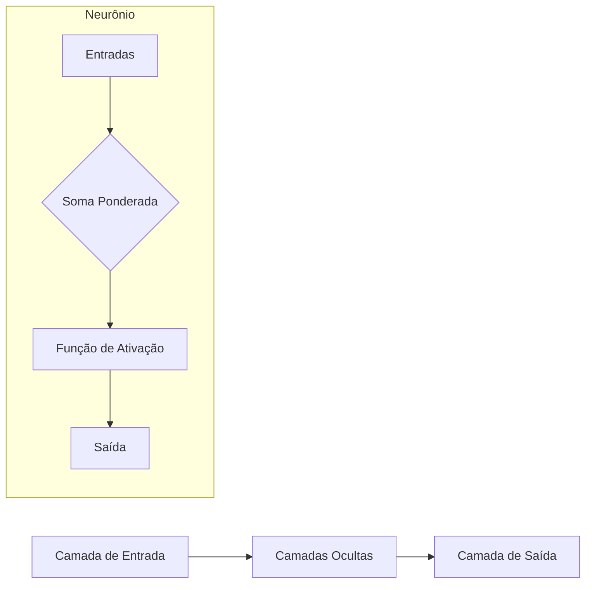
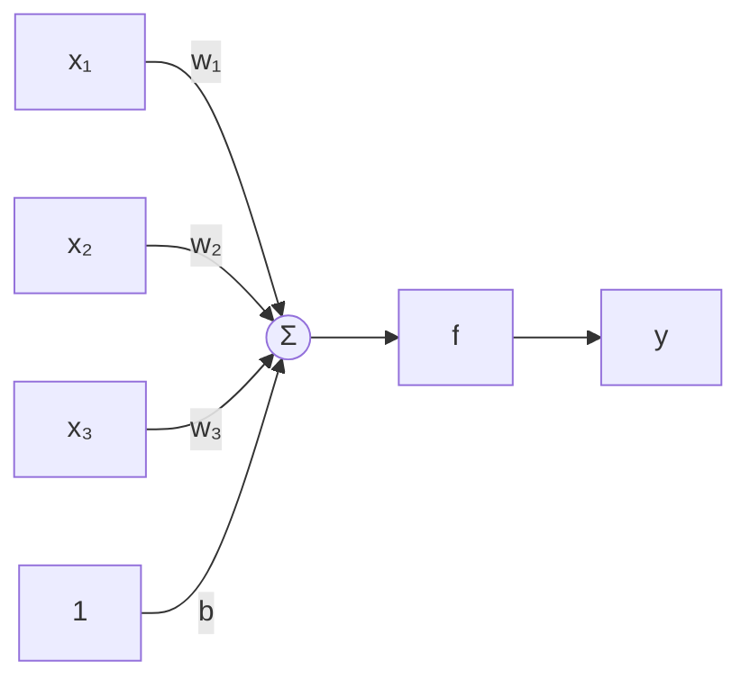
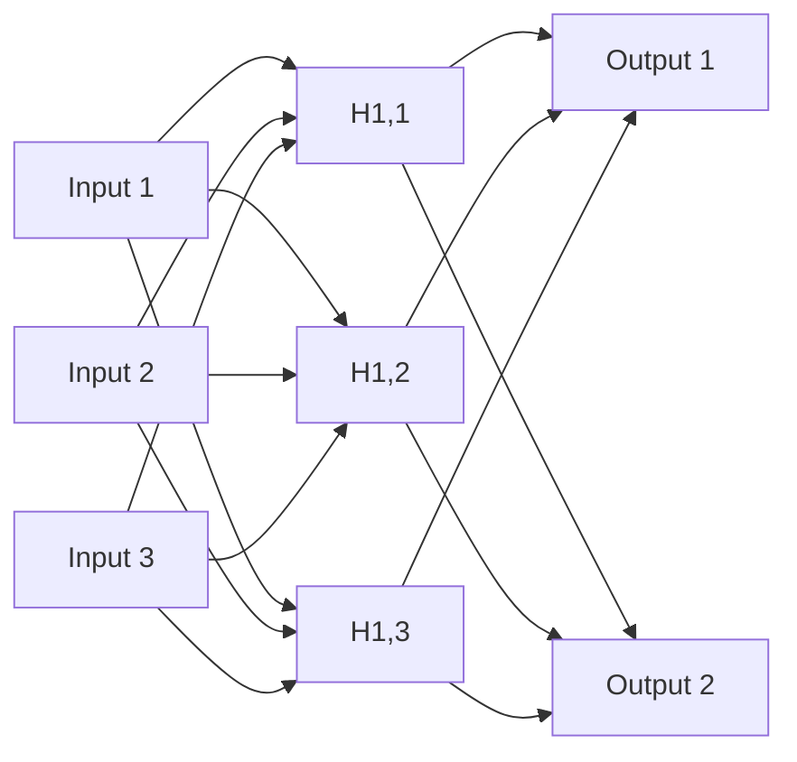
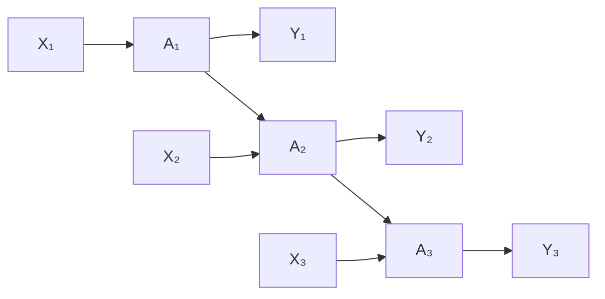
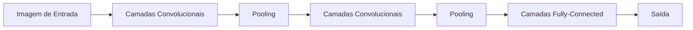
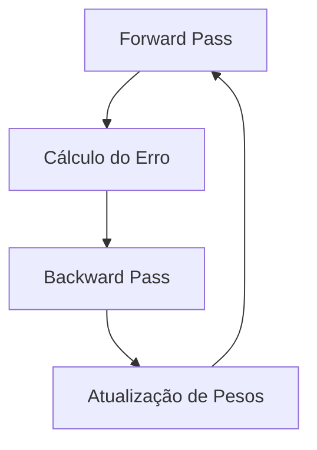
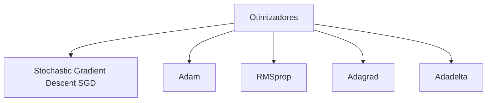
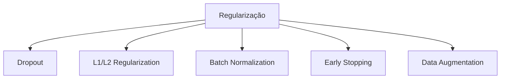

# 🧠 Redes Neurais

Redes Neurais Artificiais são modelos computacionais inspirados na estrutura e funcionamento do cérebro humano, capazes de aprender padrões complexos a partir de dados.

## 📑 Definição

Uma rede neural é composta por unidades de processamento interconectadas (neurônios artificiais) organizadas em camadas, que transformam inputs em outputs através de funções matemáticas. O poder das redes neurais está em sua capacidade de aproximar praticamente qualquer função matemática, permitindo modelar relações altamente não-lineares entre variáveis.

## 🔄 Como Funcionam



### Componentes Básicos

#### O Neurônio Artificial



1. **Entradas (x)**: Dados ou sinais recebidos de outros neurônios
2. **Pesos (w)**: Parâmetros que determinam a importância relativa de cada entrada
3. **Bias (b)**: Termo constante que ajusta o limiar de ativação
4. **Função de Soma**: Calcula a soma ponderada das entradas (Σ w·x + b)
5. **Função de Ativação (f)**: Transforma a soma ponderada em um valor de saída

#### Funções de Ativação Comuns

```mermaid
graph TD
    A[Funções de Ativação] --> B[Sigmoid]
    A --> C[Tanh]
    A --> D[ReLU]
    A --> E[Leaky ReLU]
    A --> F[Softmax]
    
    B --> B1[σ(x) = 1/(1+e^-x)]
    C --> C1[tanh(x) = (e^x - e^-x)/(e^x + e^-x)]
    D --> D1[ReLU(x) = max(0, x)]
    E --> E1[Leaky ReLU(x) = max(αx, x)]
    F --> F1[Para classificação multi-classe]
```

## 🏗️ Arquiteturas de Redes Neurais

### Feedforward Neural Network (FNN)



Informação flui em uma direção (da entrada para a saída), sem ciclos ou loops.

### Redes Neurais Recorrentes (RNN)



Contém ciclos internos de feedback, permitindo "memória" para processar sequências.

### Redes Neurais Convolucionais (CNN)



Especializadas em processamento de dados estruturados em grade (imagens).

## 🧮 Treinamento de Redes Neurais

### Algoritmo de Backpropagation



1. **Forward Pass**: Propaga a entrada através da rede para gerar uma previsão
2. **Cálculo do Erro**: Compara a previsão com o valor esperado
3. **Backward Pass**: Propaga o erro de volta, calculando gradientes
4. **Atualização de Pesos**: Ajusta os pesos usando otimizadores como SGD, Adam, etc.

### Funções de Perda Comuns

- **Mean Squared Error (MSE)**: Para problemas de regressão
- **Cross-Entropy**: Para problemas de classificação
- **Categorical Cross-Entropy**: Para classificação multi-classe
- **Binary Cross-Entropy**: Para classificação binária

### Otimizadores



## 🛠️ Técnicas Avançadas

### Regularização



### Inicialização de Pesos

- **Xavier/Glorot**: Mantém a variância constante entre camadas
- **He**: Otimizada para funções de ativação ReLU
- **Random Normal/Uniform**: Inicialização aleatória simples

## 🔗 Casos de Uso

- [Sistema de Recomendação com Redes Neurais](./use-case-recommendation-system.md)
- [Detecção de Anomalias em Séries Temporais](./use-case-anomaly-detection.md)

## 📚 Recursos Adicionais

- Frameworks: TensorFlow, PyTorch, Keras
- Hardware: GPU, TPU para treinamento acelerado
- Técnicas de visualização: TensorBoard, Weights & Biases

## 🚀 Tendências e Desafios

- **Redes Neurais Explícáveis**: Entendendo as "caixas pretas"
- **Redes Neurais Neurais Eficientes**: Reduzindo necessidade computacional
- **Auto ML**: Automação da seleção e otimização de arquiteturas
- **Redes Neurais Quânticas**: Aproveitando computação quântica