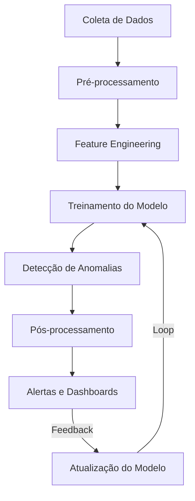
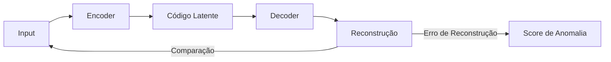
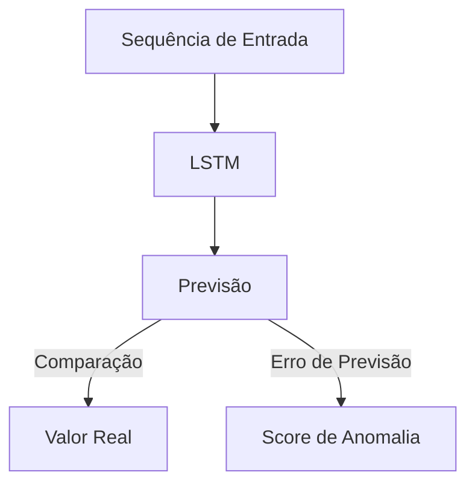
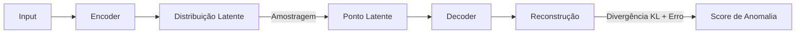
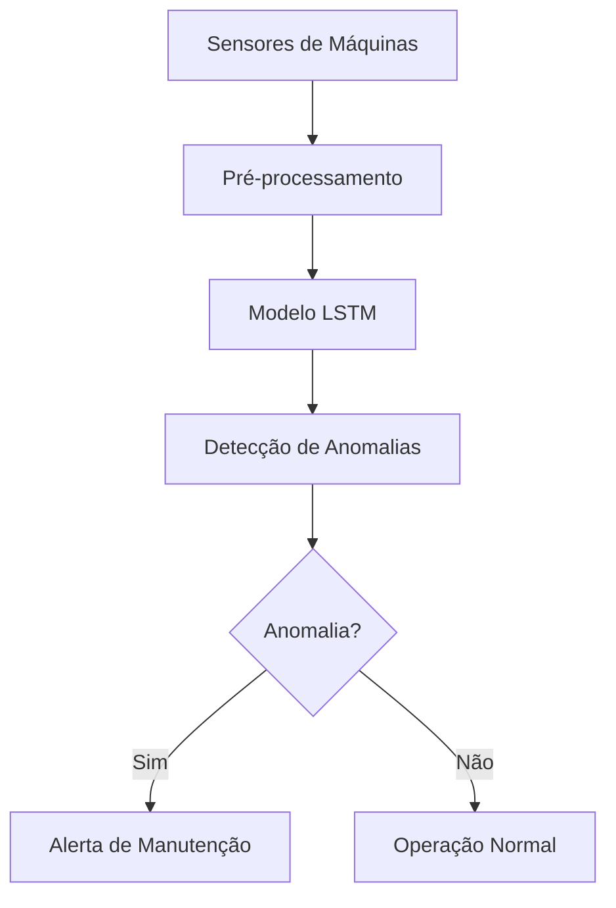
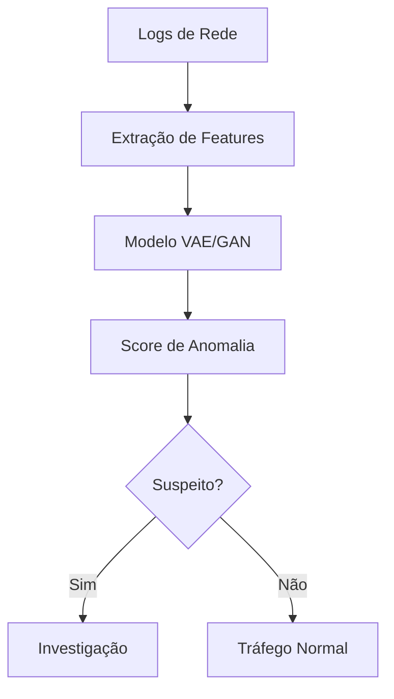
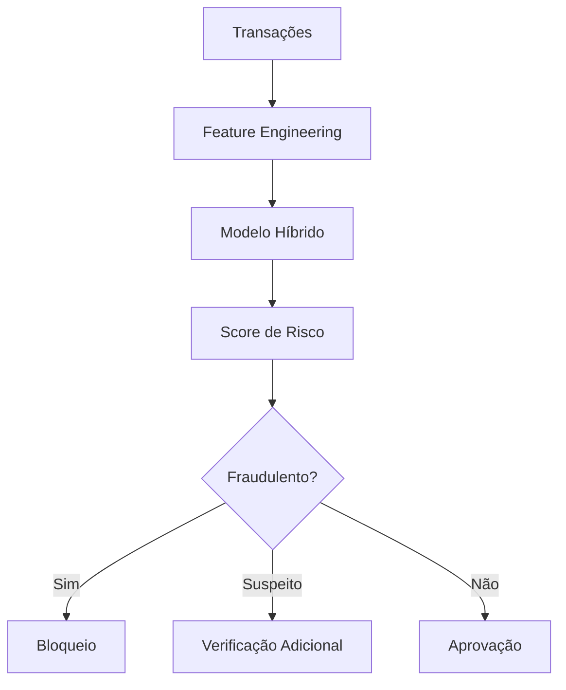

# 🔍 Caso de Uso: Detecção de Anomalias em Séries Temporais

## 🎯 Objetivo

Desenvolver um sistema baseado em redes neurais para identificar padrões anormais em séries temporais, permitindo a detecção proativa de falhas, fraudes, eventos incomuns ou comportamentos inesperados.

## 🔍 Problema de Negócio

A detecção de anomalias em séries temporais é crucial em diversos setores, desde monitoramento de infraestrutura até segurança cibernética. Métodos tradicionais estatísticos enfrentam dificuldades em:

- Capturar relações temporais complexas
- Lidar com padrões sazonais ou cíclicos
- Identificar anomalias contextuais (normais em certas condições, anormais em outras)
- Adaptar-se a novos padrões sem reconfiguração manual

Redes neurais, especialmente arquiteturas recorrentes e autoencoders, podem aprender representações robustas de comportamentos normais e identificar desvios com maior precisão.

## 📊 Dados Necessários

- Séries temporais com medições regulares (sensores, métricas de sistema, dados financeiros)
- Metadados contextuais (informações sobre ambiente, condições de operação)
- Dados históricos com anomalias rotuladas (se disponíveis)
- Informações sobre manutenções, intervenções ou eventos especiais

## 🛠️ Abordagem com Redes Neurais



### 1. Arquiteturas Neurais para Detecção de Anomalias

#### Autoencoders



Os autoencoders aprendem a reconstruir dados normais. Quando confrontados com anomalias, produzem erros de reconstrução elevados.

#### LSTM para Previsão



Modelos baseados em LSTM fazem previsões de próximos valores. Desvios significativos entre valores previstos e reais indicam anomalias.

#### Redes Neurais Variacionais (VAE)



VAEs adicionam um componente probabilístico, oferecendo robustez adicional em dados ruidosos.

## 💻 Exemplo de Implementação

Implementação de um Autoencoder LSTM para detecção de anomalias em séries temporais:

```python
import numpy as np
import pandas as pd
import matplotlib.pyplot as plt
from sklearn.preprocessing import MinMaxScaler
from sklearn.metrics import precision_recall_curve, auc
import tensorflow as tf
from tensorflow.keras.models import Sequential, Model
from tensorflow.keras.layers import LSTM, Dense, RepeatVector, TimeDistributed, Input

# Carregar os dados de série temporal
df = pd.read_csv('sensor_data.csv', parse_dates=['timestamp'], index_col='timestamp')

# Pré-processamento: normalização
scaler = MinMaxScaler()
scaled_data = scaler.fit_transform(df.values)

# Preparar sequências para o modelo
def create_sequences(data, seq_length):
    sequences = []
    for i in range(len(data) - seq_length):
        seq = data[i:i + seq_length]
        sequences.append(seq)
    return np.array(sequences)

# Parâmetros
seq_length = 24  # 24 horas, por exemplo
threshold_multiplier = 3  # Para definir o limiar de anomalia

# Criar sequências
sequences = create_sequences(scaled_data, seq_length)

# Dividir em treino e teste (assumindo que dados de treino são "normais")
train_size = int(len(sequences) * 0.8)
train_data = sequences[:train_size]
test_data = sequences[train_size:]

# Construir o modelo Autoencoder LSTM
def build_lstm_autoencoder(input_shape):
    inputs = Input(shape=input_shape)
    
    # Encoder
    encoded = LSTM(64, activation='relu', return_sequences=False)(inputs)
    
    # Representação latente
    latent_representation = RepeatVector(input_shape[0])(encoded)
    
    # Decoder
    decoded = LSTM(64, activation='relu', return_sequences=True)(latent_representation)
    outputs = TimeDistributed(Dense(input_shape[1]))(decoded)
    
    # Autoencoder completo
    autoencoder = Model(inputs, outputs)
    autoencoder.compile(optimizer='adam', loss='mse')
    
    return autoencoder

# Definir e treinar o modelo
input_shape = (seq_length, scaled_data.shape[1])
model = build_lstm_autoencoder(input_shape)
history = model.fit(
    train_data, train_data,
    epochs=50,
    batch_size=32,
    validation_split=0.1,
    verbose=1
)

# Calcular erros de reconstrução no conjunto de treino
train_predictions = model.predict(train_data)
train_errors = np.mean(np.square(train_data - train_predictions), axis=(1, 2))

# Definir limiar baseado na distribuição de erros de treino
threshold = np.mean(train_errors) + threshold_multiplier * np.std(train_errors)

# Função para detectar anomalias em novos dados
def detect_anomalies(new_data, model, threshold, scaler, seq_length):
    # Pré-processamento dos novos dados
    scaled_new_data = scaler.transform(new_data)
    sequences = create_sequences(scaled_new_data, seq_length)
    
    # Fazer previsões
    predictions = model.predict(sequences)
    
    # Calcular erros de reconstrução
    errors = np.mean(np.square(sequences - predictions), axis=(1, 2))
    
    # Marcar anomalias
    anomalies = errors > threshold
    
    # Mapear de volta para os timestamps originais
    anomaly_timestamps = []
    for i, is_anomaly in enumerate(anomalies):
        if is_anomaly:
            # O índice i+seq_length corresponde ao último ponto da sequência
            anomaly_timestamps.append(i + seq_length)
    
    return anomaly_timestamps, errors

# Detectar anomalias no conjunto de teste
test_anomaly_indices, test_errors = detect_anomalies(
    df.values[train_size:], model, threshold, scaler, seq_length
)

# Visualizar resultados
plt.figure(figsize=(15, 7))
plt.plot(df.index[seq_length:], np.concatenate([train_errors, test_errors]), label='Erro de Reconstrução')
plt.axhline(y=threshold, color='r', linestyle='-', label='Limiar de Anomalia')
for idx in test_anomaly_indices:
    plt.axvline(x=df.index[train_size + idx], color='g', alpha=0.3)
plt.legend()
plt.title('Detecção de Anomalias com Autoencoder LSTM')
plt.show()
```

## 📏 Métodos de Avaliação

- **Precisão e Recall**: Fundamental quando anomalias conhecidas estão disponíveis
- **AUC-ROC**: Avaliação do poder discriminativo do modelo
- **Erros Tipo I e II**: Falsos positivos vs. falsos negativos
- **Tempo de Detecção**: Rapidez na identificação de anomalias
- **Interpretabilidade**: Capacidade de explicar a razão da anomalia

## 🌟 Aplicações em Diferentes Setores

### Indústria (IoT e Manufatura)



Monitoramento de saúde de equipamentos, detecção precoce de falhas, manutenção preditiva.

### Cibersegurança



Detecção de intrusões, identificação de comportamentos suspeitos, prevenção de ataques.

### Finanças



Detecção de fraudes, identificação de transações suspeitas, análise de riscos.

## 📈 Resultados Esperados

- Redução de 40-60% em falsos positivos comparado a métodos tradicionais
- Detecção precoce de falhas 2-5 dias antes de ocorrerem
- Aumento de 30-50% na eficiência operacional de times de monitoramento
- Redução de 25-40% em custos de manutenção não planejada

## 🔍 Desafios e Considerações

- **Definição de "Normal"**: Estabelecer uma baseline robusta em sistemas complexos
- **Anomalias Evolutivas**: Adaptar-se a novos tipos de anomalias
- **Dados Desbalanceados**: Treinar com poucos exemplos de anomalias disponíveis
- **Latência de Detecção**: Equilibrar rapidez e precisão
- **Interpretabilidade**: Explicar por que algo foi marcado como anomalia
- **Sazonalidade e Tendências**: Distinguir padrões normais de anomalias