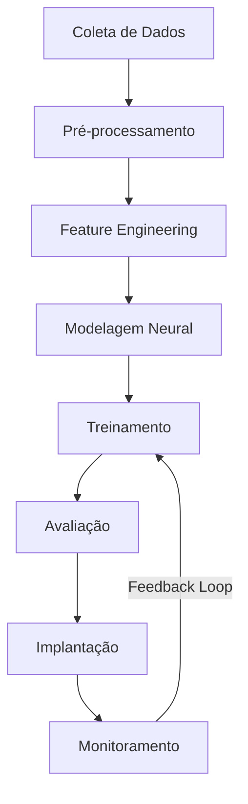
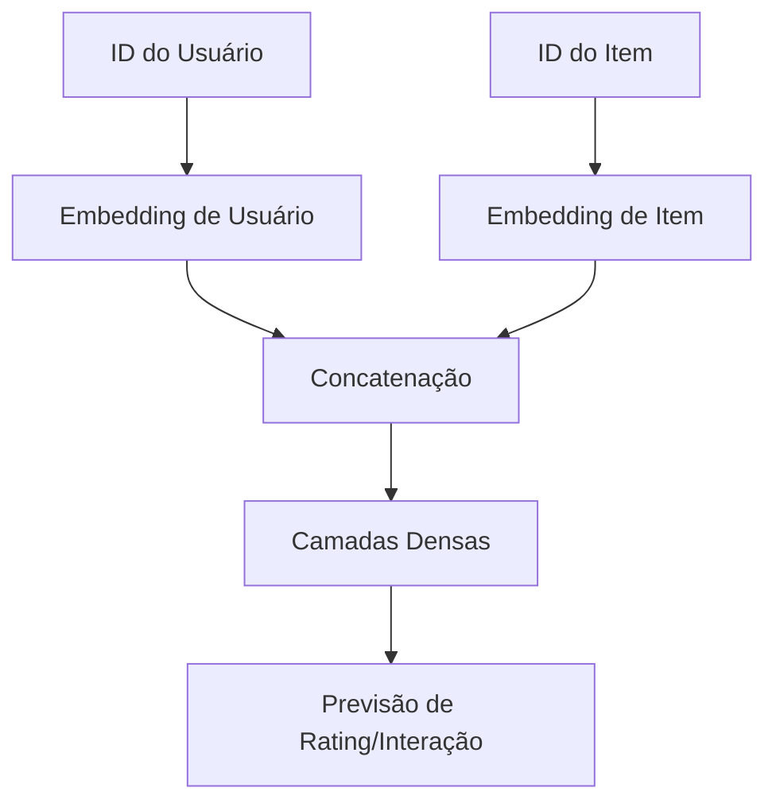
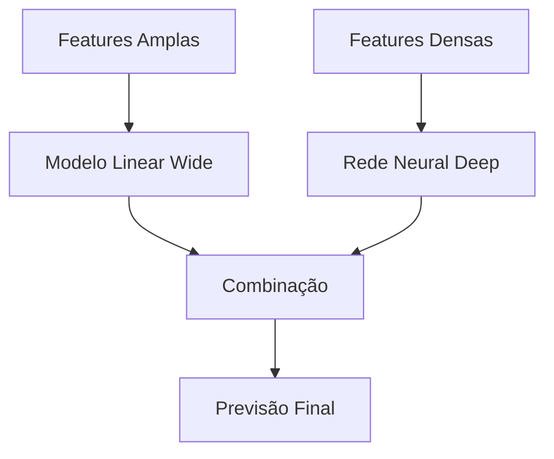
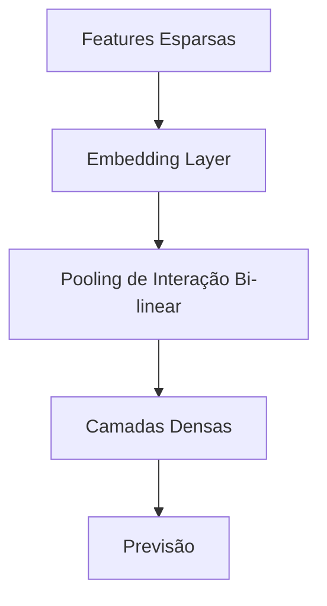
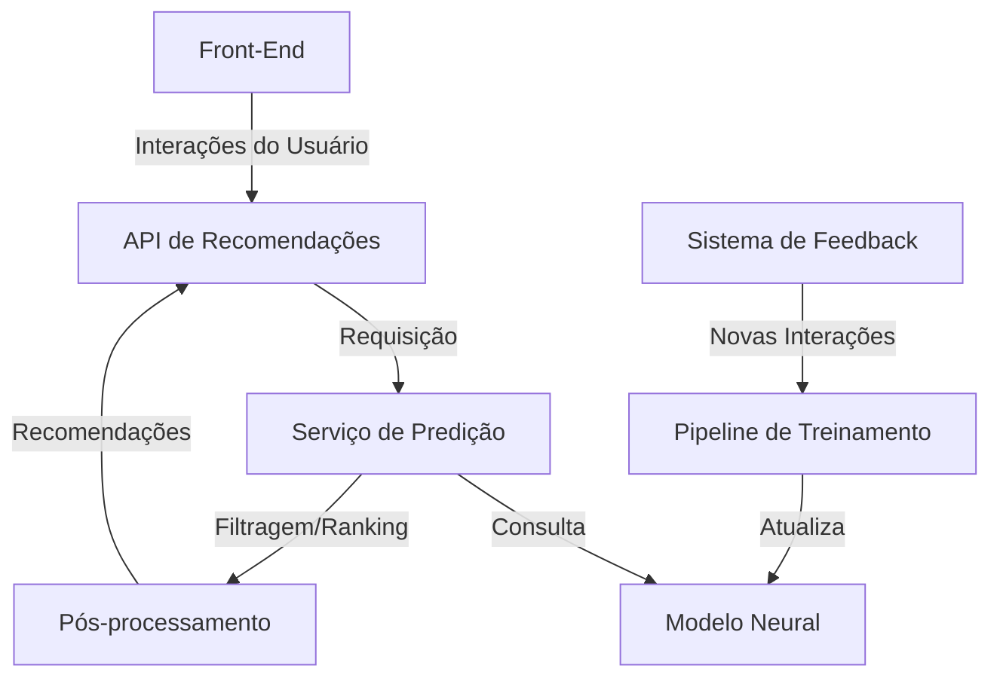

# 🎯 Caso de Uso: Sistema de Recomendação com Redes Neurais

## 🎯 Objetivo

Desenvolver um sistema de recomendação avançado utilizando redes neurais para prever as preferências dos usuários e recomendar produtos, conteúdos ou serviços personalizados, aumentando engajamento e conversão.

## 🔍 Problema de Negócio

Os sistemas de recomendação tradicionais frequentemente enfrentam desafios como:

- Dificuldade em capturar relações não-lineares complexas entre usuários e itens
- Limitações ao lidar com o problema de "cold start" (novos usuários/itens)
- Problemas para incorporar informações contextuais e temporais
- Escalabilidade para grandes conjuntos de dados

Redes neurais podem superar essas limitações, aprendendo representações ricas das interações entre usuários e itens, e levando em consideração múltiplos sinais e contextos.

## 📊 Dados Necessários

- Histórico de interações usuário-item (cliques, compras, visualizações, ratings)
- Metadados dos itens (categorias, tags, características)
- Informações dos usuários (demográficos, comportamentos)
- Dados contextuais (hora do dia, dispositivo, localização)
- Feedback implícito e explícito

## 🛠️ Abordagem com Redes Neurais



### 1. Arquiteturas Neurais para Recomendação

#### Neural Collaborative Filtering (NCF)



Esta arquitetura supera as limitações dos métodos tradicionais de filtragem colaborativa, aprendendo representações não-lineares das interações usuário-item.

#### Wide & Deep Network



Combina os benefícios de modelos lineares (memorização) e redes neurais profundas (generalização).

#### Neural Factorization Machines (NFM)



Modela interações de segunda ordem entre features através de pooling bi-linear.

### 2. Técnicas Essenciais

- **Embeddings**: Transformação de IDs de usuários e itens em vetores densos
- **Attention Mechanisms**: Para capturar a importância relativa de diferentes features
- **Sequence Models (RNN/LSTM)**: Para modelar o comportamento sequencial do usuário
- **Graph Neural Networks**: Para capturar relações entre usuários e itens em estrutura de grafo

## 💻 Exemplo de Implementação

Exemplo de um modelo Neural Collaborative Filtering (NCF) usando TensorFlow:

```python
import tensorflow as tf
from tensorflow.keras.layers import Input, Embedding, Flatten, Concatenate, Dense, Dropout
from tensorflow.keras.models import Model
from tensorflow.keras.optimizers import Adam
from tensorflow.keras.regularizers import l2
import numpy as np
import pandas as pd
from sklearn.model_selection import train_test_split

# Carregar dados
ratings = pd.read_csv('ratings.csv')
n_users = ratings['userId'].nunique()
n_items = ratings['movieId'].nunique()

# Mapeamento de IDs
user_ids = {id: i for i, id in enumerate(ratings['userId'].unique())}
item_ids = {id: i for i, id in enumerate(ratings['movieId'].unique())}

ratings['user_idx'] = ratings['userId'].map(user_ids)
ratings['item_idx'] = ratings['movieId'].map(item_ids)

# Split treino/teste
train_data, test_data = train_test_split(ratings, test_size=0.2, random_state=42)

# Parâmetros do modelo
embedding_size = 50
lr = 0.001
reg_lambda = 0.0001
epochs = 20
batch_size = 256

# Função para criar o modelo NCF
def create_ncf_model(n_users, n_items, embedding_size):
    # Input layers
    user_input = Input(shape=(1,), name='user_input')
    item_input = Input(shape=(1,), name='item_input')
    
    # Embedding layers
    user_embedding = Embedding(input_dim=n_users, output_dim=embedding_size, 
                              embeddings_regularizer=l2(reg_lambda), name='user_embedding')(user_input)
    item_embedding = Embedding(input_dim=n_items, output_dim=embedding_size,
                              embeddings_regularizer=l2(reg_lambda), name='item_embedding')(item_input)
    
    # Flatten embeddings
    user_flatten = Flatten()(user_embedding)
    item_flatten = Flatten()(item_embedding)
    
    # Concatenate embeddings
    concat = Concatenate()([user_flatten, item_flatten])
    
    # Deep layers
    dense1 = Dense(128, activation='relu')(concat)
    dropout1 = Dropout(0.2)(dense1)
    dense2 = Dense(64, activation='relu')(dropout1)
    dropout2 = Dropout(0.2)(dense2)
    dense3 = Dense(32, activation='relu')(dropout2)
    
    # Output layer
    output = Dense(1, activation='sigmoid')(dense3)
    
    # Create model
    model = Model(inputs=[user_input, item_input], outputs=output)
    model.compile(optimizer=Adam(learning_rate=lr), loss='binary_crossentropy', metrics=['accuracy'])
    
    return model

# Criar e treinar modelo
model = create_ncf_model(n_users, n_items, embedding_size)

# Preparar dados de treino
X_train_user = train_data['user_idx'].values
X_train_item = train_data['item_idx'].values
y_train = (train_data['rating'] > 3.5).astype(int).values  # Binarize ratings para recomendação

# Treinar modelo
history = model.fit(
    [X_train_user, X_train_item], y_train,
    batch_size=batch_size,
    epochs=epochs,
    validation_split=0.1,
    verbose=1
)

# Função para gerar recomendações para um usuário
def get_recommendations(user_id, top_n=10):
    user_idx = user_ids.get(user_id)
    if user_idx is None:
        return "Usuário não encontrado"
    
    # Gerar todos os itens que o usuário ainda não avaliou
    user_rated_items = set(ratings[ratings['userId'] == user_id]['movieId'].values)
    all_items = set(ratings['movieId'].unique())
    items_to_predict = list(all_items - user_rated_items)
    
    # Converter para índices internos
    items_idx = [item_ids.get(item) for item in items_to_predict if item in item_ids]
    
    # Preparar dados para predição
    user_input = np.array([user_idx] * len(items_idx))
    item_input = np.array(items_idx)
    
    # Predições
    predictions = model.predict([user_input, item_input]).flatten()
    
    # Ordenar itens por score de predição
    item_predictions = list(zip(items_to_predict, predictions))
    item_predictions.sort(key=lambda x: x[1], reverse=True)
    
    # Retornar top N recomendações
    return [item for item, _ in item_predictions[:top_n]]
```

## 📊 Métricas de Avaliação

- **Hit Rate**: Proporção de usuários que receberam pelo menos uma recomendação relevante
- **NDCG (Normalized Discounted Cumulative Gain)**: Avalia qualidade do ranking
- **Mean Average Precision (MAP)**: Precisão média considerando ordem das recomendações
- **Recall@K**: Proporção de itens relevantes recuperados nos top K
- **Diversidade**: Variedade de recomendações entre categorias
- **Novidade**: Capacidade de recomendar itens menos populares

## 🔄 Arquitetura de Sistema



## 🌟 Aplicações em Diferentes Setores

### E-commerce
- Recomendação personalizada de produtos
- Recomendações de complementos ("Quem comprou isto também comprou...")
- Recomendações contextuais baseadas em navegação

### Streaming de Mídia
- Recomendação de filmes, séries e músicas
- Descoberta de conteúdo baseado em perfil
- Geração de playlists personalizadas

### Marketing de Conteúdo
- Recomendação de artigos e posts
- Personalização de emails marketing
- Sugestões de conteúdo baseadas em interesses

## 📈 Resultados Esperados

- Aumento de 15-30% na taxa de conversão
- Incremento de 20-40% no valor médio do pedido
- Melhoria de 25-50% no tempo de engajamento com a plataforma
- Redução de 10-20% na taxa de abandono

## 🔍 Desafios e Considerações

- **Explicabilidade**: Como explicar recomendações de "caixa preta"
- **Cold Start**: Estratégias para novos usuários e itens
- **Latência**: Otimização para recomendações em tempo real
- **Feedback Loop**: Evitar bolhas de filtro e viés de popularidade
- **Privacidade**: Equilibrar personalização e proteção de dados
- **Escalabilidade**: Gerenciar milhões de usuários e itens