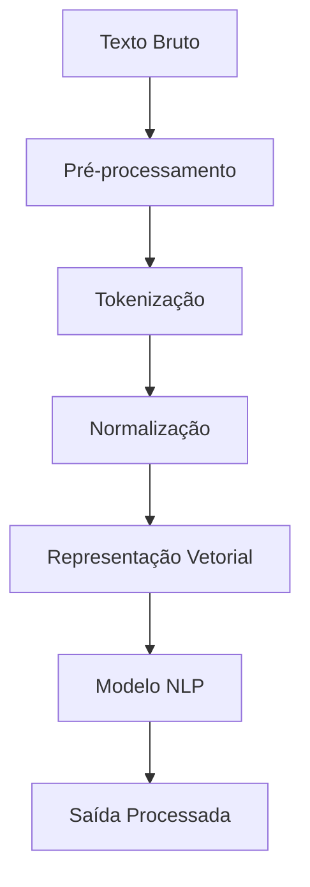
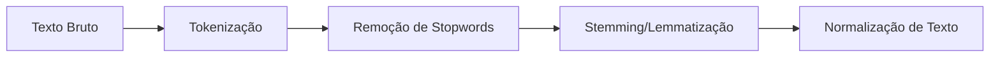
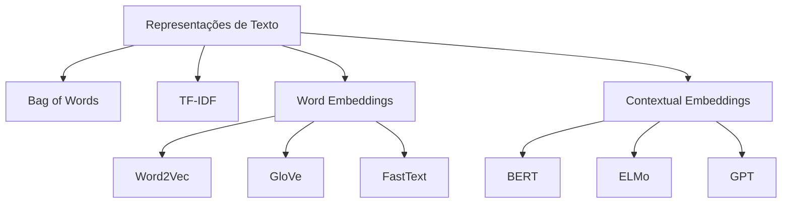
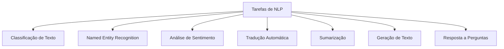
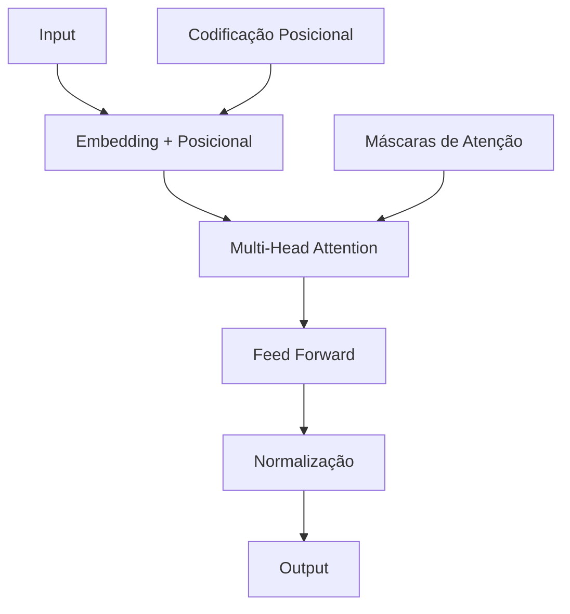
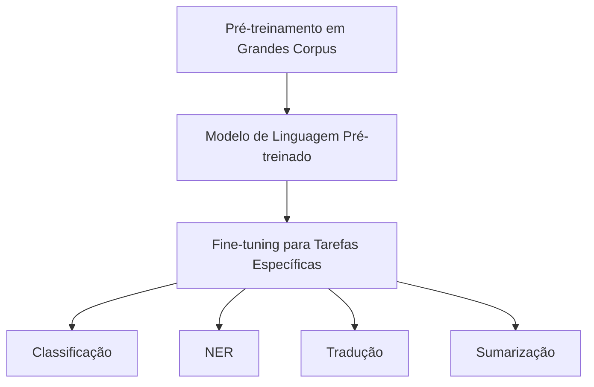
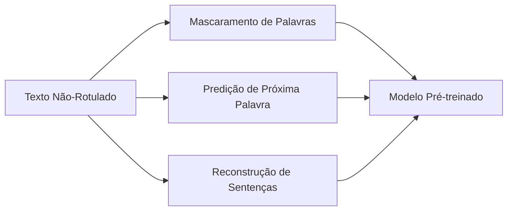
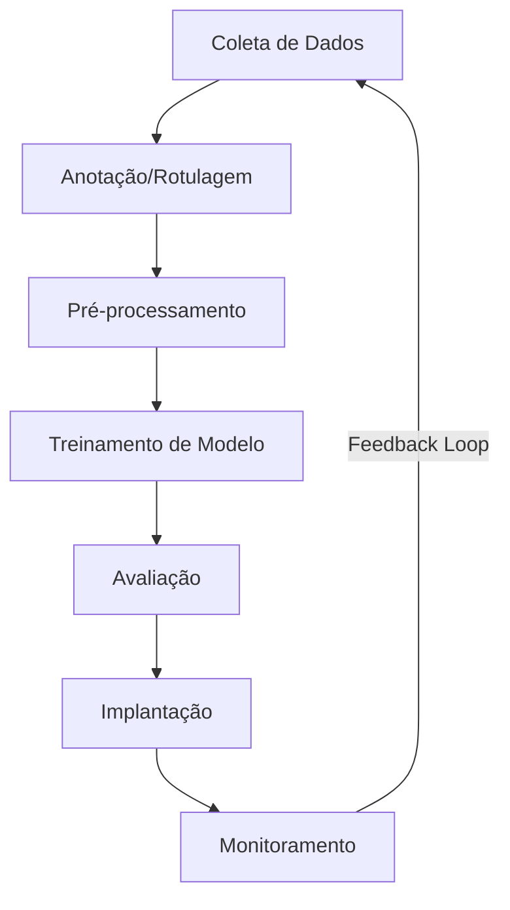

# 💬 NLP (Natural Language Processing)

O Processamento de Linguagem Natural (NLP) é um campo da inteligência artificial focado na interação entre computadores e linguagem humana, permitindo que máquinas entendam, interpretem e gerem texto de forma contextualmente relevante.

## 📑 Definição

NLP combina ciência da computação, linguística e aprendizado de máquina para desenvolver métodos e ferramentas que permitem aos computadores processar e entender a linguagem humana em suas formas escrita e falada. O objetivo é preencher a lacuna entre a comunicação humana e o entendimento computacional.

## 🔄 Como Funciona

## 🧩 Componentes Fundamentais

### 1. Pré-processamento Textual

- **Tokenização**: Dividir texto em unidades menores (palavras, frases, caracteres)
- **Remoção de Stopwords**: Eliminar palavras comuns de baixo valor semântico
- **Stemming/Lemmatização**: Reduzir palavras à sua forma base ou raiz
- **Normalização**: Converter para minúsculas, remover pontuação, tratar caracteres especiais

### 2. Representação de Texto

- **Bag of Words**: Contagem simples de ocorrências de palavras
- **TF-IDF**: Pondera a frequência de termos com sua importância no corpus
- **Word Embeddings**: Representa palavras como vetores densos capturando relações semânticas
- **Embeddings Contextuais**: Representações que variam conforme o contexto da palavra

### 3. Tarefas Básicas de NLP

## 🧠 Evolução dos Modelos de NLP

### Arquitetura Transformer

A arquitetura Transformer revolucionou o NLP com seu mecanismo de atenção, permitindo o processamento paralelo de sequências e capturando dependências de longo alcance.

## 🔧 Técnicas Avançadas

### Transfer Learning em NLP

### Aprendizado Auto-Supervisionado

## 🛠️ Ferramentas e Bibliotecas

- **NLTK**: Biblioteca clássica com ferramentas para diversas tarefas de NLP
- **spaCy**: Biblioteca focada em performance e uso prático
- **Transformers (Hugging Face)**: Implementações estado-da-arte de modelos transformer
- **Gensim**: Especializada em modelagem de tópicos e embeddings
- **Stanford NLP**: Conjunto de ferramentas para análise linguística profunda
- **fastText**: Biblioteca para aprendizado eficiente de representações de palavras

## 🔗 Casos de Uso

- [Chatbot para Atendimento ao Cliente](./use-case-customer-service-chatbot.md)
- [Sistema de Análise de Feedback de Usuários](./use-case-feedback-analysis.md)

## 🌟 Tendências Atuais

- **Modelos Multilíngues**: Capacidade de entender e gerar múltiplos idiomas
- **Alinhamento de Valores**: Garantir que modelos de linguagem atuem de acordo com valores humanos
- **Modelos Multimodais**: Integrando compreensão de texto, imagem, áudio e vídeo
- **Redução de Viés**: Métodos para identificar e mitigar preconceitos em modelos de linguagem
- **Eficiência Computacional**: Modelos menores com desempenho competitivo

## 🔍 Desafios Persistentes

- **Ambiguidade Linguística**: Interpretar nuances, sarcasmo, humor
- **Conhecimento de Mundo**: Incorporar conhecimento comum que humanos possuem naturalmente
- **Contextualização**: Manter contexto em conversas longas ou documentos extensos
- **Raciocínio**: Desenvolver capacidade de raciocínio lógico e causal
- **Generalização entre Idiomas**: Transferir conhecimento entre línguas diferentes
- **Avaliação**: Métricas que capturam genuinamente a qualidade de texto gerado

## 📊 Métricas de Avaliação

- **BLEU, ROUGE, METEOR**: Para tarefas de geração (tradução, sumarização)
- **Perplexidade**: Para avaliar modelos de linguagem
- **F1-Score, Precisão, Recall**: Para classificação e NER
- **GLUE/SuperGLUE**: Benchmarks para múltiplas tarefas de compreensão
- **Avaliação Humana**: Essencial para qualidade de geração e interação

## 🔄 Ciclo de Desenvolvimento NLP

1. **Coleta de Dados**: Reunir corpus relevante para o domínio
2. **Anotação**: Rotular dados para treinamento supervisionado
3. **Pré-processamento**: Limpar e preparar dados
4. **Treinamento**: Desenvolver e treinar modelos
5. **Avaliação**: Testar performance em métricas relevantes
6. **Implantação**: Integrar em ambiente de produção
7. **Monitoramento**: Acompanhar performance e coletar feedback

## 🌐 Impacto em Diversas Indústrias

- **Tecnologia**: Assistentes virtuais, chatbots, busca semântica
- **Saúde**: Extração de informações de prontuários, sumarização médica
- **Finanças**: Análise de sentimento de mercado, extração de informações de documentos financeiros
- **Legal**: Pesquisa jurídica, análise de contratos, revisão de documentos
- **Mídia**: Geração de conteúdo, detecção de notícias falsas, personalização
- **Educação**: Tutores virtuais, avaliação automatizada, adaptação de conteúdo