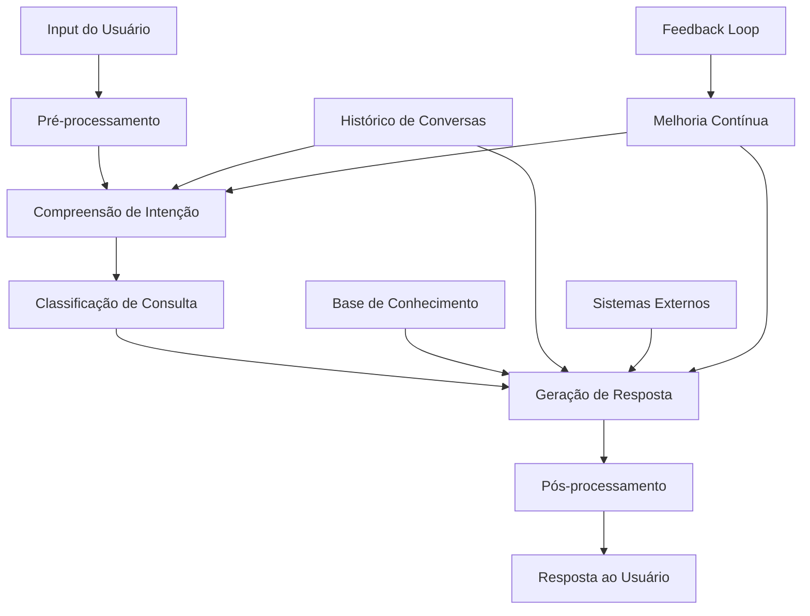
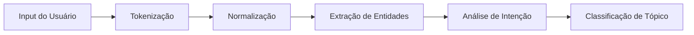
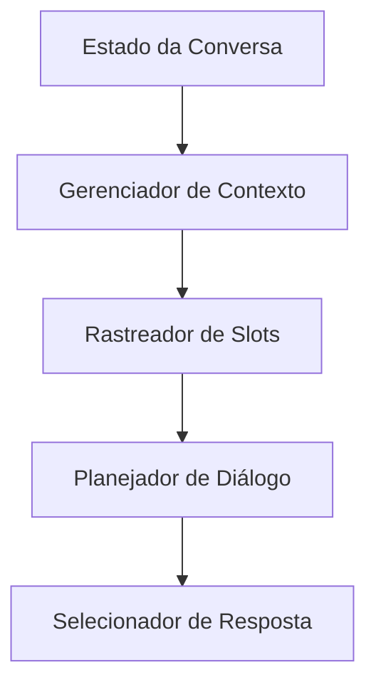
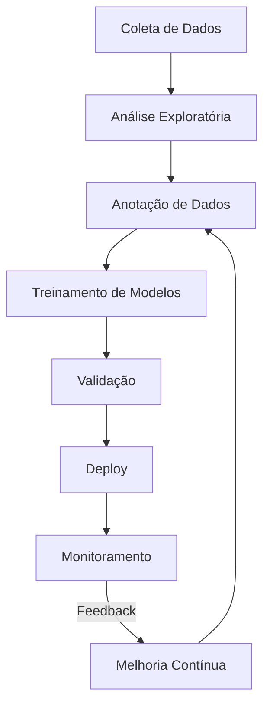
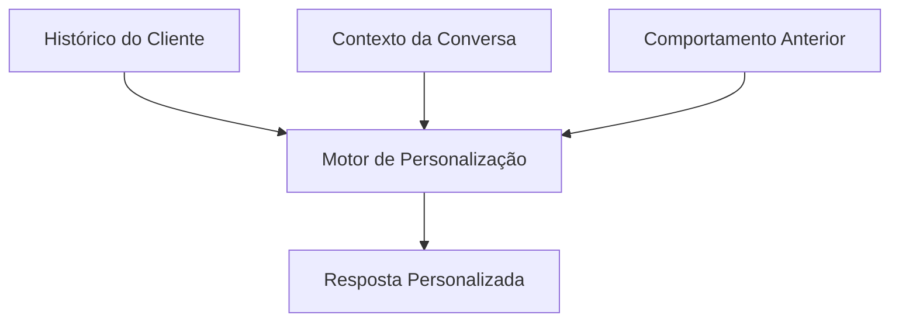
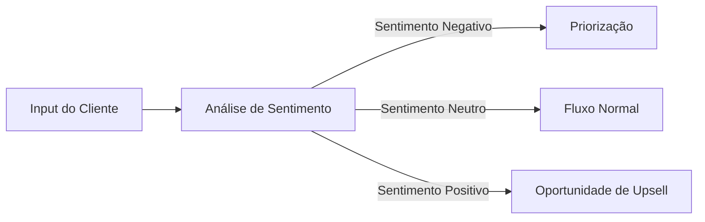
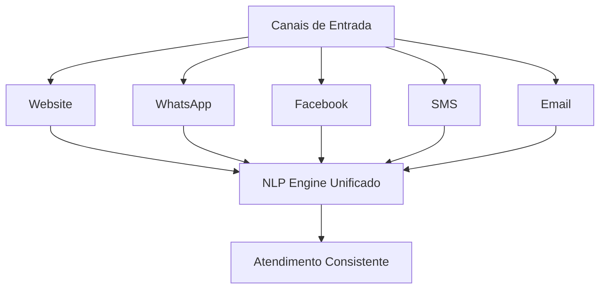

# 🤖 Caso de Uso: Chatbot para Atendimento ao Cliente

## 🎯 Objetivo

Desenvolver um chatbot inteligente baseado em técnicas modernas de NLP para automatizar e otimizar o atendimento ao cliente, fornecendo respostas precisas e contextuais, reduzindo o tempo de espera e melhorando a experiência do usuário.

## 🔍 Problema de Negócio

O atendimento ao cliente tradicional enfrenta desafios significativos:

- Longos tempos de espera para clientes
- Alto custo operacional de equipes de suporte humano
- Inconsistência nas respostas entre diferentes agentes
- Limitações de escala durante períodos de pico
- Dificuldade em oferecer suporte 24/7

Um chatbot com NLP avançado pode automatizar até 80% das consultas rotineiras, liberando agentes humanos para casos mais complexos e reduzindo custos operacionais significativamente.

## 📊 Dados Necessários

- Histórico de conversas entre clientes e atendentes
- Base de conhecimento da empresa (FAQs, manuais, políticas)
- Feedback de interações anteriores com chatbots
- Taxonomia de consultas e problemas comuns
- Fluxos de decisão para resolução de problemas

## 🛠️ Arquitetura do Sistema



### 1. Componentes Principais

#### Processamento de Linguagem Natural (NLP)



#### Gestão de Diálogo



### 2. Arquiteturas de Modelo

#### Intent Classification

- **Modelo BERT Fine-tuned**: Para classificar as intenções dos usuários em categorias predefinidas
- **FastText/Word Embeddings**: Para intents simples em dispositivos com recursos limitados

#### Entity Recognition

- **BiLSTM-CRF**: Para extração de dados específicos (nomes, produtos, números)
- **Spacy NER**: Para entidades padrão e personalizadas

#### Generation

- **Retrieval-Based**: Seleciona respostas apropriadas de um banco de dados
- **Generative Model (T5/GPT)**: Gera respostas dinamicamente baseadas no contexto

## 💻 Exemplo de Implementação

Vamos implementar um chatbot básico de atendimento ao cliente usando Rasa e BERT para compreensão de linguagem natural:

```python
import rasa
import torch
from transformers import BertTokenizer, BertForSequenceClassification
import numpy as np
import pandas as pd
from sklearn.model_selection import train_test_split

# Carregar dados de treinamento para classificação de intenções
data = pd.read_csv('customer_intents.csv')
intents = data['intent'].unique()
intent_to_id = {intent: i for i, intent in enumerate(intents)}

# Preparar tokenizador BERT
tokenizer = BertTokenizer.from_pretrained('bert-base-uncased')
max_len = 128

# Função para codificar texto para input BERT
def encode_text(texts, tokenizer, max_len):
    input_ids = []
    attention_masks = []
    
    for text in texts:
        encoded = tokenizer.encode_plus(
            text,
            add_special_tokens=True,
            max_length=max_len,
            padding='max_length',
            truncation=True,
            return_attention_mask=True,
            return_tensors='pt'
        )
        
        input_ids.append(encoded['input_ids'])
        attention_masks.append(encoded['attention_mask'])
    
    return torch.cat(input_ids, dim=0), torch.cat(attention_masks, dim=0)

# Dividir em treino e teste
train_texts, test_texts, train_labels, test_labels = train_test_split(
    data['text'].values, 
    data['intent'].map(intent_to_id).values,
    test_size=0.2,
    random_state=42
)

# Codificar textos
train_inputs, train_masks = encode_text(train_texts, tokenizer, max_len)
test_inputs, test_masks = encode_text(test_texts, tokenizer, max_len)

# Preparar datasets
train_labels = torch.tensor(train_labels)
test_labels = torch.tensor(test_labels)

from torch.utils.data import TensorDataset, DataLoader, RandomSampler, SequentialSampler

batch_size = 16

train_data = TensorDataset(train_inputs, train_masks, train_labels)
train_sampler = RandomSampler(train_data)
train_dataloader = DataLoader(train_data, sampler=train_sampler, batch_size=batch_size)

test_data = TensorDataset(test_inputs, test_masks, test_labels)
test_sampler = SequentialSampler(test_data)
test_dataloader = DataLoader(test_data, sampler=test_sampler, batch_size=batch_size)

# Configurar modelo BERT para classificação
model = BertForSequenceClassification.from_pretrained(
    'bert-base-uncased',
    num_labels=len(intents),
    output_attentions=False,
    output_hidden_states=False,
)

# Treinar o modelo (código simplificado para brevidade)
optimizer = torch.optim.AdamW(model.parameters(), lr=2e-5)

# Função para treinar o modelo
def train_model(model, dataloader, optimizer, device='cpu', epochs=4):
    model.train()
    for epoch in range(epochs):
        for batch in dataloader:
            batch = tuple(t.to(device) for t in batch)
            b_input_ids, b_input_mask, b_labels = batch
            
            model.zero_grad()
            outputs = model(
                b_input_ids, 
                token_type_ids=None, 
                attention_mask=b_input_mask, 
                labels=b_labels
            )
            
            loss = outputs.loss
            loss.backward()
            optimizer.step()
            
    return model

# Treinar modelo (simulado)
# model = train_model(model, train_dataloader, optimizer)

# Integração com Rasa para o fluxo completo do chatbot
# (Este é um esboço simplificado - uma implementação real exigiria mais código)

# Função para classificar intenções do usuário
def predict_intent(text, model, tokenizer, intent_id_to_name, device='cpu'):
    model.eval()
    encoded_text = tokenizer.encode_plus(
        text,
        add_special_tokens=True,
        max_length=128,
        padding='max_length',
        truncation=True,
        return_attention_mask=True,
        return_tensors='pt'
    )
    
    input_ids = encoded_text['input_ids'].to(device)
    attention_mask = encoded_text['attention_mask'].to(device)
    
    with torch.no_grad():
        outputs = model(input_ids, attention_mask=attention_mask)
    
    logits = outputs.logits
    intent_id = torch.argmax(logits, dim=1).item()
    
    return intent_id_to_name[intent_id]

# Exemplo de uso com Rasa
from rasa.nlu.model import Interpreter

# Em uma implementação real, você usaria:
# interpreter = Interpreter.load("./models/nlu")

# Função simulada do fluxo do chatbot
def process_message(message, model, tokenizer, intent_map, response_templates):
    # 1. Detectar intenção
    intent = predict_intent(message, model, tokenizer, intent_map)
    
    # 2. Extrair entidades (simplificado)
    entities = extract_entities(message)
    
    # 3. Determinar próxima ação com base na intenção e entidades
    action = determine_action(intent, entities)
    
    # 4. Gerar resposta
    response = generate_response(action, entities, response_templates)
    
    return response

# Função de geração de resposta simples usando templates
def generate_response(action, entities, templates):
    if action in templates:
        response_template = templates[action]
        
        # Substituir placeholders de entidades
        for entity, value in entities.items():
            placeholder = f"{{{entity}}}"
            if placeholder in response_template:
                response_template = response_template.replace(placeholder, value)
        
        return response_template
    else:
        return "Desculpe, não entendi completamente. Poderia reformular sua pergunta?"
```

## 📈 Ciclo de Desenvolvimento



## 📊 Métricas de Avaliação

- **Acurácia de Intenção**: Precisão na identificação da intenção do usuário
- **Taxa de Fallback**: Frequência com que o chatbot não consegue entender
- **Tempo de Resolução**: Duração média para resolver uma consulta
- **CSAT/NPS**: Satisfação do cliente após interação com chatbot
- **Taxa de Transferência para Humano**: % de conversas transferidas para agentes humanos
- **Self-Service Rate**: % de interações resolvidas sem intervenção humana

## 🌟 Recursos Avançados

### Personalização Contextual



### Análise de Sentimento



### Integração Omnichannel



## 🌐 Aplicações em Diferentes Setores

### E-commerce & Varejo
- Consultas sobre pedidos e status de entrega
- Recomendações de produtos personalizadas
- Assistência em checkout e pagamentos
- Retornos e trocas automatizadas

### Serviços Financeiros
- Consultas de saldo e transações
- Alertas de segurança e detecção de fraudes
- Orientação financeira básica
- Suporte para aplicativos bancários

### Telecomunicações
- Solução de problemas técnicos
- Suporte à instalação
- Informações sobre planos e serviços
- Gerenciamento de conta e cobranças

## 🔍 Considerações Importantes

### Privacidade e Segurança
- Tratamento adequado de dados pessoais (LGPD/GDPR)
- Autenticação para acesso a informações sensíveis
- Criptografia de dados em trânsito e armazenados
- Retenção limitada de conversas

### Design Ético
- Transparência sobre natureza não-humana
- Escalação para humanos quando necessário
- Evitar linguagem que manipule emoções
- Monitoramento para prevenção de viés

### Limitações e Backup
- Plano para situações de alto volume
- Protocolo para falhas técnicas
- Alternativas quando o chatbot não consegue resolver
- Treinamento de agentes para transições suaves

## 📈 Resultados Esperados

- Redução de 30-50% nos custos de atendimento ao cliente
- Aumento de 15-25% na satisfação do cliente (CSAT)
- Suporte 24/7 sem aumento proporcional de custos
- Diminuição de 40-60% no tempo médio de resposta
- Escalabilidade para picos de demanda sem degradação de serviço