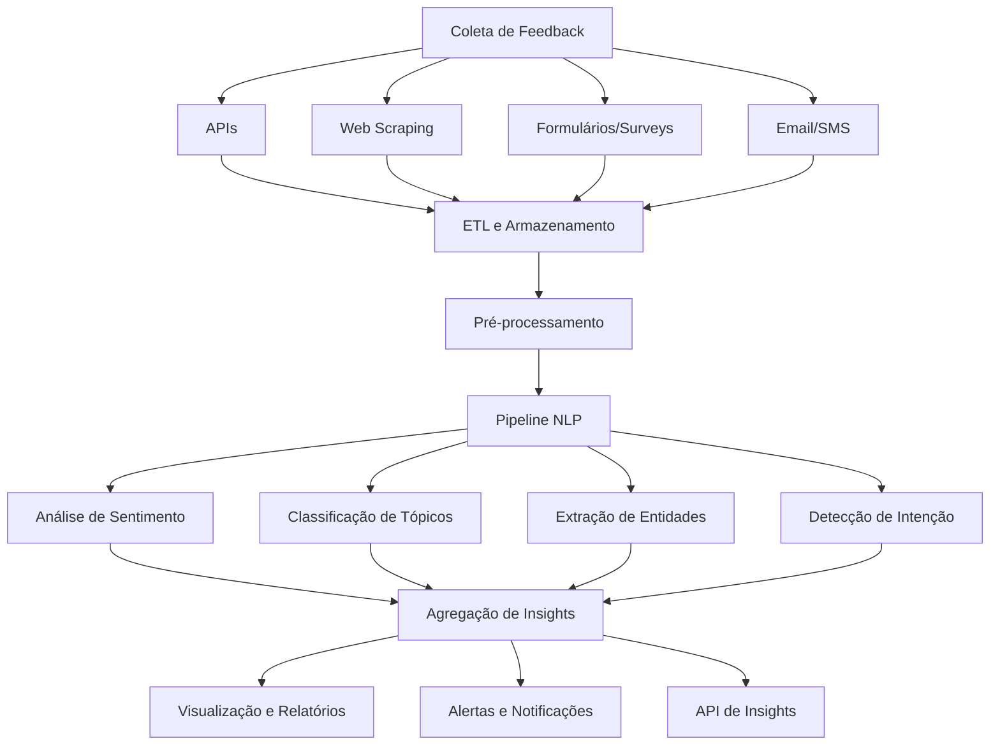
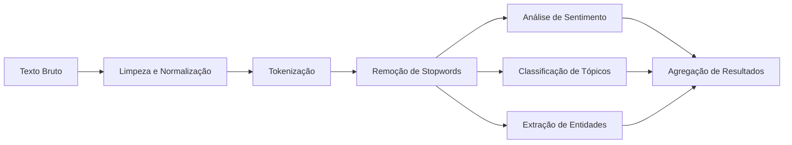
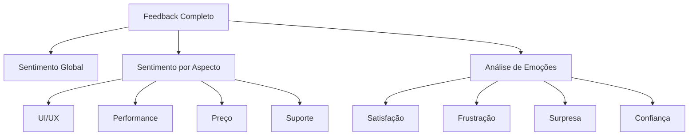
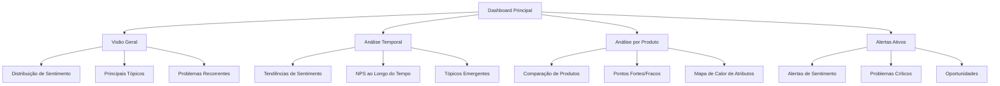
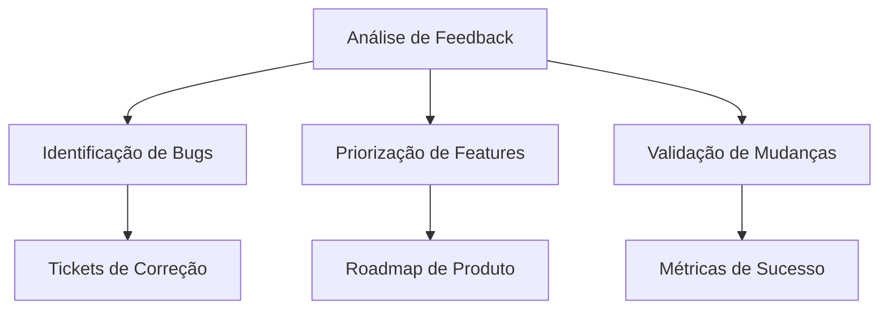
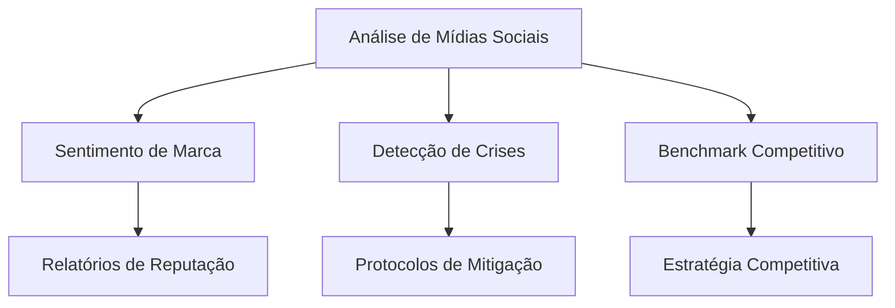
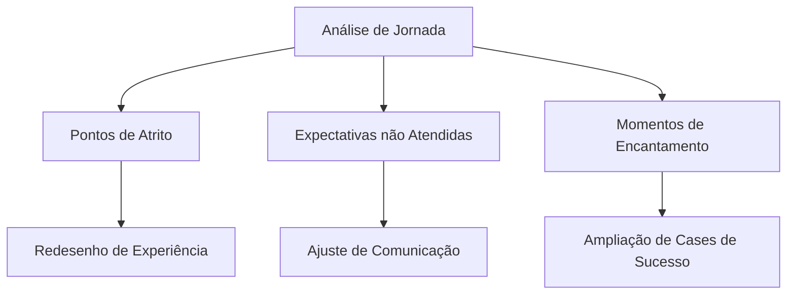
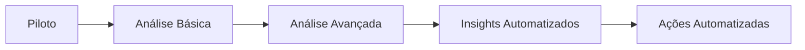

# 📊 Caso de Uso: Sistema de Análise de Feedback de Usuários

## 🎯 Objetivo

Desenvolver um sistema de análise de feedback baseado em NLP capaz de processar e extrair insights valiosos de grandes volumes de comentários, avaliações e feedback de usuários, permitindo que as empresas identifiquem padrões, problemas e oportunidades de melhoria em seus produtos e serviços.

## 🔍 Problema de Negócio

As empresas enfrentam desafios significativos ao lidar com feedback de usuários:

- Volume massivo de comentários em múltiplos canais
- Dificuldade em identificar tendências e padrões manualmente
- Atraso entre o recebimento do feedback e a implementação de melhorias
- Inconsistência na categorização e priorização de problemas
- Necessidade de contextualização para tomada de decisão

Um sistema de análise de feedback baseado em NLP pode transformar dados não estruturados em insights acionáveis, identificando problemas emergentes, rastreando sentimentos dos clientes e informando decisões estratégicas em tempo quase real.

## 📊 Dados Necessários

- Avaliações e comentários de usuários de produtos/serviços
- Feedback de atendimento ao cliente
- Menções em mídias sociais e fóruns
- Respostas a pesquisas de satisfação
- Dados de contexto (versão do produto, segmento do cliente, data)

## 🛠️ Arquitetura do Sistema



### 1. Componentes Principais

#### Pipeline de Processamento NLP



#### Análise de Sentimento Multinível



### 2. Técnicas de NLP Aplicadas

#### Classificação de Tópicos

Identificar os principais assuntos mencionados no feedback:

- **Modelos supervisionados**: Classificação em categorias predefinidas
- **Modelagem de Tópicos (LDA, NMF)**: Descoberta não supervisionada de temas
- **Transformers Fine-tuned**: Para classificação multi-label com contexto

#### Análise de Sentimento

Determinar a polaridade e intensidade emocional do feedback:

- **Lexicon-based**: Utilizando dicionários de palavras com pontuações de sentimento
- **Modelos de Machine Learning**: SVM, Naive Bayes para classificação simples
- **Deep Learning**: BERT, RoBERTa para análise contextual e nuances

#### Named Entity Recognition (NER)

Extrair menções específicas a produtos, recursos, pessoas ou eventos:

- **Modelos CRF/BiLSTM**: Para entidades padrão
- **BERT-NER customizado**: Para entidades específicas do domínio
- **Few-shot learning**: Para adaptação rápida a novos tipos de entidades

## 💻 Exemplo de Implementação

```python
import pandas as pd
import numpy as np
import matplotlib.pyplot as plt
import seaborn as sns
from sklearn.model_selection import train_test_split
from sklearn.metrics import classification_report, confusion_matrix

# NLP Libraries
import nltk
from nltk.corpus import stopwords
from nltk.tokenize import word_tokenize
from nltk.stem import WordNetLemmatizer
import spacy
from transformers import pipeline, AutoModelForSequenceClassification, AutoTokenizer
import torch

# Carregar dataset de exemplo (avaliações de produtos)
df = pd.read_csv('product_reviews.csv')
print(f"Total de avaliações: {len(df)}")

# Pré-processamento de texto
nltk.download('stopwords')
nltk.download('punkt')
nltk.download('wordnet')

stop_words = set(stopwords.words('portuguese'))
lemmatizer = WordNetLemmatizer()

def preprocess_text(text):
    if isinstance(text, str):
        # Tokenização
        tokens = word_tokenize(text.lower())
        # Remover stopwords e pontuação
        tokens = [t for t in tokens if t.isalpha() and t not in stop_words]
        # Lemmatização
        tokens = [lemmatizer.lemmatize(t) for t in tokens]
        return ' '.join(tokens)
    return ''

# Aplicar pré-processamento
df['processed_text'] = df['review_text'].apply(preprocess_text)

# Carregando modelos pré-treinados para análise de sentimento
sentiment_model_name = "neuralmind/bert-base-portuguese-cased"
tokenizer = AutoTokenizer.from_pretrained(sentiment_model_name)
model = AutoModelForSequenceClassification.from_pretrained(sentiment_model_name, num_labels=3)  # Positivo, Neutro, Negativo

# Configurar pipeline de análise de sentimento
sentiment_analyzer = pipeline(
    "sentiment-analysis",
    model=model,
    tokenizer=tokenizer,
    return_all_scores=True
)

# Função para análise de sentimento
def analyze_sentiment(text):
    if not text or not isinstance(text, str):
        return {"positive": 0, "neutral": 0.5, "negative": 0.5}
    
    try:
        result = sentiment_analyzer(text)
        scores = result[0]
        return {score['label']: score['score'] for score in scores}
    except Exception as e:
        print(f"Erro na análise de sentimento: {e}")
        return {"positive": 0, "neutral": 0.5, "negative": 0.5}

# Aplicar análise de sentimento (em amostra para demonstração)
sample_size = min(1000, len(df))
df_sample = df.sample(sample_size, random_state=42)
sentiments = df_sample['processed_text'].apply(analyze_sentiment)

# Extrair scores para análise
df_sample['sentiment_positive'] = sentiments.apply(lambda x: x.get('positive', 0))
df_sample['sentiment_neutral'] = sentiments.apply(lambda x: x.get('neutral', 0))
df_sample['sentiment_negative'] = sentiments.apply(lambda x: x.get('negative', 0))
df_sample['sentiment_label'] = df_sample[['sentiment_positive', 'sentiment_neutral', 'sentiment_negative']].idxmax(axis=1).apply(lambda x: x.replace('sentiment_', ''))

# Modelagem de tópicos usando LDA
from sklearn.feature_extraction.text import CountVectorizer
from sklearn.decomposition import LatentDirichletAllocation

# Preparar vectorizer
vectorizer = CountVectorizer(max_df=0.95, min_df=2, max_features=1000)
X = vectorizer.fit_transform(df_sample['processed_text'])

# Treinar modelo LDA
n_topics = 5
lda = LatentDirichletAllocation(n_components=n_topics, random_state=42)
lda.fit(X)

# Função para exibir os principais termos por tópico
def display_topics(model, feature_names, n_top_words):
    topics = {}
    for topic_idx, topic in enumerate(model.components_):
        top_words = [feature_names[i] for i in topic.argsort()[:-n_top_words - 1:-1]]
        topics[f"Topic {topic_idx+1}"] = top_words
    return topics

# Extrair os principais termos por tópico
feature_names = vectorizer.get_feature_names_out()
topics = display_topics(lda, feature_names, 10)

# Atribuir tópicos aos documentos
topic_assignments = lda.transform(X)
df_sample['primary_topic'] = np.argmax(topic_assignments, axis=1) + 1

# Extrair entidades nomeadas usando spaCy
nlp = spacy.load('pt_core_news_sm')

def extract_entities(text):
    if not isinstance(text, str) or not text:
        return []
    
    doc = nlp(text)
    entities = []
    for ent in doc.ents:
        entities.append({
            'text': ent.text,
            'label': ent.label_,
            'start': ent.start_char,
            'end': ent.end_char
        })
    return entities

# Aplicar extração de entidades (amostra para demonstração)
small_sample = df_sample.head(100)
small_sample['entities'] = small_sample['review_text'].apply(extract_entities)

# Agregação e análise exploratória
topic_sentiment = df_sample.groupby('primary_topic')['sentiment_label'].value_counts().unstack().fillna(0)
topic_sentiment_pct = topic_sentiment.div(topic_sentiment.sum(axis=1), axis=0) * 100

# Análise de tendências temporais
if 'review_date' in df_sample.columns:
    df_sample['review_date'] = pd.to_datetime(df_sample['review_date'])
    df_sample['month_year'] = df_sample['review_date'].dt.to_period('M')
    temporal_sentiment = df_sample.groupby('month_year')['sentiment_label'].value_counts().unstack().fillna(0)
    
    # Cálculo de Net Promoter Score (NPS) ao longo do tempo
    def classify_sentiment(row):
        if row['sentiment_positive'] > 0.6:
            return 'Promoter'
        elif row['sentiment_negative'] > 0.6:
            return 'Detractor'
        else:
            return 'Passive'
    
    df_sample['nps_category'] = df_sample.apply(classify_sentiment, axis=1)
    nps_over_time = df_sample.groupby('month_year')['nps_category'].value_counts().unstack().fillna(0)
    
    # Cálculo do NPS
    nps_over_time['NPS'] = ((nps_over_time['Promoter'] - nps_over_time['Detractor']) / 
                            (nps_over_time['Promoter'] + nps_over_time['Passive'] + nps_over_time['Detractor'])) * 100

# Análise de co-ocorrência de tópicos e entidades
if 'entities' in small_sample.columns:
    entity_topic_cooccurrence = pd.DataFrame()
    for idx, row in small_sample.iterrows():
        for entity in row['entities']:
            entity_topic_cooccurrence = entity_topic_cooccurrence.append({
                'topic': row['primary_topic'],
                'entity_text': entity['text'],
                'entity_type': entity['label'],
                'sentiment': row['sentiment_label']
            }, ignore_index=True)
    
    # Análise de entidades mais mencionadas por tópico
    entity_counts = entity_topic_cooccurrence.groupby(['topic', 'entity_text']).size().reset_index(name='count')
    top_entities_per_topic = entity_counts.sort_values(['topic', 'count'], ascending=[True, False]).groupby('topic').head(5)

# Dashboard para visualização (exemplo simplificado)
def create_dashboard():
    fig, axes = plt.subplots(2, 2, figsize=(15, 12))
    
    # Distribuição geral de sentimentos
    sentiment_counts = df_sample['sentiment_label'].value_counts()
    axes[0, 0].pie(sentiment_counts, labels=sentiment_counts.index, autopct='%1.1f%%', startangle=90)
    axes[0, 0].set_title('Distribuição de Sentimentos')
    
    # Sentimento por tópico
    topic_sentiment_pct.plot(kind='bar', stacked=True, ax=axes[0, 1])
    axes[0, 1].set_title('Sentimento por Tópico')
    axes[0, 1].set_ylabel('Porcentagem')
    
    # Palavras mais comuns por tópico
    topic_idx = 1  # Escolher um tópico para visualizar
    topic_words = topics[f"Topic {topic_idx}"]
    axes[1, 0].barh(range(len(topic_words)), [1] * len(topic_words))
    axes[1, 0].set_yticks(range(len(topic_words)))
    axes[1, 0].set_yticklabels(topic_words)
    axes[1, 0].set_title(f'Palavras Principais - Tópico {topic_idx}')
    
    # Evolução temporal do sentimento (se disponível)
    if 'temporal_sentiment' in locals():
        temporal_sentiment.plot(ax=axes[1, 1])
        axes[1, 1].set_title('Evolução do Sentimento ao Longo do Tempo')
        axes[1, 1].set_ylabel('Número de Reviews')
    
    plt.tight_layout()
    plt.savefig('feedback_dashboard.png')
    plt.close()

# Implementação de alertas automáticos
def generate_alerts(df, threshold=0.7):
    alerts = []
    
    # Alerta para aumento significativo de sentimento negativo
    recent_data = df[df['review_date'] >= (df['review_date'].max() - pd.Timedelta(days=7))]
    if recent_data['sentiment_negative'].mean() > threshold:
        topics = recent_data[recent_data['sentiment_label'] == 'negative']['primary_topic'].value_counts().index[0]
        alerts.append({
            'type': 'HIGH_NEGATIVE_SENTIMENT',
            'description': f'Aumento significativo de sentimento negativo detectado nos últimos 7 dias, principalmente relacionado ao Tópico {topics}',
            'severity': 'HIGH'
        })
    
    # Alerta para tópicos emergentes
    topic_growth = df.groupby(['month_year', 'primary_topic']).size().unstack().fillna(0).pct_change().iloc[-1]
    growing_topics = topic_growth[topic_growth > 0.3].index.tolist()
    
    if growing_topics:
        for topic in growing_topics:
            alerts.append({
                'type': 'EMERGING_TOPIC',
                'description': f'Crescimento rápido detectado no Tópico {topic}',
                'severity': 'MEDIUM'
            })
    
    return alerts

# Exemplo de uso do sistema completo
def main():
    # Pré-processar dados
    preprocessed_data = preprocess_feedback_data()
    
    # Analisar sentimentos
    sentiment_results = analyze_sentiments(preprocessed_data)
    
    # Classificar tópicos
    topic_results = classify_topics(preprocessed_data)
    
    # Extrair entidades
    entity_results = extract_named_entities(preprocessed_data)
    
    # Agregar resultados
    insights = aggregate_results(sentiment_results, topic_results, entity_results)
    
    # Gerar visualizações
    create_visualizations(insights)
    
    # Configurar alertas
    alerts = configure_alerts(insights)
    
    # Exportar resultados para dashboard
    export_to_dashboard(insights, alerts)
    
    return insights, alerts
```

## 📊 Visualizações e Dashboards

### Exemplo de Dashboard de Feedback



## 📈 Métricas de Avaliação

- **Acurácia do Sentimento**: Comparação com avaliação humana
- **Cobertura de Tópicos**: % de feedback corretamente categorizado
- **Recall de Entidades**: % de menções importantes identificadas
- **Tempo de Processamento**: Latência entre recebimento e análise
- **Efetividade de Alerta**: Taxa de falsos positivos/negativos
- **Impacto nos Negócios**: Melhoria em métricas de produto após ação

## 🌟 Casos de Uso Específicos

### Desenvolvimento de Produto



### Monitoramento de Marca e Reputação



### Melhoria de Experiência do Cliente



## 🔍 Considerações Importantes

### Privacidade e Ética

- Anonimização de dados pessoais antes da análise
- Consentimento claro para uso de feedback em análises
- Implementação de políticas de retenção de dados
- Transparência sobre uso de feedback para melhorias

### Limitações Técnicas

- Desafios com idiomas de baixos recursos
- Dificuldade com linguagem altamente específica de domínio
- Interpretação incorreta de sarcasmo e expressões idiomáticas
- Viés em modelos pré-treinados

### Implementação Gradual



1. **Piloto**: Começar com escopo limitado e validar com análise manual
2. **Análise Básica**: Implementar sentimento e tópicos simples
3. **Análise Avançada**: Adicionar entidades e relações complexas
4. **Insights Automatizados**: Gerar recomendações baseadas em padrões
5. **Ações Automatizadas**: Fechar o ciclo com ações diretas baseadas em feedback

## 📈 Resultados Esperados

- Redução de 70-80% no tempo para identificar problemas críticos
- Aumento de 40-50% na capacidade de processamento de feedback
- Melhoria de 20-30% na precisão de categorização de problemas
- Economia de 30-40% em recursos de análise manual
- ROI significativo através de correções mais rápidas e melhorias priorizadas

## 🔗 Integração com Outros Sistemas

- **CRM**: Enriquecer perfis de clientes com sentimentos e preferências
- **Sistemas de Ticketing**: Criar e priorizar tickets automaticamente
- **Ferramentas de Product Management**: Alimentar decisões de roadmap
- **Business Intelligence**: Fornecer KPIs e métricas sobre satisfação
- **Sistemas de Marketing**: Informar campanhas baseadas em sentimentos