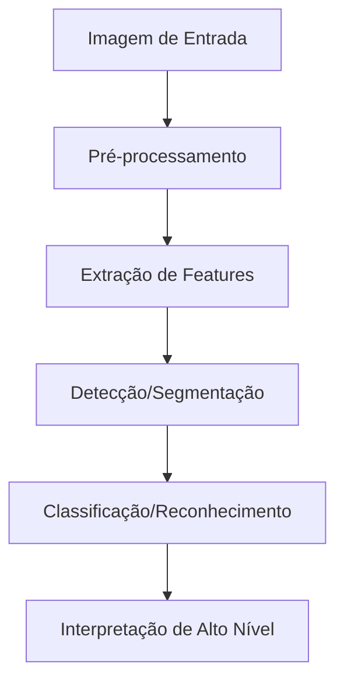
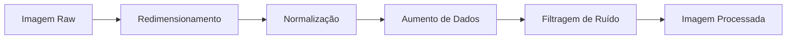
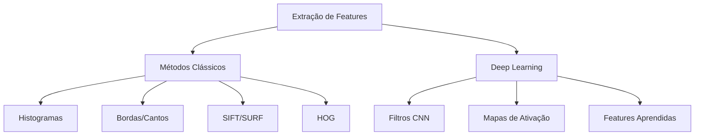
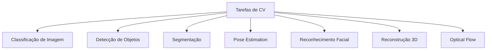
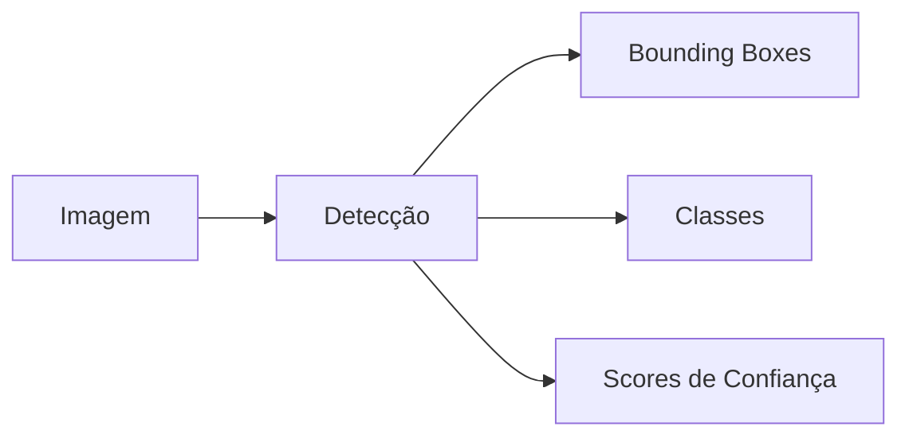
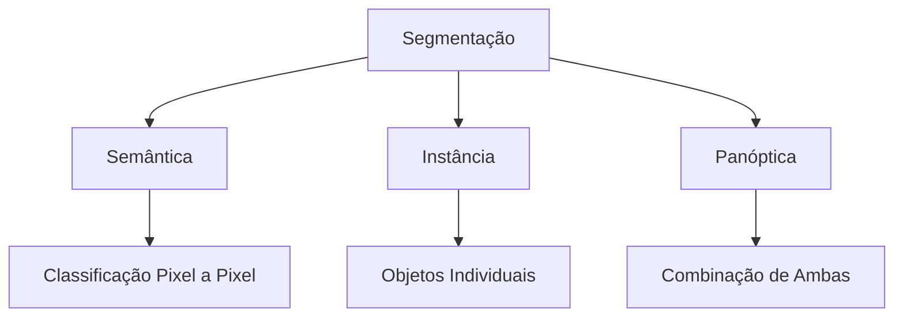
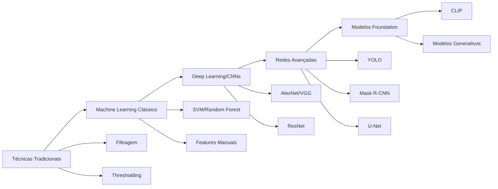
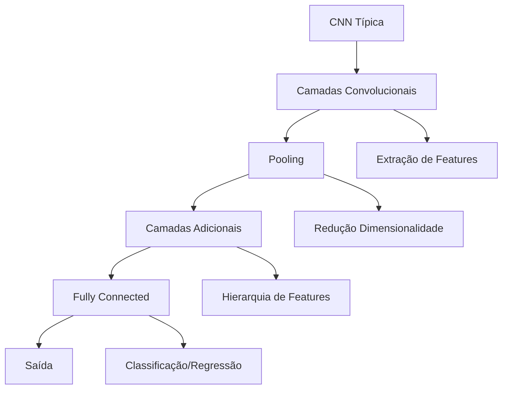
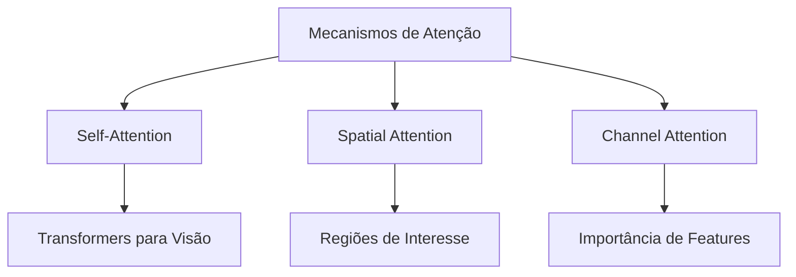
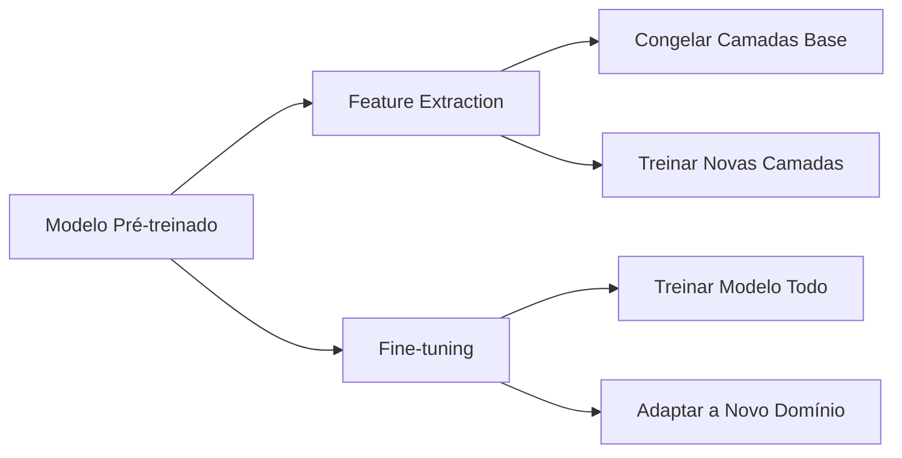

# 👁️ Computer Vision

Computer Vision (CV) é um campo da Inteligência Artificial que treina computadores para interpretar e compreender o mundo visual, permitindo que máquinas extraiam informações significativas de imagens e vídeos.

## 📑 Definição

Computer Vision é a ciência e tecnologia que permite que computadores ganhem compreensão de alto nível a partir de imagens ou vídeos digitais. O objetivo é automatizar tarefas que o sistema visual humano pode realizar, desde a simples detecção de objetos até a compreensão de cenas complexas e contextos visuais.

## 🔄 Como Funciona

## 🧩 Componentes Fundamentais

### 1. Pré-processamento de Imagem

- **Redimensionamento**: Ajustar dimensões para processamento eficiente
- **Normalização**: Padronizar valores de pixel para melhorar convergência
- **Aumento de Dados**: Gerar variações sintéticas para melhorar generalização
- **Filtragem**: Remover ruído e destacar características relevantes

### 2. Extração de Features

### 3. Principais Tarefas de Computer Vision

#### Classificação de Imagem
Atribui uma ou mais labels a uma imagem inteira.

#### Detecção de Objetos
Localiza e classifica múltiplos objetos em uma imagem.

#### Segmentação
Divide a imagem em regiões significativas.

## 🧠 Evolução dos Modelos de CV

### Arquiteturas de CNN

## 🔧 Técnicas Avançadas

### Redes Neurais com Atenção para CV

### Transfer Learning

## 🛠️ Frameworks e Bibliotecas

- **OpenCV**: Biblioteca abrangente para processamento de imagem e tarefas de CV
- **TensorFlow/Keras**: Treinamento e implantação de modelos de deep learning para CV
- **PyTorch/torchvision**: Ferramentas flexíveis para pesquisa e desenvolvimento em CV
- **Detectron2**: Framework focado em detecção de objetos e segmentação
- **YOLO**: Family of real-time object detection models
- **SimpleCV**: Biblioteca simplificada para tarefas comuns de visão computacional

## 🔗 Casos de Uso

- [Reconhecimento Facial para Autenticação](./use-case-facial-recognition.md)
- [Inspeção Visual Automatizada na Indústria](./use-case-industrial-inspection.md)

## 🌟 Tendências Recentes

- **Modelos Vision-Language**: Integrando compreensão visual e linguística (CLIP, DALL-E)
- **Self-Supervised Learning**: Reduzindo dependência de dados rotulados
- **NeRF (Neural Radiance Fields)**: Representações 3D implícitas a partir de imagens 2D
- **Efficient CV**: Modelos leves para dispositivos móveis e edge computing
- **CV + Reinforcement Learning**: Para robótica e navegação autônoma

## 🔍 Desafios Persistentes

- **Robustez a Variações**: Iluminação, perspectiva, oclusão, etc.
- **Generalização**: Desempenho consistente em diferentes domínios e condições
- **Explicabilidade**: Compreensão das decisões tomadas por modelos de CV
- **Eficiência Computacional**: Equilíbrio entre precisão e requisitos de recursos
- **Dados Limitados**: Aprendizado eficaz com poucos exemplos rotulados