# 👤 Caso de Uso: Reconhecimento Facial para Autenticação

## 🎯 Objetivo

Desenvolver um sistema de reconhecimento facial robusto e seguro para autenticação de usuários em aplicações que demandam alta segurança, combinando precisão, usabilidade e proteção contra tentativas de fraude.

## 🔍 Problema de Negócio

Os métodos tradicionais de autenticação apresentam várias limitações:

- Senhas podem ser esquecidas, roubadas ou compartilhadas
- Tokens físicos podem ser perdidos ou clonados
- PINs são vulneráveis a observadores mal-intencionados
- Muitos métodos biométricos exigem hardware especializado

O reconhecimento facial oferece uma alternativa biométrica não-intrusiva que pode ser implementada com hardware comum (câmeras), proporcionando um equilíbrio entre segurança e conveniência, especialmente quando combinado com outras estratégias de autenticação em um sistema multifator.

## 📊 Dados Necessários

- Imagens faciais de alta qualidade para treinamento
- Múltiplas poses e condições de iluminação por pessoa
- Dataset diversificado em termos de idade, gênero e etnia
- Imagens com diferentes expressões faciais
- Dados para casos de detecção de falsificação (liveness detection)

## 🛠️ Arquitetura de Sistema

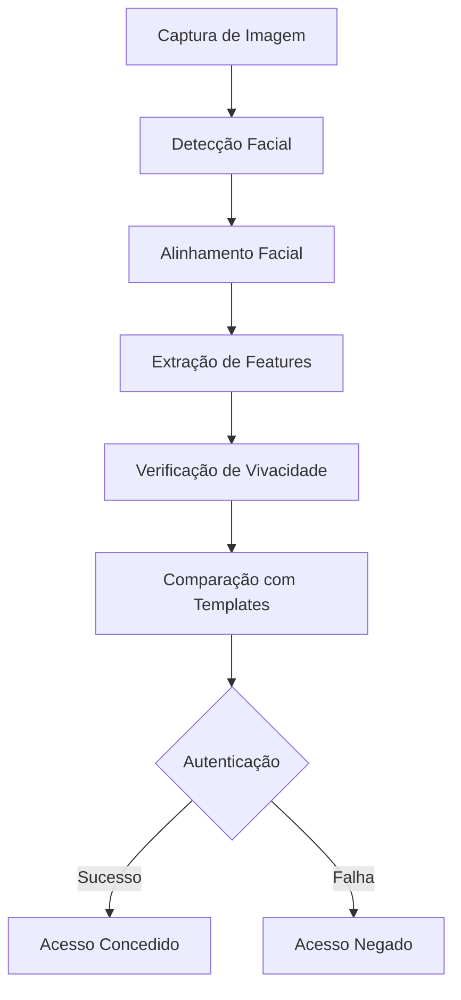

### 1. Pipeline de Processamento

#### Detecção Facial

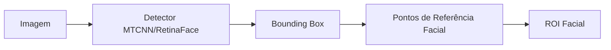

Primeiro, localizamos a face na imagem utilizando detectores especializados.

#### Alinhamento e Pré-processamento

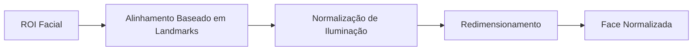

O alinhamento garante que diferenças de pose não afetem o reconhecimento.

#### Extração de Features

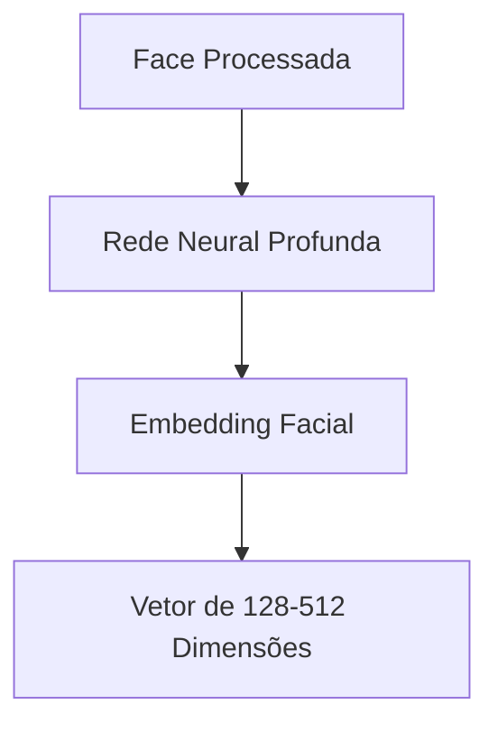

Um modelo de deep learning transforma a imagem facial em um vetor de características compacto (embedding).

### 2. Modelos de Aprendizado Profundo para Reconhecimento Facial

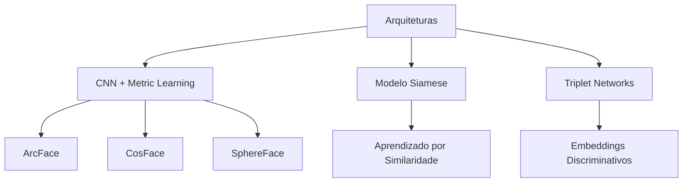

#### Funções de Perda Especializadas

- **Triplet Loss**: Minimiza a distância entre faces da mesma pessoa e maximiza entre pessoas diferentes
- **ArcFace/CosFace**: Introduz margens angulares para melhorar a discriminação entre classes
- **Center Loss**: Penaliza a variação intra-classe para features mais compactas

### 3. Verificação de Vivacidade (Liveness Detection)

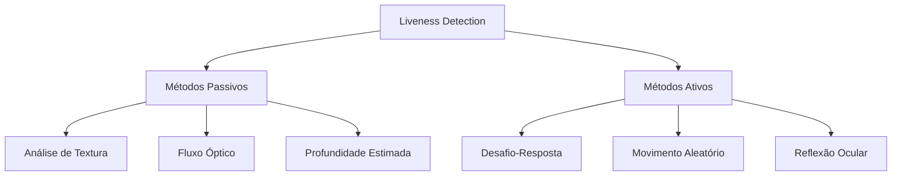

Essencial para detectar tentativas de fraude usando fotos, vídeos ou máscaras.

## 💻 Exemplo de Implementação

```python
import cv2
import numpy as np
import tensorflow as tf
from mtcnn import MTCNN
from tensorflow.keras.models import load_model
import dlib

# Carregar modelos pré-treinados
detector = MTCNN()
facenet_model = load_model('facenet_keras.h5')
shape_predictor = dlib.shape_predictor('shape_predictor_68_face_landmarks.dat')
liveness_model = load_model('liveness_detection.h5')

# Função para detecção facial usando MTCNN
def detect_face(image):
    results = detector.detect_faces(image)
    if not results:
        return None, None
    
    # Extrair bounding box com margem
    x, y, w, h = results[0]['box']
    x, y = max(0, x), max(0, y)
    face = image[y:y+h, x:x+w]
    
    # Extrair landmarks faciais
    landmarks = results[0]['keypoints']
    
    return face, landmarks

# Função para alinhar face usando landmarks
def align_face(image, landmarks):
    # Converter imagem para formato dlib
    img_dlib = cv2.cvtColor(image, cv2.COLOR_BGR2RGB)
    
    # Obter coordenadas dos olhos
    left_eye = landmarks['left_eye']
    right_eye = landmarks['right_eye']
    
    # Calcular ângulo para alinhamento horizontal dos olhos
    delta_x = right_eye[0] - left_eye[0]
    delta_y = right_eye[1] - left_eye[1]
    angle = np.arctan(delta_y/delta_x) * 180/np.pi
    
    # Calcular centro da imagem
    center = (image.shape[1]//2, image.shape[0]//2)
    
    # Matriz de rotação
    M = cv2.getRotationMatrix2D(center, angle, 1)
    
    # Aplicar rotação
    aligned_face = cv2.warpAffine(image, M, (image.shape[1], image.shape[0]))
    
    return aligned_face

# Função para pré-processar face para o modelo
def preprocess_face(face_img, required_size=(160, 160)):
    # Redimensionar
    face_img = cv2.resize(face_img, required_size)
    
    # Converter para RGB (se necessário)
    if face_img.shape[2] == 1:
        face_img = cv2.cvtColor(face_img, cv2.COLOR_GRAY2RGB)
    elif face_img.shape[2] == 4:
        face_img = cv2.cvtColor(face_img, cv2.COLOR_BGRA2RGB)
    elif face_img.shape[2] == 3 and face_img.dtype == np.uint8:
        face_img = cv2.cvtColor(face_img, cv2.COLOR_BGR2RGB)
    
    # Normalizar pixel values
    face_img = face_img.astype('float32')
    mean, std = face_img.mean(), face_img.std()
    face_img = (face_img - mean) / std
    
    # Expandir dimensões para modelo
    face_img = np.expand_dims(face_img, axis=0)
    
    return face_img

# Função para extrair embedding facial
def get_embedding(face_img):
    # Pré-processar face
    processed_face = preprocess_face(face_img)
    
    # Gerar embedding
    embedding = facenet_model.predict(processed_face)[0]
    
    # Normalizar embedding (importante para comparação)
    embedding = embedding / np.linalg.norm(embedding)
    
    return embedding

# Função para verificação de vivacidade (simplificada)
def check_liveness(face_img):
    # Pré-processar para modelo de liveness
    processed_face = cv2.resize(face_img, (128, 128))
    processed_face = processed_face / 255.0  # Normalização simples
    processed_face = np.expand_dims(processed_face, axis=0)
    
    # Prever se é uma face real (1) ou falsa (0)
    prediction = liveness_model.predict(processed_face)[0]
    
    # Limiar de decisão
    is_real = prediction[0] > 0.7
    confidence = prediction[0] if is_real else 1 - prediction[0]
    
    return is_real, confidence

# Função para comparar embeddings
def verify_face(embedding1, embedding2, threshold=0.7):
    # Calcular distância euclidiana
    distance = np.linalg.norm(embedding1 - embedding2)
    
    # Converter para similaridade (0-1)
    similarity = 1.0 / (1.0 + distance)
    
    # Verificar se excede o limiar
    is_match = similarity >= threshold
    
    return is_match, similarity

# Função principal de autenticação
def authenticate_user(image, user_id, database):
    # Detectar e alinhar face
    face, landmarks = detect_face(image)
    if face is None:
        return {"success": False, "error": "No face detected"}
    
    aligned_face = align_face(face, landmarks)
    
    # Verificar se é uma face real
    is_real, liveness_confidence = check_liveness(aligned_face)
    if not is_real:
        return {"success": False, "error": "Potential spoofing attempt", "confidence": liveness_confidence}
    
    # Extrair embedding
    user_embedding = get_embedding(aligned_face)
    
    # Verificar se usuário existe no banco de dados
    if user_id not in database:
        return {"success": False, "error": "User not registered"}
    
    # Comparar com embedding armazenado
    stored_embedding = database[user_id]
    is_match, similarity = verify_face(user_embedding, stored_embedding)
    
    if is_match:
        return {
            "success": True, 
            "user_id": user_id, 
            "similarity": similarity,
            "liveness_confidence": liveness_confidence
        }
    else:
        return {
            "success": False, 
            "error": "Authentication failed", 
            "similarity": similarity
        }

# Uso do sistema
def main():
    # Exemplo simulado de banco de dados de embeddings
    user_database = {
        "user123": np.random.rand(128),  # Normalmente seria um embedding real armazenado
        "user456": np.random.rand(128)
    }
    
    # Capturar imagem da câmera (ou carregar de arquivo)
    # image = cv2.imread("test_image.jpg")
    
    # Para webcam:
    cap = cv2.VideoCapture(0)
    ret, frame = cap.read()
    cap.release()
    
    if not ret:
        print("Failed to capture image")
        return
    
    # Autenticar usuário
    result = authenticate_user(frame, "user123", user_database)
    print(result)

if __name__ == "__main__":
    main()
```

## 📏 Métricas de Avaliação

- **False Acceptance Rate (FAR)**: Taxa de impostores aceitos incorretamente
- **False Rejection Rate (FRR)**: Taxa de usuários genuínos rejeitados incorretamente
- **Equal Error Rate (EER)**: Ponto onde FAR = FRR
- **Accuracy**: Precisão geral do sistema
- **TAR@FAR=1%**: Taxa de aceitação verdadeira quando FAR é fixado em 1%
- **Presentation Attack Detection (PAD)**: Eficácia contra ataques de falsificação

## 🔒 Considerações de Segurança e Privacidade

### Proteção Contra Ataques

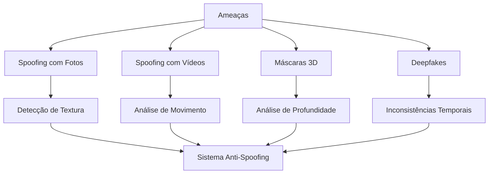

### Privacidade e Conformidade

- **LGPD/GDPR**: Conformidade com regulamentações de proteção de dados
- **Armazenamento Seguro**: Templates biométricos criptografados
- **Minimização de Dados**: Armazenar apenas o necessário (embeddings, não imagens)
- **Consentimento Explícito**: Coleta e uso transparentes
- **Direito ao Esquecimento**: Mecanismos para remover dados biométricos

## 🌟 Aplicações em Diferentes Setores

### Serviços Financeiros

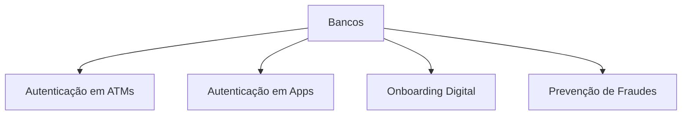

### Controle de Acesso Físico

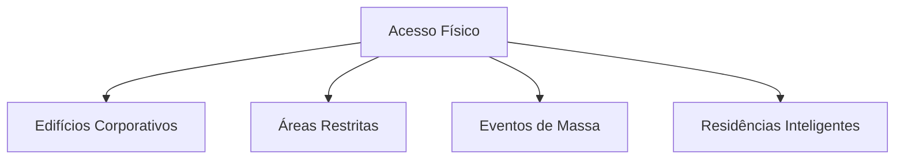

### Dispositivos de Consumo

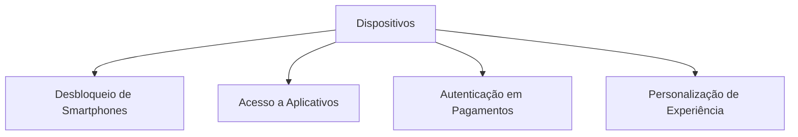

## 📈 Resultados Esperados

- Redução de 40-60% em tentativas de fraude em autenticação
- Diminuição de 70% no tempo de autenticação comparado a métodos tradicionais
- Melhoria de 30% na experiência do usuário (UX)
- Taxa de falsos positivos abaixo de 0.1% em ambientes controlados
- Taxa de falsos negativos abaixo de 5% mesmo com variações de aparência

## 🔍 Desafios e Mitigações

### Variações na Aparência

- **Envelhecimento**: Atualizações periódicas de templates
- **Mudanças Cosméticas**: Foco em características estáveis
- **Variações de Iluminação**: Pré-processamento robusto e data augmentation

### Aspectos Éticos

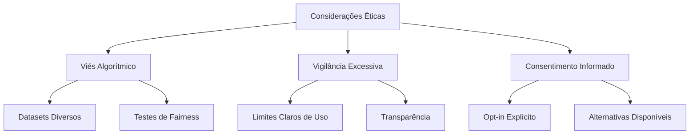

## 🔄 Tendências Futuras

- **Reconhecimento Facial em Movimento**: Autenticação contínua sem interrupção
- **Multi-espectral**: Combinação de luz visível, IR e outros espectros
- **Federated Learning**: Melhoria de modelos preservando privacidade
- **Sistemas Multimodais**: Combinação com outras biometrias (voz, comportamento)
- **Autenticação Contínua**: Verificação constante de identidade em sessões críticas