# 🏭 Caso de Uso: Inspeção Visual Automatizada na Indústria

## 🎯 Objetivo

Desenvolver um sistema de inspeção visual automatizada baseado em Computer Vision para detectar defeitos, garantir qualidade e otimizar processos de produção industrial, reduzindo custos operacionais e melhorando a consistência do controle de qualidade.

## 🔍 Problema de Negócio

A inspeção visual de produtos e componentes industriais enfrenta desafios significativos:

- Inconsistência na inspeção manual devido à fadiga humana
- Alto custo de mão de obra especializada para inspeção
- Dificuldade em escalar operações mantendo padrões de qualidade
- Impossibilidade de inspecionar 100% dos produtos em linhas de alta velocidade
- Limitação humana para detectar defeitos sutis ou microscópicos

Um sistema de inspeção visual automatizada pode proporcionar verificação contínua, objetiva e escalável, melhorando significativamente a detecção de defeitos e reduzindo o desperdício de material e tempo.

## 📊 Dados Necessários

- Imagens de produtos/componentes com e sem defeitos
- Mapa de anotações de defeitos (localizações e classificações)
- Especificações de tolerância para cada tipo de produto
- Condições ambientais durante a captura de imagens
- Metadados de produção (lote, velocidade da linha, matéria-prima)

## 🛠️ Arquitetura de Sistema

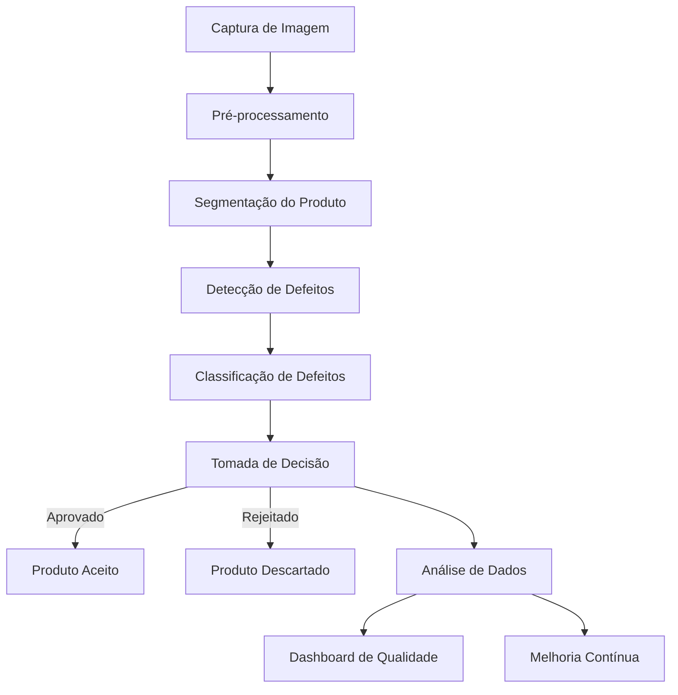

### 1. Subsistema de Captura de Imagens

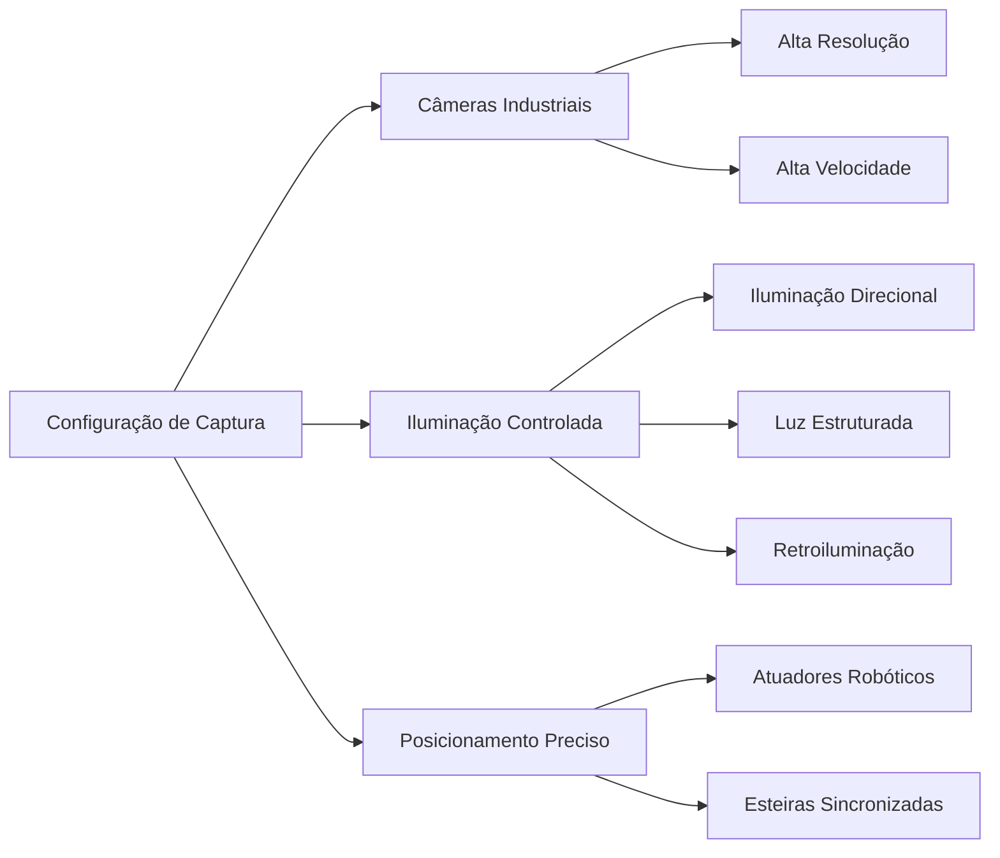

### 2. Pipeline de Processamento

#### Pré-processamento

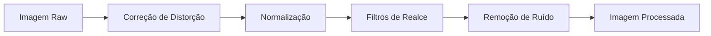

#### Segmentação e Detecção

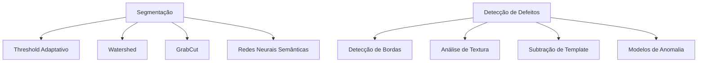

### 3. Técnicas de Deep Learning para Inspeção

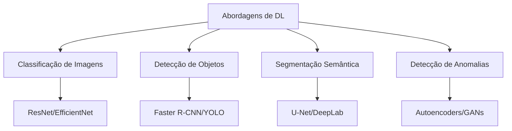

## 💻 Exemplo de Implementação

```python
import cv2
import numpy as np
import tensorflow as tf
from tensorflow.keras.models import load_model
from tensorflow.keras.applications import MobileNetV2
from tensorflow.keras.preprocessing.image import img_to_array
from tensorflow.keras.applications.mobilenet_v2 import preprocess_input
from tensorflow.keras.models import Model
import datetime
import os
import pandas as pd
import matplotlib.pyplot as plt

# Configurações do sistema
CAMERA_ID = 0
IMAGE_WIDTH = 1280
IMAGE_HEIGHT = 720
DEFECT_THRESHOLD = 0.75
SAVE_IMAGES = True
SAVE_PATH = "inspection_logs/"
MODEL_PATH = "defect_detection_model.h5"

# Garantir que o diretório de logs existe
os.makedirs(SAVE_PATH, exist_ok=True)

# Classe para o sistema de inspeção visual
class IndustrialInspectionSystem:
    def __init__(self, camera_id=CAMERA_ID, model_path=MODEL_PATH):
        self.camera_id = camera_id
        self.camera = None
        self.defect_model = None
        self.inspection_log = []
        self.total_inspected = 0
        self.defects_found = 0
        
        # Inicializar a câmera
        self.initialize_camera()
        
        # Carregar modelo de detecção de defeitos
        self.load_model(model_path)
    
    def initialize_camera(self):
        """Inicializa a câmera de captura"""
        self.camera = cv2.VideoCapture(self.camera_id)
        self.camera.set(cv2.CAP_PROP_FRAME_WIDTH, IMAGE_WIDTH)
        self.camera.set(cv2.CAP_PROP_FRAME_HEIGHT, IMAGE_HEIGHT)
        
        # Verificar se a câmera está aberta
        if not self.camera.isOpened():
            raise Exception("Erro ao abrir a câmera")
        
        print("Câmera inicializada com sucesso")
    
    def load_model(self, model_path):
        """Carrega o modelo de detecção de defeitos"""
        try:
            # Carregar modelo treinado ou criar um modelo base para demonstração
            if os.path.exists(model_path):
                self.defect_model = load_model(model_path)
                print(f"Modelo carregado de {model_path}")
            else:
                print("Modelo não encontrado. Criando modelo base para demonstração")
                self.create_demo_model()
        except Exception as e:
            print(f"Erro ao carregar modelo: {e}")
            print("Criando modelo base para demonstração")
            self.create_demo_model()
    
    def create_demo_model(self):
        """Cria um modelo base para demonstração usando transfer learning"""
        # Carregar modelo base (MobileNetV2)
        base_model = MobileNetV2(weights='imagenet', include_top=False, input_shape=(224, 224, 3))
        base_model.trainable = False
        
        # Adicionar camadas personalizadas para detecção de defeitos
        x = base_model.output
        x = tf.keras.layers.GlobalAveragePooling2D()(x)
        x = tf.keras.layers.Dense(1024, activation='relu')(x)
        x = tf.keras.layers.Dropout(0.5)(x)
        x = tf.keras.layers.Dense(512, activation='relu')(x)
        
        # Saída para classificação multiclasse de defeitos
        # 5 classes: sem defeito + 4 tipos de defeitos comuns
        outputs = tf.keras.layers.Dense(5, activation='softmax')(x)
        
        self.defect_model = Model(inputs=base_model.input, outputs=outputs)
        print("Modelo de demonstração criado")
    
    def preprocess_image(self, image):
        """Pré-processa a imagem para inspeção"""
        # Redimensionar
        resized = cv2.resize(image, (224, 224))
        
        # Converter para o formato correto
        img_array = img_to_array(resized)
        img_array = np.expand_dims(img_array, axis=0)
        processed_img = preprocess_input(img_array)
        
        return processed_img
    
    def enhance_image(self, image):
        """Aplica técnicas de realce de imagem"""
        # Converter para escala de cinza
        gray = cv2.cvtColor(image, cv2.COLOR_BGR2GRAY)
        
        # Aplicar equalização de histograma para melhorar contraste
        clahe = cv2.createCLAHE(clipLimit=2.0, tileGridSize=(8, 8))
        enhanced = clahe.apply(gray)
        
        # Reduzir ruído
        denoised = cv2.fastNlMeansDenoising(enhanced, None, 10, 7, 21)
        
        # Detectar bordas (útil para muitos tipos de inspeção)
        edges = cv2.Canny(denoised, 30, 100)
        
        return edges, denoised
    
    def segment_product(self, image):
        """Segmenta o produto do fundo"""
        # Converter para escala de cinza
        gray = cv2.cvtColor(image, cv2.COLOR_BGR2GRAY)
        
        # Aplicar threshold adaptativo
        thresh = cv2.adaptiveThreshold(
            gray, 255, cv2.ADAPTIVE_THRESH_GAUSSIAN_C, 
            cv2.THRESH_BINARY_INV, 115, 4
        )
        
        # Encontrar contornos
        contours, _ = cv2.findContours(
            thresh, cv2.RETR_EXTERNAL, cv2.CHAIN_APPROX_SIMPLE
        )
        
        # Encontrar o maior contorno (provavelmente o produto)
        if contours:
            largest_contour = max(contours, key=cv2.contourArea)
            
            # Criar máscara
            mask = np.zeros_like(gray)
            cv2.drawContours(mask, [largest_contour], 0, 255, -1)
            
            # Aplicar máscara à imagem original
            result = cv2.bitwise_and(image, image, mask=mask)
            
            return result, mask
        else:
            return image, None
    
    def detect_defects(self, image):
        """Detecta defeitos na imagem usando o modelo carregado"""
        # Pré-processar a imagem
        processed_img = self.preprocess_image(image)
        
        # Fazer a predição
        predictions = self.defect_model.predict(processed_img)[0]
        
        # Obter a classe com maior probabilidade
        defect_class = np.argmax(predictions)
        defect_prob = predictions[defect_class]
        
        # Mapear para nomes de defeitos (para um modelo de exemplo)
        defect_names = [
            "sem_defeito", "arranhão", "mancha", "deformação", "quebra"
        ]
        
        result = {
            "defect_found": defect_class > 0,  # Classe 0 = sem defeito
            "defect_type": defect_names[defect_class],
            "confidence": float(defect_prob),
            "all_probs": {name: float(prob) for name, prob in zip(defect_names, predictions)}
        }
        
        return result
    
    def traditional_defect_detection(self, image, mask=None):
        """Método alternativo usando técnicas tradicionais de CV"""
        # Realçar a imagem
        edges, denoised = self.enhance_image(image)
        
        # Aplicar máscara se disponível
        if mask is not None:
            edges = cv2.bitwise_and(edges, edges, mask=mask)
        
        # Detectar anomalias usando técnicas tradicionais
        # Este é um exemplo simples - em produção seria mais complexo
        # e adaptado ao tipo específico de produto e defeito
        
        # Contar pixels de borda - muitos podem indicar irregularidades
        edge_count = np.count_nonzero(edges)
        
        # Limiar adaptativo baseado no tamanho da imagem
        edge_threshold = edges.shape[0] * edges.shape[1] * 0.05
        
        # Simulação de detecção de anomalias
        abnormal = edge_count > edge_threshold
        
        return {
            "defect_found": abnormal,
            "edge_count": edge_count,
            "threshold": edge_threshold,
            "edges_image": edges
        }
    
    def capture_and_inspect(self):
        """Captura uma imagem e realiza a inspeção"""
        # Capturar imagem
        ret, frame = self.camera.read()
        if not ret:
            print("Erro ao capturar imagem")
            return None
        
        # Registrar timestamp
        timestamp = datetime.datetime.now()
        
        # Segmentar o produto
        segmented, mask = self.segment_product(frame)
        
        # Detectar defeitos usando deep learning
        dl_results = self.detect_defects(segmented)
        
        # Método alternativo usando CV tradicional
        cv_results = self.traditional_defect_detection(segmented, mask)
        
        # Combinar resultados (em produção, seria implementada uma lógica mais robusta)
        defect_found = dl_results["defect_found"] or cv_results["defect_found"]
        
        # Registrar resultados
        inspection_result = {
            "timestamp": timestamp,
            "defect_found": defect_found,
            "dl_results": dl_results,
            "cv_results": cv_results,
            "image_path": None
        }
        
        # Salvar imagem se necessário
        if SAVE_IMAGES:
            filename = f"{timestamp.strftime('%Y%m%d_%H%M%S')}_{dl_results['defect_type']}.jpg"
            filepath = os.path.join(SAVE_PATH, filename)
            cv2.imwrite(filepath, frame)
            inspection_result["image_path"] = filepath
        
        # Atualizar estatísticas
        self.total_inspected += 1
        if defect_found:
            self.defects_found += 1
        
        # Adicionar ao log
        self.inspection_log.append(inspection_result)
        
        return inspection_result
    
    def visualize_result(self, result):
        """Visualiza o resultado da inspeção"""
        if not result:
            return
        
        # Carregar imagem
        if result["image_path"] and os.path.exists(result["image_path"]):
            image = cv2.imread(result["image_path"])
            
            # Converter para RGB para matplotlib
            image_rgb = cv2.cvtColor(image, cv2.COLOR_BGR2RGB)
            
            # Configurar visualização
            fig, axes = plt.subplots(1, 3, figsize=(15, 5))
            
            # Imagem original
            axes[0].imshow(image_rgb)
            axes[0].set_title("Imagem Original")
            axes[0].axis("off")
            
            # Imagem com bordas (do CV tradicional)
            if "edges_image" in result["cv_results"]:
                axes[1].imshow(result["cv_results"]["edges_image"], cmap="gray")
                axes[1].set_title("Detecção de Bordas")
                axes[1].axis("off")
            
            # Heatmap de probabilidades
            defect_types = list(result["dl_results"]["all_probs"].keys())
            probs = list(result["dl_results"]["all_probs"].values())
            
            y_pos = np.arange(len(defect_types))
            axes[2].barh(y_pos, probs, align="center")
            axes[2].set_yticks(y_pos)
            axes[2].set_yticklabels(defect_types)
            axes[2].set_xlabel("Probabilidade")
            axes[2].set_title("Classificação de Defeitos")
            
            plt.tight_layout()
            
            # Salvar visualização
            viz_path = result["image_path"].replace(".jpg", "_viz.jpg")
            plt.savefig(viz_path)
            plt.close()
            
            return viz_path
    
    def generate_report(self):
        """Gera relatório com estatísticas de inspeção"""
        if not self.inspection_log:
            return "Nenhuma inspeção realizada."
        
        # Criar DataFrame com logs
        df = pd.DataFrame([
            {
                "timestamp": log["timestamp"],
                "defect_found": log["defect_found"],
                "defect_type": log["dl_results"]["defect_type"],
                "confidence": log["dl_results"]["confidence"]
            } for log in self.inspection_log
        ])
        
        # Calcular estatísticas
        stats = {
            "total_inspected": self.total_inspected,
            "defects_found": self.defects_found,
            "defect_rate": self.defects_found / self.total_inspected if self.total_inspected > 0 else 0,
            "defect_types": df[df["defect_found"]]["defect_type"].value_counts().to_dict()
        }
        
        # Criar visualizações
        fig, axes = plt.subplots(1, 2, figsize=(12, 5))
        
        # Gráfico de pizza para tipos de defeitos
        if stats["defect_types"]:
            axes[0].pie(
                stats["defect_types"].values(), 
                labels=stats["defect_types"].keys(),
                autopct='%1.1f%%'
            )
            axes[0].set_title("Distribuição de Tipos de Defeitos")
        else:
            axes[0].text(0.5, 0.5, "Nenhum defeito encontrado", ha="center", va="center")
            axes[0].axis("off")
        
        # Gráfico de barras para taxa de defeitos ao longo do tempo
        df["hour"] = df["timestamp"].dt.hour
        hourly_defect_rate = df.groupby("hour")["defect_found"].mean()
        
        axes[1].bar(hourly_defect_rate.index, hourly_defect_rate.values)
        axes[1].set_xlabel("Hora do Dia")
        axes[1].set_ylabel("Taxa de Defeitos")
        axes[1].set_title("Taxa de Defeitos por Hora")
        
        plt.tight_layout()
        
        # Salvar relatório
        report_path = os.path.join(SAVE_PATH, f"report_{datetime.datetime.now().strftime('%Y%m%d_%H%M%S')}.png")
        plt.savefig(report_path)
        plt.close()
        
        return report_path, stats
    
    def run_continuous_inspection(self, duration_seconds=60, interval_ms=500):
        """Executa inspeção contínua por um período determinado"""
        start_time = datetime.datetime.now()
        end_time = start_time + datetime.timedelta(seconds=duration_seconds)
        
        print(f"Iniciando inspeção contínua por {duration_seconds} segundos...")
        
        while datetime.datetime.now() < end_time:
            # Capturar e inspecionar
            result = self.capture_and_inspect()
            
            # Exibir resultado
            if result:
                defect_status = "DEFEITUOSO" if result["defect_found"] else "OK"
                print(f"Inspeção {self.total_inspected}: {defect_status} - Tipo: {result['dl_results']['defect_type']} ({result['dl_results']['confidence']:.2f})")
            
            # Aguardar intervalo
            cv2.waitKey(interval_ms)
        
        print(f"Inspeção concluída. {self.total_inspected} itens inspecionados, {self.defects_found} defeitos encontrados.")
        
        # Gerar relatório
        report_path, stats = self.generate_report()
        print(f"Relatório gerado em: {report_path}")
        print(f"Taxa de defeitos: {stats['defect_rate']*100:.2f}%")
        
        return stats
    
    def close(self):
        """Libera recursos"""
        if self.camera:
            self.camera.release()
        cv2.destroyAllWindows()

# Exemplo de uso
if __name__ == "__main__":
    # Inicializar sistema
    inspection_system = IndustrialInspectionSystem()
    
    try:
        # Executar inspeção contínua por 1 minuto
        stats = inspection_system.run_continuous_inspection(duration_seconds=60)
        
        print("Estatísticas da inspeção:")
        for key, value in stats.items():
            print(f"- {key}: {value}")
        
    finally:
        # Liberar recursos
        inspection_system.close()
```

## 📏 Métodos de Avaliação

### Métricas de Desempenho

- **Precisão/Recall**: Fundamentais para avaliar detecção de defeitos
- **F1-Score**: Equilíbrio entre precisão e recall
- **Matriz de Confusão**: Para análise de tipos específicos de defeitos
- **Taxa de Falsos Positivos/Negativos**: Crucial para aplicações industriais
- **Tempo de Processamento**: Garante viabilidade para produção em tempo real

### Validação em Ambiente Produtivo

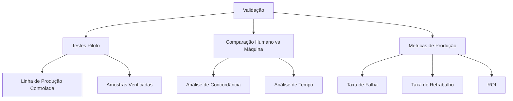

## 🌟 Aplicações em Diferentes Setores

### Setor Automotivo

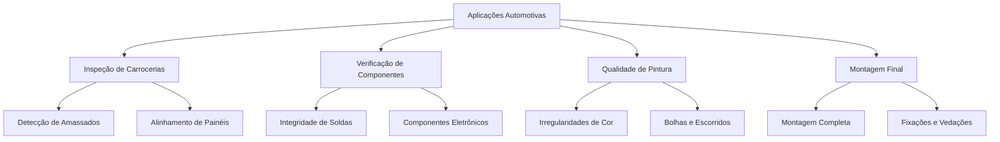

### Eletrônicos

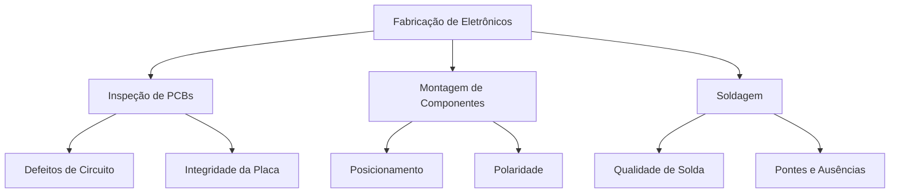

### Farmacêutica e Alimentos

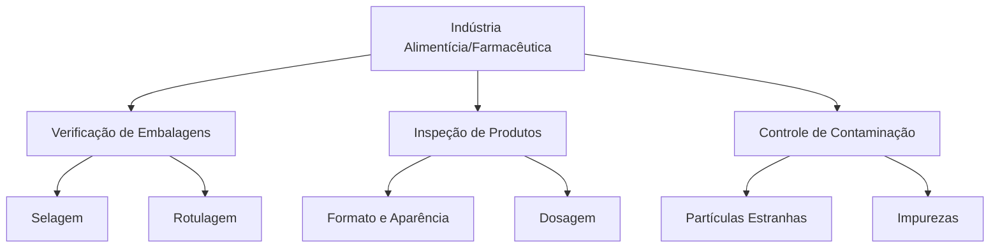

## 📈 Resultados Esperados

- Redução de 80-95% em defeitos não detectados comparado à inspeção manual
- Aumento de 30-50% na velocidade de inspeção
- Melhoria de 15-30% na consistência de qualidade
- Diminuição de 40-60% em custos de mão de obra para inspeção
- Redução de 10-25% em desperdício de materiais e retrabalho

## 🔄 Integração com Sistemas Industriais

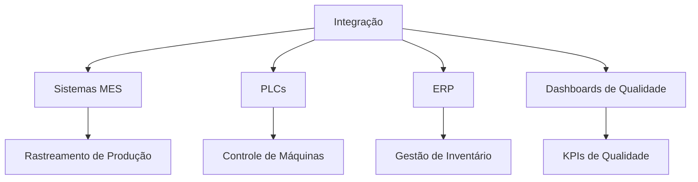

## 🔍 Considerações Importantes

### Desafios de Implementação

- **Variabilidade de Produtos**: Adaptação a diferentes SKUs
- **Resistência à Mudança**: Treinamento e aceitação de operadores
- **Ambiente Industrial**: Robustez a vibrações, poeira, iluminação variável
- **Manutenção do Sistema**: Calibração periódica e atualização de modelos

### Abordagem de Implementação Gradual

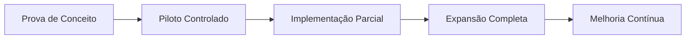

1. **Prova de Conceito**: Validar tecnologia em ambiente controlado
2. **Piloto Controlado**: Testar em uma linha de produção com supervisão
3. **Implementação Parcial**: Operar em paralelo com inspeção humana
4. **Expansão Completa**: Implementar em toda a produção
5. **Melhoria Contínua**: Refinar modelos com novos dados

## 🔄 Tendências Futuras

- **Auto-aprendizado**: Sistemas que melhoram com feedback de produção
- **Edge AI**: Processamento próximo aos sensores para menor latência
- **Multispectral**: Combinação de câmeras diferentes (IR, UV, raio-X)
- **Digital Twin**: Integração com modelos virtuais da linha de produção
- **Manutenção Preditiva**: Prever falhas antes que afetem a qualidade