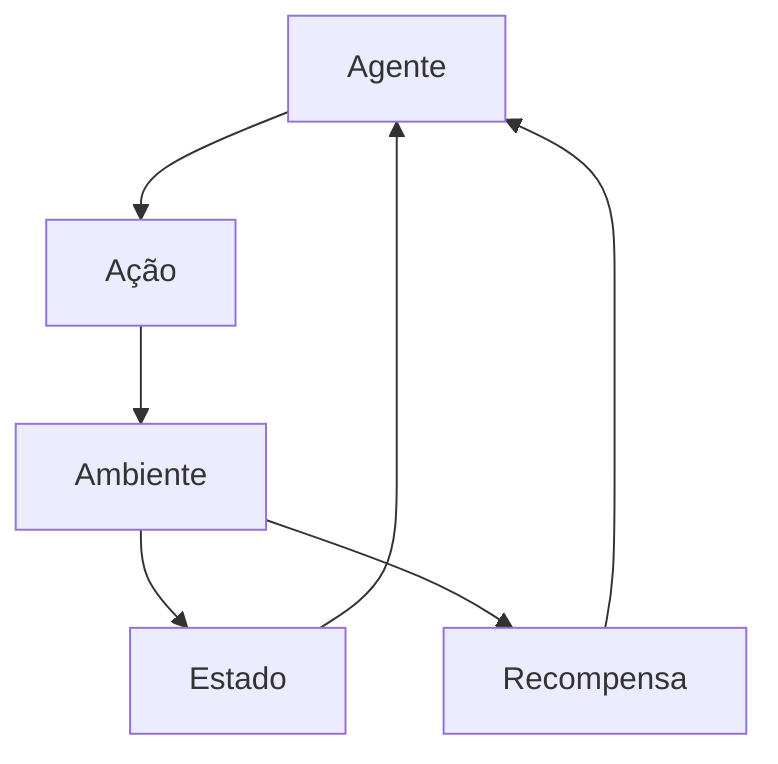
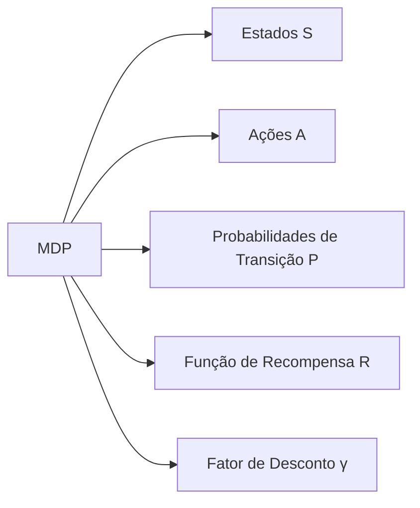
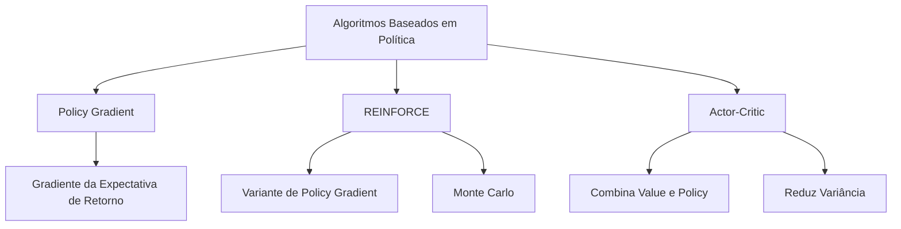
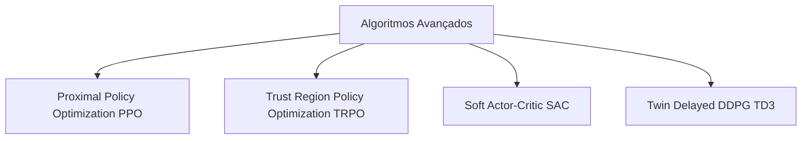
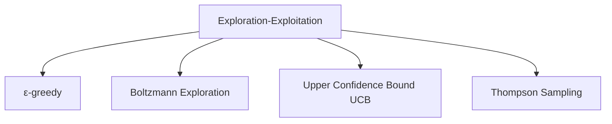
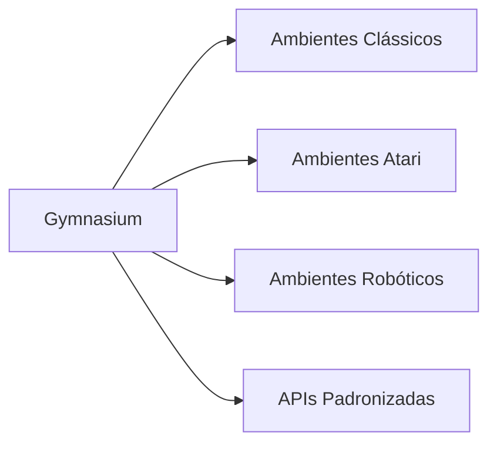
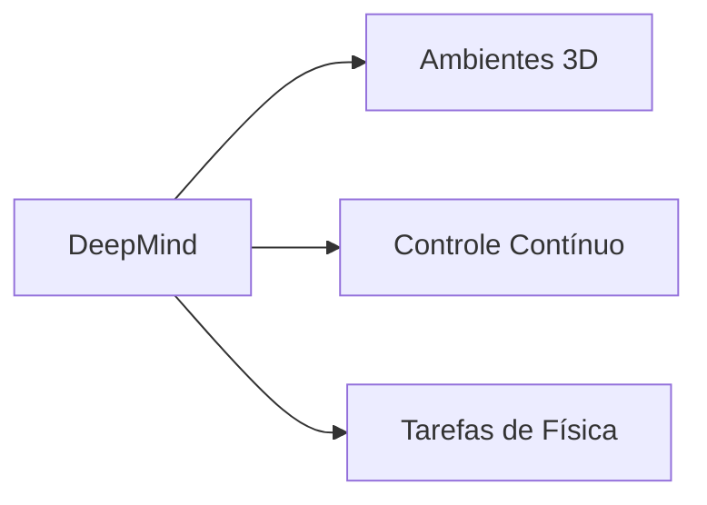

# 🎮 Reinforcement Learning

Reinforcement Learning (RL) é um paradigma de aprendizado de máquina em que um agente aprende a tomar decisões através de interações com um ambiente, recebendo feedback na forma de recompensas ou penalidades.

## 📑 Definição

O Reinforcement Learning é uma abordagem onde agentes aprendem comportamentos ideais através de tentativa e erro, maximizando uma função de recompensa cumulativa. Diferente do aprendizado supervisionado, no RL não há rótulos explícitos; em vez disso, o agente descobre quais ações geram o melhor resultado através da exploração do ambiente e da exploração das estratégias já conhecidas.

## 🔄 Componentes Fundamentais



- **Agente**: Entidade que toma decisões e executa ações
- **Ambiente**: Sistema com o qual o agente interage
- **Estado**: Representação da situação atual do ambiente
- **Ação**: Decisão tomada pelo agente que afeta o ambiente
- **Recompensa**: Feedback numérico que indica o sucesso da ação

## 🧩 Componentes Matemáticos

### Processo de Decisão de Markov (MDP)



O MDP é formalmente definido como uma tupla (S, A, P, R, γ) onde:
- S é o conjunto de estados
- A é o conjunto de ações
- P é a função de probabilidade de transição: P(s'|s,a)
- R é a função de recompensa: R(s,a,s')
- γ é o fator de desconto (entre 0 e 1)

### Funções de Valor

```mermaid
graph TD
    A[Funções de Valor] --> B[Função Valor de Estado V<sub>π</sub>]
    A --> C[Função Valor de Ação Q<sub>π</sub>]
    
    B --> D[V<sub>π</sub>(s) = E<sub>π</sub>[G<sub>t</sub>|S<sub>t</sub>=s]]
    C --> E[Q<sub>π</sub>(s,a) = E<sub>π</sub>[G<sub>t</sub>|S<sub>t</sub>=s, A<sub>t</sub>=a]]
```

### Equação de Bellman

```mermaid
graph LR
    A[Equação de Bellman] --> B[V<sub>π</sub>(s) = ∑<sub>a</sub> π(a|s) ∑<sub>s'</sub> P(s'|s,a)[R(s,a,s') + γV<sub>π</sub>(s')]]
    A --> C[Q<sub>π</sub>(s,a) = ∑<sub>s'</sub> P(s'|s,a)[R(s,a,s') + γ∑<sub>a'</sub>π(a'|s')Q<sub>π</sub>(s',a')]]
```

## 🧠 Principais Algoritmos

### Algoritmos Baseados em Valor

```mermaid
graph TD
    A[Algoritmos Baseados em Valor] --> B[Q-Learning]
    A --> C[SARSA]
    A --> D[DQN]
    
    B --> B1[Off-policy]
    B --> B2[Atualiza Q(s,a) com max Q(s',a')]
    
    C --> C1[On-policy]
    C --> C2[Atualiza Q(s,a) com Q(s',a')]
    
    D --> D1[Deep Q-Networks]
    D --> D2[Redes Neurais + Experience Replay]
```

### Algoritmos Baseados em Política



### Algoritmos Avançados



## 🛠️ Técnicas Essenciais

### Exploração vs Exploração



- **Exploration**: Tentar novas ações para descobrir melhores estratégias
- **Exploitation**: Usar o conhecimento existente para maximizar recompensas
- O equilíbrio entre ambas é crucial para o sucesso do RL

### Redução da Variância

```mermaid
graph LR
    A[Redução de Variância] --> B[Função Baseline]
    A --> C[Advantage Function]
    A --> D[GAE]
    
    B --> B1[Subtrai um valor de referência]
    C --> C1[A(s,a) = Q(s,a) - V(s)]
    D --> D1[Generalized Advantage Estimation]
```

## 🔗 Casos de Uso

- [Otimização de Rotas Logísticas](./use-case-logistics-optimization.md)
- [Sistemas de Recomendação Dinâmicos](./use-case-recommendation-system.md)

## 📊 Ambientes de Aprendizado

### OpenAI Gym/Gymnasium



### DeepMind Lab/Control Suite



## 🚀 Aplicações Práticas

- **Sistemas de Recomendação**: Personalização de conteúdo e produtos
- **Robótica**: Controle motor e navegação autônoma
- **Jogos**: Agentes que aprendem a jogar jogos complexos
- **Logística**: Otimização de rotas e cadeia de suprimentos
- **Finanças**: Trading algorítmico e otimização de portfólio
- **Saúde**: Dosagem personalizada de medicamentos
- **Energia**: Gerenciamento de redes elétricas

## 🌟 Tendências Recentes

- **RL Multi-agente**: Múltiplos agentes interagindo e competindo
- **RL Meta-learning**: Algoritmos que aprendem a aprender
- **RL Offline**: Aprendizado a partir de conjuntos de dados fixos
- **RL + NLP**: Aprendizado por reforço para processamento de linguagem natural
- **RL com Feedback Humano**: Incorporando feedback humano no aprendizado

## 🔍 Desafios do RL

- **Sample Efficiency**: Necessidade de muitas amostras para aprendizado
- **Generalização**: Dificuldade em transferir conhecimento entre tarefas
- **Reward Engineering**: Desafio de projetar funções de recompensa adequadas
- **Escalabilidade**: Dificuldades em aplicar a problemas de alta dimensionalidade
- **Segurança e Robustez**: Garantir comportamento seguro em situações inesperadas