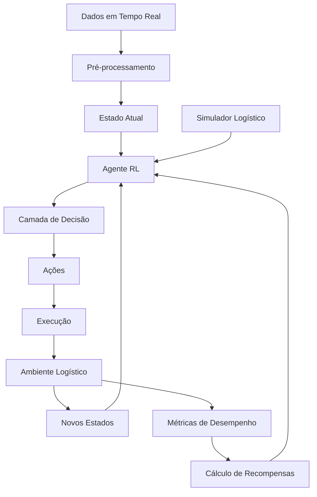
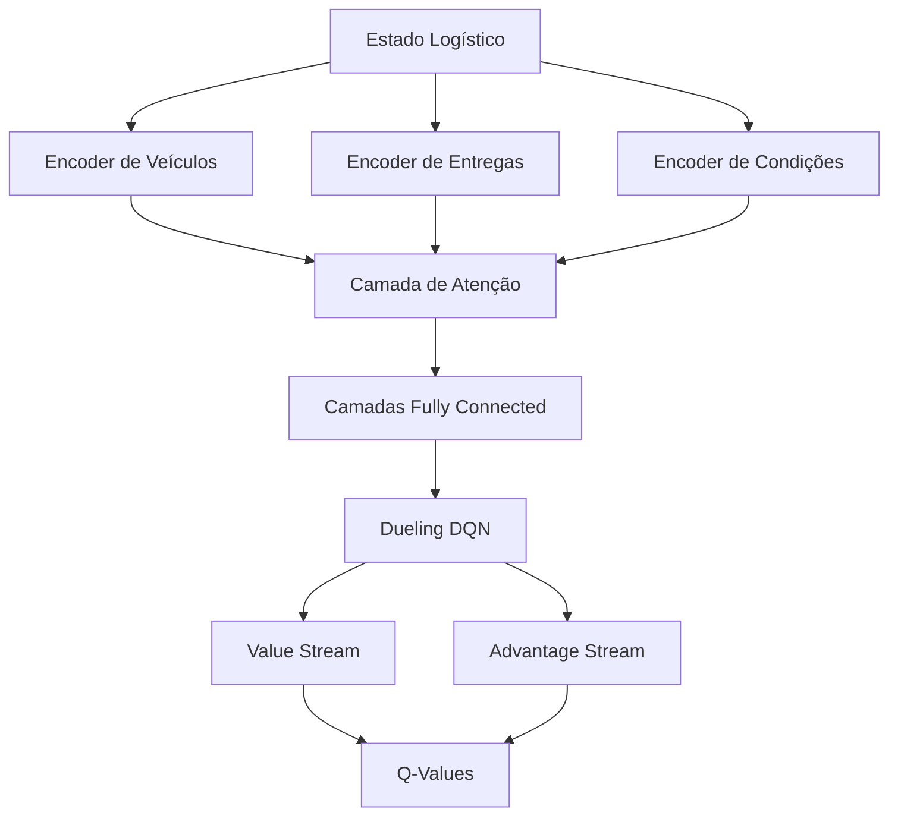
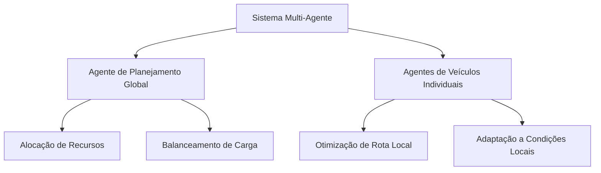
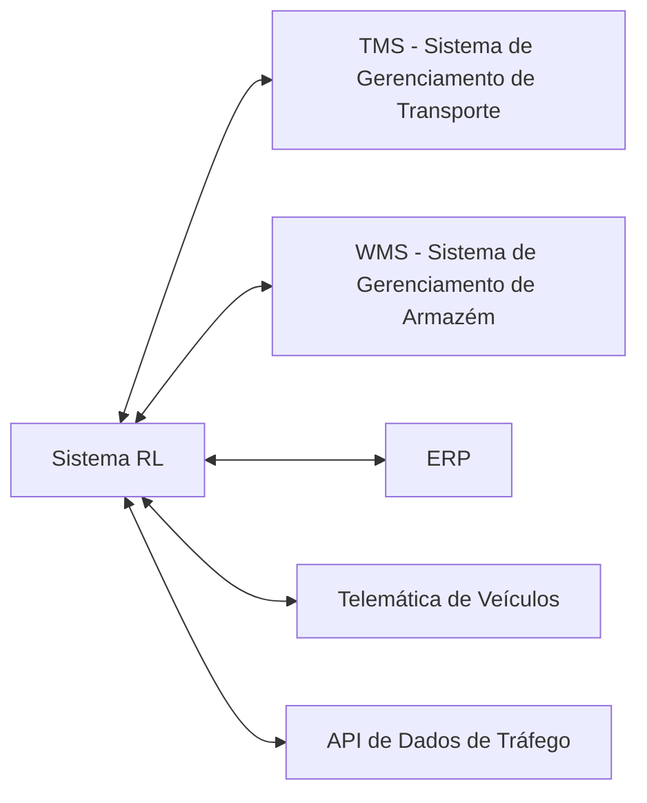
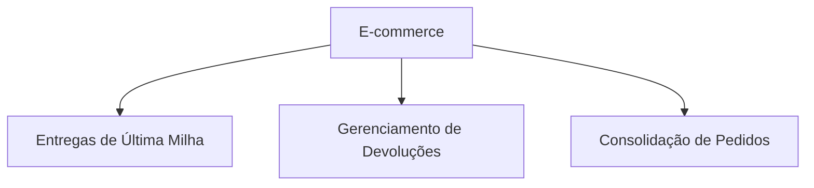
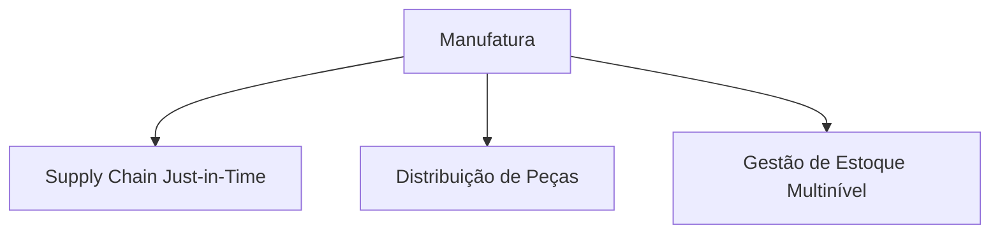
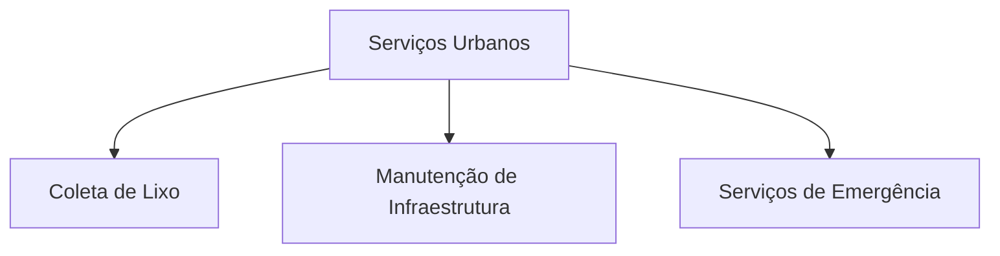

# 🚚 Caso de Uso: Otimização de Rotas Logísticas

## 🎯 Objetivo

Desenvolver um sistema baseado em Reinforcement Learning (RL) para otimizar rotas de entrega em uma rede logística complexa, minimizando custos operacionais, tempo de entrega e consumo de combustível, enquanto maximiza a satisfação do cliente e a utilização de recursos.

## 🔍 Problema de Negócio

O gerenciamento de logística enfrenta desafios crescentes:

- Aumento da complexidade das redes de distribuição
- Expectativas de entregas cada vez mais rápidas
- Pressão por redução de custos e impacto ambiental
- Volatilidade das condições (tráfego, clima, demanda)
- Balanceamento entre objetivos competitivos (velocidade vs. custo)

Métodos tradicionais de otimização frequentemente falham em ambientes dinâmicos e complexos. O Reinforcement Learning oferece uma abordagem que pode se adaptar continuamente e descobrir estratégias inovadoras para problemas de roteamento que são computacionalmente intratáveis por métodos exatos.

## 📊 Modelagem do Problema

### Formulação como MDP (Processo de Decisão de Markov)

```mermaid
graph TD
    A[Estado] --> A1[Posições dos Veículos]
    A --> A2[Entregas Pendentes]
    A --> A3[Condições das Rotas]
    A --> A4[Capacidades dos Veículos]
    A --> A5[Janelas de Tempo]
    
    B[Ações] --> B1[Atribuir Entrega a Veículo]
    B --> B2[Determinar Próximo Destino]
    B --> B3[Reordenar Entregas]
    B --> B4[Ajustar Velocidade]
    
    C[Recompensas] --> C1[Tempo de Entrega]
    C --> C2[Consumo de Combustível]
    C --> C3[Pontualidade]
    C --> C4[Taxa de Utilização]
    C --> C5[Satisfação do Cliente]
```



### Definição Formal

- **Estados (S)**: Representação do ambiente logístico com veículos e entregas
- **Ações (A)**: Decisões sobre alocação e roteamento
- **Transições (P)**: Dinâmica do sistema após uma ação (inclui incertezas)
- **Recompensas (R)**: Feedback numérico baseado nos objetivos do negócio
- **Política (π)**: Estratégia aprendida para tomada de decisões

## 🛠️ Arquitetura do Sistema



### 1. Componentes do Sistema

#### Representação do Estado

O estado deve capturar todos os aspectos relevantes do ambiente:

```python
class LogisticsState:
    def __init__(self, vehicles, deliveries, map_data, time_info):
        self.vehicles = {
            vehicle_id: {
                'position': (lat, lon),
                'capacity': remaining_capacity,
                'current_route': list_of_delivery_ids,
                'estimated_times': list_of_ETAs,
                'fuel': remaining_fuel
            } for vehicle_id in vehicles
        }
        
        self.deliveries = {
            delivery_id: {
                'pickup': (pickup_lat, pickup_lon),
                'dropoff': (dropoff_lat, dropoff_lon),
                'time_window': (earliest, latest),
                'priority': priority_level,
                'size': capacity_needed,
                'status': 'pending' | 'assigned' | 'in_progress' | 'completed'
            } for delivery_id in deliveries
        }
        
        self.traffic_conditions = map_data['traffic']
        self.weather_conditions = map_data['weather']
        self.current_time = time_info['timestamp']
```

#### Arquitetura de Rede Neural



## 💻 Implementação com RL Profundo

### Algoritmo Principal: Proximal Policy Optimization (PPO)

O PPO é escolhido por sua estabilidade, eficiência de amostra e capacidade de lidar com espaços de ação grandes e contínuos.

```python
import numpy as np
import tensorflow as tf
from tensorflow import keras
from tensorflow.keras import layers
import gym
import matplotlib.pyplot as plt
from logistics_env import LogisticsEnvironment

# Criar ambiente personalizado de logística
env = LogisticsEnvironment(
    num_vehicles=20,
    num_deliveries=100,
    map_size=(100, 100),
    time_horizon=24  # horas
)

# Definir hiperparâmetros
num_iterations = 1000
num_actor_updates = 10
num_critic_updates = 10
clip_ratio = 0.2
target_kl = 0.01
gamma = 0.99
lam = 0.95
actor_learning_rate = 3e-4
critic_learning_rate = 1e-3

# Arquitetura de modelo para política (Actor)
def create_actor_model(state_dim, action_dim):
    inputs = layers.Input(shape=(state_dim,))
    
    # Feature extractor compartilhado
    x = layers.Dense(256, activation='relu')(inputs)
    x = layers.Dense(256, activation='relu')(x)
    
    # Camada de política
    logits = layers.Dense(action_dim)(x)
    
    # Modelo
    model = keras.Model(inputs=inputs, outputs=logits)
    
    return model

# Arquitetura de modelo para valor (Critic)
def create_critic_model(state_dim):
    inputs = layers.Input(shape=(state_dim,))
    
    x = layers.Dense(256, activation='relu')(inputs)
    x = layers.Dense(256, activation='relu')(x)
    
    # Estimativa de valor
    value = layers.Dense(1)(x)
    
    # Modelo
    model = keras.Model(inputs=inputs, outputs=value)
    
    return model

# Dimensões das entradas e saídas
state_dim = env.observation_space.shape[0]
action_dim = env.action_space.n

# Criar modelos
actor_model = create_actor_model(state_dim, action_dim)
critic_model = create_critic_model(state_dim)

# Otimizadores
actor_optimizer = keras.optimizers.Adam(learning_rate=actor_learning_rate)
critic_optimizer = keras.optimizers.Adam(learning_rate=critic_learning_rate)

# Função para calcular vantagens usando GAE (Generalized Advantage Estimation)
def compute_advantages(rewards, values, dones, next_value, gamma, lam):
    advantages = np.zeros_like(rewards)
    last_gae_lam = 0
    
    for t in reversed(range(len(rewards))):
        if t == len(rewards) - 1:
            next_non_terminal = 1.0 - dones[-1]
            next_values = next_value
        else:
            next_non_terminal = 1.0 - dones[t+1]
            next_values = values[t+1]
        
        delta = rewards[t] + gamma * next_values * next_non_terminal - values[t]
        last_gae_lam = delta + gamma * lam * next_non_terminal * last_gae_lam
        advantages[t] = last_gae_lam
    
    returns = advantages + values
    
    # Normalizar vantagens
    advantages = (advantages - np.mean(advantages)) / (np.std(advantages) + 1e-8)
    
    return advantages, returns

# Loop principal de treinamento
for iteration in range(num_iterations):
    # Coletar trajetórias
    states = []
    actions = []
    rewards = []
    dones = []
    values = []
    log_probs = []
    
    state, _ = env.reset()
    done = False
    episode_reward = 0
    
    while not done:
        # Converter estado para tensor
        state_tensor = tf.convert_to_tensor(state[np.newaxis, ...], dtype=tf.float32)
        
        # Prever distribuição de política
        logits = actor_model(state_tensor)
        probs = tf.nn.softmax(logits)
        
        # Prever valor
        value = critic_model(state_tensor)
        
        # Amostrar ação da distribuição
        action = np.random.choice(action_dim, p=probs.numpy()[0])
        
        # Calcular log prob
        action_mask = tf.one_hot(action, action_dim)
        log_prob = tf.reduce_sum(action_mask * tf.nn.log_softmax(logits), axis=1)
        
        # Executar ação
        next_state, reward, done, _, _ = env.step(action)
        
        # Armazenar dados
        states.append(state)
        actions.append(action)
        rewards.append(reward)
        dones.append(done)
        values.append(value[0, 0].numpy())
        log_probs.append(log_prob[0].numpy())
        
        # Atualizar estado
        state = next_state
        episode_reward += reward
    
    # Calcular valor do estado final
    if done:
        next_value = 0
    else:
        next_state_tensor = tf.convert_to_tensor(next_state[np.newaxis, ...], dtype=tf.float32)
        next_value = critic_model(next_state_tensor)[0, 0].numpy()
    
    # Calcular vantagens e retornos
    advantages, returns = compute_advantages(
        rewards, values, dones, next_value, gamma, lam
    )
    
    # Atualização de política (Actor)
    for _ in range(num_actor_updates):
        with tf.GradientTape() as tape:
            # Converter dados para tensores
            old_log_probs = tf.convert_to_tensor(log_probs, dtype=tf.float32)
            states_tensor = tf.convert_to_tensor(states, dtype=tf.float32)
            actions_tensor = tf.convert_to_tensor(actions, dtype=tf.int32)
            advantages_tensor = tf.convert_to_tensor(advantages, dtype=tf.float32)
            
            # Prever log probs atuais
            logits = actor_model(states_tensor)
            action_masks = tf.one_hot(actions_tensor, action_dim)
            curr_log_probs = tf.reduce_sum(action_masks * tf.nn.log_softmax(logits), axis=1)
            
            # Calcular razão de probabilidades
            ratio = tf.exp(curr_log_probs - old_log_probs)
            
            # Termo de perda clipped
            clipped_ratio = tf.clip_by_value(ratio, 1 - clip_ratio, 1 + clip_ratio)
            
            # Perda de política
            policy_loss = -tf.reduce_mean(
                tf.minimum(ratio * advantages_tensor, clipped_ratio * advantages_tensor)
            )
            
            # Adicionar regularização de entropia (opcional)
            probs = tf.nn.softmax(logits)
            entropy_loss = -tf.reduce_mean(
                tf.reduce_sum(probs * tf.nn.log_softmax(logits), axis=1)
            )
            
            total_loss = policy_loss - 0.01 * entropy_loss
        
        # Calcular gradientes e atualizar pesos
        grads = tape.gradient(total_loss, actor_model.trainable_variables)
        actor_optimizer.apply_gradients(zip(grads, actor_model.trainable_variables))
    
    # Atualização de função de valor (Critic)
    for _ in range(num_critic_updates):
        with tf.GradientTape() as tape:
            # Converter dados para tensores
            states_tensor = tf.convert_to_tensor(states, dtype=tf.float32)
            returns_tensor = tf.convert_to_tensor(returns, dtype=tf.float32)
            
            # Prever valores atuais
            values = critic_model(states_tensor)
            values = tf.squeeze(values)
            
            # Calcular perda de valor
            value_loss = tf.reduce_mean(tf.square(returns_tensor - values))
        
        # Calcular gradientes e atualizar pesos
        grads = tape.gradient(value_loss, critic_model.trainable_variables)
        critic_optimizer.apply_gradients(zip(grads, critic_model.trainable_variables))
    
    # Registrar estatísticas
    print(f"Iteração {iteration} - Recompensa média: {episode_reward}")
    
    # Avaliar periodicamente
    if iteration % 10 == 0:
        eval_rewards = []
        for _ in range(5):  # 5 episódios de avaliação
            state, _ = env.reset()
            done = False
            total_reward = 0
            
            while not done:
                state_tensor = tf.convert_to_tensor(state[np.newaxis, ...], dtype=tf.float32)
                logits = actor_model(state_tensor)
                probs = tf.nn.softmax(logits)
                action = np.argmax(probs.numpy()[0])  # Determinístico para avaliação
                next_state, reward, done, _, _ = env.step(action)
                state = next_state
                total_reward += reward
            
            eval_rewards.append(total_reward)
        
        avg_eval_reward = sum(eval_rewards) / len(eval_rewards)
        print(f"Avaliação após {iteration} iterações: Recompensa média = {avg_eval_reward}")

# Salvar modelos treinados
actor_model.save("logistics_actor_model")
critic_model.save("logistics_critic_model")
```

### Técnicas Avançadas para Melhorar Desempenho

1. **Curriculum Learning**: Começar com problemas mais simples (menos entregas) e aumentar a complexidade gradualmente.

2. **Prioritized Experience Replay**: Focar em experiências mais informativas para acelerar o aprendizado.

3. **Multi-Agent RL**: Treinar agentes independentes para diferentes áreas ou funções:



## 📏 Métricas de Avaliação

- **Redução de Distância**: Diminuição do trajeto total percorrido
- **Taxa de Entrega no Prazo**: Percentual de entregas dentro da janela de tempo
- **Utilização de Frota**: Aproveitamento da capacidade dos veículos
- **Custo Operacional**: Combustível, manutenção, horas extras
- **Tempo de Resposta**: Adaptação a eventos imprevistos

## 🌟 Implementação na Prática

### Integração com Sistemas Existentes



### Implantação Gradual

1. **Fase de Shadow Mode**: Sistema executa em paralelo com decisões humanas
2. **Implantação Limitada**: Aplicado a uma região ou frota específica
3. **Escala Gradual**: Expansão baseada em resultados validados

## 📊 Resultados Esperados

- Redução de 15-30% nos custos operacionais
- Diminuição de 20-40% nas distâncias percorridas
- Aumento de 10-20% na taxa de entregas no prazo
- Melhoria de 15-25% na utilização da frota
- Redução de 30-50% no tempo de planejamento

## 🌐 Aplicações em Diferentes Setores

### E-commerce



### Manufatura



### Serviços Urbanos



## 🔍 Considerações e Desafios

### Desafios Técnicos

- **Escalabilidade**: Problemas logísticos crescem exponencialmente com o número de nós
- **Integração de Dados**: Combinação de múltiplas fontes de informação
- **Latência**: Necessidade de decisões rápidas para adaptação em tempo real
- **Capacidade Computacional**: Balancear qualidade das decisões com velocidade

### Aspectos Práticos

- **Transparência**: Compreensão das decisões do algoritmo
- **Intervenção Humana**: Capacidade de override manual quando necessário
- **Treinamento da Equipe**: Capacitação para trabalhar com o sistema
- **Medição de Sucesso**: Definição clara de KPIs e objetivos

## 🚀 Próximos Passos e Evolução

- **Previsão de Demanda**: Integrar modelos preditivos para antecipação de necessidades
- **Simulação Avançada**: Ambiente digital gêmeo para treinamento e testes
- **Insights Estratégicos**: Identificação de padrões para decisões de longo prazo
- **Otimização Multi-objetivo**: Balanceamento dinâmico entre custo, velocidade e sustentabilidade