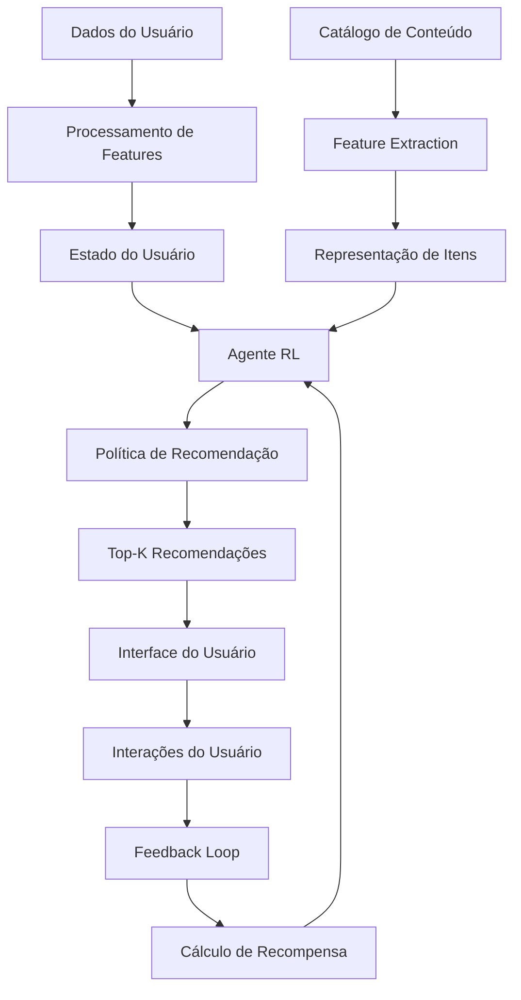
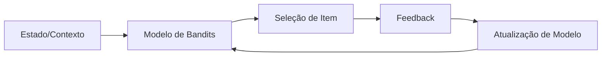
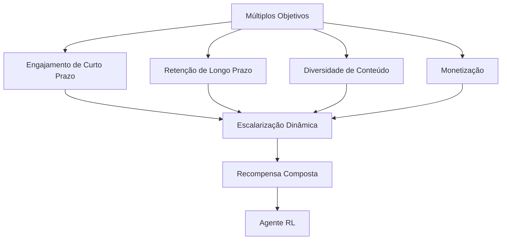
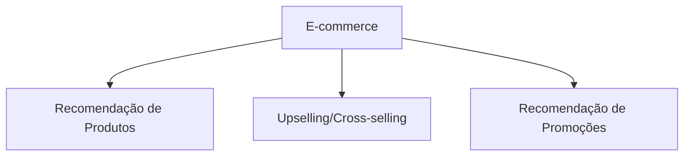
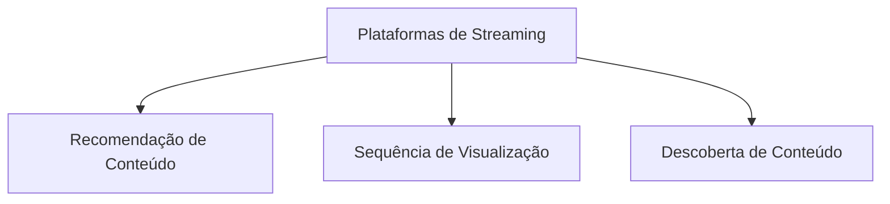
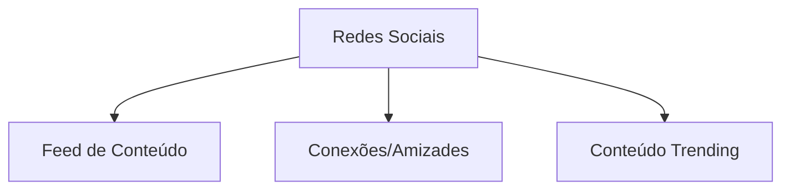

# 🧠 Caso de Uso: Sistemas de Recomendação Dinâmicos

## 🎯 Objetivo

Desenvolver um sistema de recomendação avançado baseado em Reinforcement Learning (RL) que se adapte dinamicamente às preferências do usuário, maximizando o engajamento de longo prazo e proporcionando recomendações personalizadas que evoluem com o tempo.

## 🔍 Problema de Negócio

Os sistemas de recomendação tradicionais enfrentam desafios significativos:

- Foco excessivo em recompensa imediata (cliques) em detrimento de valor de longo prazo
- Dificuldade em equilibrar exploração de novos interesses e exploração de preferências conhecidas
- "Filter bubbles" e recomendações homogêneas que limitam descobertas
- Incapacidade de adaptar-se rapidamente às mudanças de preferência
- Falta de consideração do contexto e estado atual do usuário

O Reinforcement Learning oferece uma solução dinâmica que pode otimizar simultaneamente objetivos de curto e longo prazo, explorando de maneira inteligente o espaço de conteúdo e adaptando-se às mudanças de comportamento e interesses.

## 📊 Modelagem do Problema

### Formulação como MDP (Processo de Decisão de Markov)

```mermaid
graph TD
    A[Estado] --> A1[Histórico do Usuário]
    A --> A2[Contexto Atual]
    A --> A3[Comportamento Recente]
    A --> A4[Feedback Explícito/Implícito]
    A --> A5[Hora/Localização/Dispositivo]
    
    B[Ações] --> B1[Itens a Recomendar]
    B --> B2[Diversidade da Lista]
    B --> B3[Ordem de Apresentação]
    B --> B4[Momento da Recomendação]
    
    C[Recompensas] --> C1[Cliques/Visualizações]
    C --> C2[Tempo de Engajamento]
    C --> C3[Compras/Conversões]
    C --> C4[Retenção de Longo Prazo]
    C --> C5[Feedback Explícito]
```



### Definição Formal

- **Estados (S)**: Representação do usuário, seu histórico, contexto e comportamento
- **Ações (A)**: Conjunto de itens possíveis para recomendar
- **Transições (P)**: Como as ações afetam o estado do usuário
- **Recompensas (R)**: Feedback imediato e métricas de engajamento de longo prazo
- **Política (π)**: Estratégia para selecionar recomendações em cada estado

## 🛠️ Arquitetura do Sistema



### 1. Componentes do Sistema

#### Representação do Usuário e Contexto

```python
class UserState:
    def __init__(self, user_id, history, context):
        # Informações básicas do usuário
        self.user_id = user_id
        self.demographics = get_user_demographics(user_id)
        
        # Histórico de interações
        self.short_term_history = history['short_term']  # últimas 20 interações
        self.long_term_history = history['long_term']    # padrões históricos
        
        # Embeddings de preferências
        self.item_embedding_avg = compute_avg_embedding(history['items'])
        self.category_preferences = compute_category_preferences(history)
        
        # Contexto atual
        self.time_of_day = context['time_of_day']
        self.day_of_week = context['day_of_week']
        self.device = context['device']
        self.location = context['location']
        
        # Estado da sessão
        self.session_length = context['session_length']
        self.last_interactions = context['last_interactions']
        
        # Métricas de engajamento
        self.avg_session_length = history['avg_session_length']
        self.return_rate = history['return_rate']
        self.conversion_rate = history['conversion_rate']
```

#### Representação de Itens

```python
class ItemLibrary:
    def __init__(self, catalog_items):
        self.items = {
            item_id: {
                'embedding': compute_item_embedding(item),
                'categories': item['categories'],
                'popularity': item['popularity'],
                'recency': item['recency'],
                'features': extract_features(item)
            } for item_id, item in catalog_items.items()
        }
        
        # Criar índices para busca eficiente
        self.category_index = build_category_index(self.items)
        self.embedding_index = build_ann_index(self.items)  # Approximate Nearest Neighbors
        
    def get_similar_items(self, item_id, n=10):
        """Retorna os N itens mais similares a um item específico"""
        if item_id not in self.items:
            return []
        
        query_embedding = self.items[item_id]['embedding']
        similar_ids = self.embedding_index.get_nearest(query_embedding, n)
        return similar_ids
    
    def get_items_by_category(self, category, n=50):
        """Retorna até N itens de uma categoria específica"""
        if category not in self.category_index:
            return []
        
        return list(self.category_index[category])[:n]
    
    def get_candidate_items(self, user_state, n=100):
        """Gera candidatos para recomendação baseados no estado do usuário"""
        candidates = set()
        
        # Itens similares aos que o usuário interagiu recentemente
        for item_id in user_state.short_term_history:
            similar = self.get_similar_items(item_id, n=10)
            candidates.update(similar)
        
        # Itens das categorias preferidas
        for category, score in user_state.category_preferences.items():
            if score > 0.2:  # Limiar de interesse
                category_items = self.get_items_by_category(category, n=25)
                candidates.update(category_items)
        
        # Remover itens que o usuário já interagiu
        all_history = set(user_state.short_term_history + user_state.long_term_history)
        candidates = candidates - all_history
        
        # Limitar número de candidatos
        return list(candidates)[:n]
```

## 💻 Implementação com RL Profundo

### Algoritmo: Deep Q-Network (DQN) com Dueling Architecture

O DQN é adequado para este caso por sua capacidade de lidar com espaços de ação grandes e discretos, além de manter a estabilidade durante o treinamento.

```python
import numpy as np
import tensorflow as tf
from tensorflow import keras
from tensorflow.keras import layers
import random
from collections import deque

class DuelingDQNAgent:
    def __init__(
        self,
        state_dim,
        action_dim,
        learning_rate=0.001,
        gamma=0.95,
        epsilon=1.0,
        epsilon_decay=0.995,
        epsilon_min=0.01,
        batch_size=64,
        memory_size=10000
    ):
        self.state_dim = state_dim
        self.action_dim = action_dim
        self.learning_rate = learning_rate
        self.gamma = gamma  # fator de desconto
        self.epsilon = epsilon  # exploração
        self.epsilon_decay = epsilon_decay
        self.epsilon_min = epsilon_min
        self.batch_size = batch_size
        
        # Memória de experiência
        self.memory = deque(maxlen=memory_size)
        
        # Modelos Q
        self.model = self.build_dueling_dqn()
        self.target_model = self.build_dueling_dqn()
        self.update_target_model()
    
    def build_dueling_dqn(self):
        """Constrói a arquitetura de rede dueling DQN"""
        # Camada de entrada
        input_layer = layers.Input(shape=(self.state_dim,))
        
        # Camadas compartilhadas
        x = layers.Dense(256, activation='relu')(input_layer)
        x = layers.Dense(256, activation='relu')(x)
        
        # Stream de Valor (V)
        value_stream = layers.Dense(128, activation='relu')(x)
        value = layers.Dense(1)(value_stream)
        
        # Stream de Vantagem (A)
        advantage_stream = layers.Dense(128, activation='relu')(x)
        advantage = layers.Dense(self.action_dim)(advantage_stream)
        
        # Combinar streams - Q(s,a) = V(s) + A(s,a) - mean(A(s,a))
        q_values = value + (advantage - tf.reduce_mean(advantage, axis=1, keepdims=True))
        
        model = keras.Model(inputs=input_layer, outputs=q_values)
        model.compile(optimizer=keras.optimizers.Adam(learning_rate=self.learning_rate), loss='mse')
        
        return model
    
    def update_target_model(self):
        """Atualiza o modelo alvo com pesos do modelo principal"""
        self.target_model.set_weights(self.model.get_weights())
    
    def remember(self, state, action, reward, next_state, done):
        """Armazena experiência na memória"""
        self.memory.append((state, action, reward, next_state, done))
    
    def act(self, state, training=True):
        """Seleciona uma ação usando a política epsilon-greedy"""
        if training and np.random.rand() < self.epsilon:
            # Exploração - ação aleatória
            return random.randrange(self.action_dim)
        
        # Exploração - usar modelo para prever valores Q
        q_values = self.model.predict(state.reshape(1, -1), verbose=0)[0]
        return np.argmax(q_values)  # ação com maior valor Q
    
    def replay(self):
        """Treina o modelo com experiências passadas (experience replay)"""
        if len(self.memory) < self.batch_size:
            return
        
        # Amostra de experiências
        minibatch = random.sample(self.memory, self.batch_size)
        
        for state, action, reward, next_state, done in minibatch:
            target = reward
            
            if not done:
                # Double DQN: usar modelo principal para selecionar ação,
                # mas modelo alvo para avaliar
                actions = self.model.predict(next_state.reshape(1, -1), verbose=0)[0]
                action_idx = np.argmax(actions)
                target_q = self.target_model.predict(next_state.reshape(1, -1), verbose=0)[0]
                target += self.gamma * target_q[action_idx]
            
            # Atualizar valor Q para a ação tomada
            target_f = self.model.predict(state.reshape(1, -1), verbose=0)
            target_f[0][action] = target
            
            # Treinar modelo
            self.model.fit(state.reshape(1, -1), target_f, epochs=1, verbose=0)
        
        # Decair epsilon
        if self.epsilon > self.epsilon_min:
            self.epsilon *= self.epsilon_decay
    
    def save(self, file_path):
        """Salva o modelo em disco"""
        self.model.save(file_path)
    
    def load(self, file_path):
        """Carrega o modelo do disco"""
        self.model = keras.models.load_model(file_path)
        self.update_target_model()
```

### Classe RecommendationEnvironment para Treinamento

```python
class RecommendationEnvironment:
    def __init__(self, user_data, item_library):
        self.user_data = user_data
        self.item_library = item_library
        self.current_user = None
        self.current_state = None
        self.recommended_items = []
        self.step_count = 0
        self.max_steps = 20  # máximo de recomendações por episódio
    
    def reset(self, user_id=None):
        """Reinicia o ambiente com um usuário aleatório ou específico"""
        if user_id is None:
            user_id = random.choice(list(self.user_data.keys()))
        
        self.current_user = user_id
        history = self.user_data[user_id]['history']
        context = self.user_data[user_id]['context']
        
        self.current_state = self.create_state_representation(user_id, history, context)
        self.recommended_items = []
        self.step_count = 0
        
        return self.current_state, {}
    
    def create_state_representation(self, user_id, history, context):
        """Cria representação vetorial do estado"""
        user_state = UserState(user_id, history, context)
        
        # Converter UserState para vetor
        state_vector = []
        
        # Adicionar características do usuário
        state_vector.extend(user_state.item_embedding_avg)
        
        # One-hot encoding das categorias preferidas
        category_vector = [0] * len(self.item_library.category_index)
        for cat_idx, category in enumerate(self.item_library.category_index.keys()):
            if category in user_state.category_preferences:
                category_vector[cat_idx] = user_state.category_preferences[category]
        state_vector.extend(category_vector)
        
        # Adicionar contexto
        state_vector.extend([
            user_state.time_of_day / 24.0,  # normalizado
            user_state.day_of_week / 7.0,   # normalizado
            user_state.session_length / 60.0,  # normalizado para 1 hora
            user_state.avg_session_length / 60.0,
            user_state.return_rate,
            user_state.conversion_rate
        ])
        
        # Adicionar últimas interações (encoded como índices de itens)
        recent_items = user_state.last_interactions
        for item_id in recent_items:
            if item_id in self.item_library.items:
                state_vector.extend(self.item_library.items[item_id]['embedding'])
        
        # Padding se necessário para manter tamanho fixo
        # ...
        
        return np.array(state_vector)
    
    def step(self, action):
        """
        Executa uma ação (recomendação) e retorna:
        - próximo estado
        - recompensa
        - flag de término
        - informações adicionais
        """
        self.step_count += 1
        
        # Mapear índice de ação para ID de item
        item_candidates = self.item_library.get_candidate_items(
            self.current_state, n=self.action_space.n
        )
        
        if action < len(item_candidates):
            item_id = item_candidates[action]
        else:
            # Fallback se ação estiver fora do range
            item_id = random.choice(item_candidates) if item_candidates else None
        
        # Verificar se item já foi recomendado neste episódio
        if item_id in self.recommended_items:
            reward = -0.5  # penalidade por recomendar o mesmo item
        else:
            # Simular feedback do usuário
            reward = self.simulate_user_feedback(item_id)
            self.recommended_items.append(item_id)
        
        # Atualizar estado
        history = self.user_data[self.current_user]['history']
        context = self.user_data[self.current_user]['context']
        
        # Atualizar contexto com novas informações
        if item_id:
            context['last_interactions'].append(item_id)
            context['session_length'] += 1
        
        # Criar novo estado
        next_state = self.create_state_representation(
            self.current_user, history, context
        )
        
        # Verificar se episódio terminou
        done = self.step_count >= self.max_steps
        
        # Informações adicionais
        info = {
            'item_id': item_id,
            'user_id': self.current_user,
            'reward_details': {
                'click': 1 if reward > 0 else 0,
                'engagement': max(0, reward - 0.5)
            }
        }
        
        self.current_state = next_state
        
        return next_state, reward, done, info
    
    def simulate_user_feedback(self, item_id):
        """
        Simula a resposta do usuário à recomendação
        Retorna uma recompensa baseada na probabilidade de interesse
        """
        if not item_id:
            return -1.0  # penalidade por recomendação inválida
        
        user_state = UserState(
            self.current_user,
            self.user_data[self.current_user]['history'],
            self.user_data[self.current_user]['context']
        )
        
        # Calcular probabilidade de interesse baseada em:
        
        # 1. Similaridade com histórico recente
        similarity_score = 0
        if item_id in self.item_library.items:
            item_embedding = self.item_library.items[item_id]['embedding']
            similarity_score = cosine_similarity(item_embedding, user_state.item_embedding_avg)
        
        # 2. Preferência por categoria
        category_score = 0
        if item_id in self.item_library.items:
            item_categories = self.item_library.items[item_id]['categories']
            category_scores = [
                user_state.category_preferences.get(cat, 0) 
                for cat in item_categories
            ]
            category_score = max(category_scores) if category_scores else 0
        
        # 3. Fator de novidade/surpresa
        novelty_score = 1.0
        for hist_item in user_state.short_term_history:
            if hist_item in self.item_library.items:
                hist_embedding = self.item_library.items[hist_item]['embedding']
                if item_id in self.item_library.items:
                    item_embedding = self.item_library.items[item_id]['embedding']
                    similarity = cosine_similarity(hist_embedding, item_embedding)
                    novelty_score = min(novelty_score, 1.0 - similarity)
        
        # Combinar scores
        interest_probability = (
            0.5 * similarity_score + 
            0.3 * category_score + 
            0.2 * novelty_score
        )
        
        # Adicionar ruído para simular comportamento não deterministico
        interest_probability = min(1.0, max(0.0, 
            interest_probability + np.random.normal(0, 0.1)
        ))
        
        # Simular clique (recompensa binária)
        click = np.random.random() < interest_probability
        
        # Simular engajamento (recompensa contínua)
        if click:
            engagement = interest_probability * 2  # Escala: 0 - 2
            return 1.0 + engagement  # Recompensa total: 1 (clique) + engajamento
        else:
            return 0.0  # Sem clique, sem recompensa
```

### Treinamento e Implementação do Agente

```python
# Configuração do ambiente e agente
def train_recommendation_agent(user_data, item_library, episodes=1000):
    """Treina o agente de recomendação usando DQN"""
    # Criar ambiente
    env = RecommendationEnvironment(user_data, item_library)
    
    # Obter dimensões do problema
    state_dim = env.reset()[0].shape[0]
    action_dim = 100  # Considerar top-100 candidatos como ações possíveis
    
    # Criar agente
    agent = DuelingDQNAgent(
        state_dim=state_dim,
        action_dim=action_dim,
        learning_rate=0.0005,
        gamma=0.95,
        epsilon=1.0,
        epsilon_decay=0.995,
        epsilon_min=0.01,
        batch_size=32,
        memory_size=50000
    )
    
    # Métricas de treinamento
    rewards_history = []
    avg_rewards_history = []
    
    # Loop de treinamento
    for episode in range(episodes):
        state, _ = env.reset()
        total_reward = 0
        done = False
        
        while not done:
            # Selecionar ação
            action = agent.act(state)
            
            # Executar ação
            next_state, reward, done, info = env.step(action)
            
            # Armazenar experiência
            agent.remember(state, action, reward, next_state, done)
            
            # Treinar agente
            agent.replay()
            
            state = next_state
            total_reward += reward
        
        # Atualizar modelo alvo periodicamente
        if episode % 10 == 0:
            agent.update_target_model()
        
        # Registrar recompensas
        rewards_history.append(total_reward)
        avg_reward = np.mean(rewards_history[-100:])
        avg_rewards_history.append(avg_reward)
        
        # Exibir progresso
        if episode % 20 == 0:
            print(f"Episódio: {episode}, Recompensa: {total_reward:.2f}, "
                  f"Média (100 ep): {avg_reward:.2f}, Epsilon: {agent.epsilon:.4f}")
        
        # Salvar modelo periodicamente
        if episode % 100 == 0:
            agent.save(f"recommendation_model_ep{episode}.h5")
    
    # Salvar modelo final
    agent.save("recommendation_model_final.h5")
    
    return agent, rewards_history, avg_rewards_history
```

## 📏 Métricas de Avaliação

### Métricas Online

- **CTR (Click-Through Rate)**: Taxa de cliques nas recomendações
- **Tempo de Sessão**: Duração média das sessões de usuário
- **Profundidade de Scroll**: Quantas recomendações são visualizadas
- **Conversion Rate**: Taxa de conversão após recomendações 
- **Retention Rate**: Taxa de retorno dos usuários

### Métricas Offline

- **Precision@K**: Precisão das recomendações nos top-K itens
- **Recall@K**: Cobertura das recomendações nos top-K itens
- **NDCG**: Discounted Cumulative Gain normalizado
- **Diversity**: Diversidade das recomendações
- **Serendipity**: Capacidade de recomendar itens surpreendentes mas relevantes

## 🌟 Aspectos Avançados

### Contextual Multi-Armed Bandits

Para cenários com menos dados disponíveis ou necessidade de adaptação mais rápida:



### Recomendação Multi-objetivo



### Exploration Strategies

```mermaid
graph TD
    A[Estratégias de Exploração] --> B[Thompson Sampling]
    A --> C[UCB (Upper Confidence Bound)]
    A --> D[Noisy Networks]
    A --> E[Entropy-Based Exploration]
    
    B & C & D & E --> F[Política de Recomendação]
```

## 🌐 Aplicações em Diferentes Setores

### E-commerce



### Streaming de Conteúdo



### Redes Sociais



## 🔍 Considerações e Desafios

### Desafios Técnicos

- **Cold Start**: Recomendações para novos usuários/itens
- **Feedback Escasso**: Nem todas as interações geram feedback explícito
- **Escalabilidade**: Milhões de usuários e itens
- **Latência**: Recomendações devem ser geradas em milissegundos

### Aspectos Éticos

- **Filter Bubbles**: Evitar reforço excessivo de preferências existentes
- **Manipulação**: Balancear interesses do usuário e objetivos do negócio
- **Transparência**: Explicabilidade das recomendações
- **Privacidade**: Tratamento responsável dos dados de usuário

## 📈 Resultados Esperados

- Aumento de 15-30% no engajamento do usuário
- Melhoria de 20-40% no tempo de sessão médio
- Incremento de 10-25% nas taxas de conversão
- Crescimento de 15-30% na diversidade de conteúdo consumido
- Aumento de 20-35% na retenção de usuários

## 🚀 Evolução e Próximos Passos

- **Personalização em Multiníveis**: Recomendações em diferentes horizontes temporais
- **Recomendação Multimodal**: Integrar texto, imagem, áudio e vídeo
- **Aprendizado Federado**: Treinamento sem centralização de dados
- **Adaptação Contínua**: Modelos que evoluem em tempo real
- **Explicabilidade**: Justificativas compreensíveis para recomendações