# 🔄 Generative Models

Modelos Generativos são uma classe de algoritmos de inteligência artificial capazes de aprender a distribuição estatística de dados e gerar novos exemplos semelhantes aos dados de treinamento, mas originais.

## 📑 Definição

Modelos Generativos são técnicas de aprendizado de máquina que aprendem a representar a distribuição de probabilidade implícita dos dados de treinamento, permitindo que gerem novos dados com características similares. Diferente dos modelos discriminativos que aprendem fronteiras de decisão entre classes, os generativos modelam como os dados são gerados.

## 🔄 Funcionamento Básico

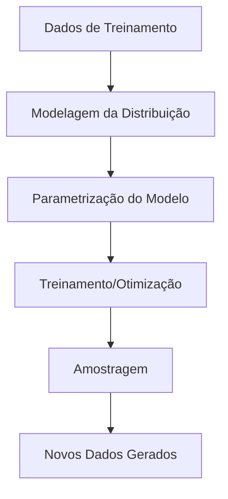

## 🧩 Principais Tipos de Modelos Generativos

### Redes Adversárias Generativas (GANs)

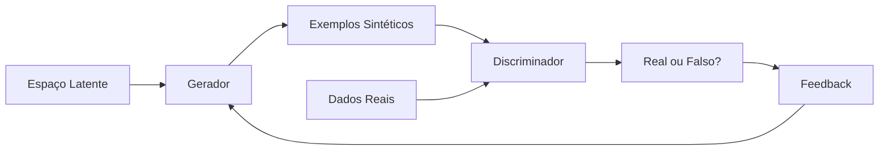

GANs consistem em duas redes neurais que competem entre si: um gerador que cria amostras e um discriminador que tenta distinguir entre amostras reais e geradas.

### Variational Autoencoders (VAEs)

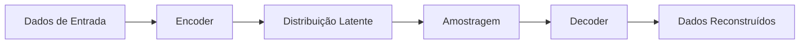

VAEs aprendem uma representação latente dos dados usando um encoder, e então usam um decoder para gerar novos dados a partir desse espaço latente.

### Diffusion Models

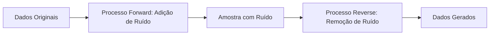

Modelos de difusão aprendem a reverter gradualmente um processo de difusão, removendo ruído de uma distribuição aleatória até gerar amostras de alta qualidade.

### Transformer-Based Models

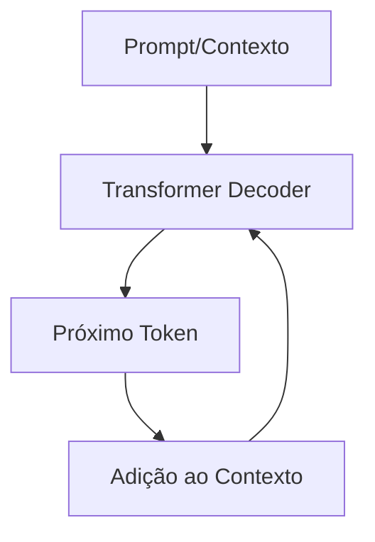

Modelos baseados em Transformers, como GPT, geram conteúdo de forma autoregressiva, predizendo o próximo token com base no contexto anterior.

### Energy-Based Models (EBMs)

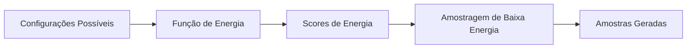

EBMs atribuem um valor escalar (energia) a cada configuração possível, com configurações mais prováveis recebendo energias mais baixas.

## 🛠️ Aplicações dos Modelos Generativos

- **Geração de Imagens**: Criação de imagens fotorrealistas ou artísticas
- **Síntese de Texto**: Geração de texto coerente e contextual
- **Geração de Áudio**: Síntese de fala, música e efeitos sonoros
- **Síntese de Vídeo**: Criação de conteúdo audiovisual
- **Design Generativo**: Criação de designs, arquitetura, moda
- **Aumento de Dados**: Expansão de datasets para treinamento
- **Simulação**: Criação de ambientes e cenários virtuais
- **Edição e Manipulação**: Modificação controlada de conteúdo existente

## 🔍 Principais Desafios

### Mode Collapse

Problema onde o modelo gera apenas um subconjunto limitado de amostras possíveis.

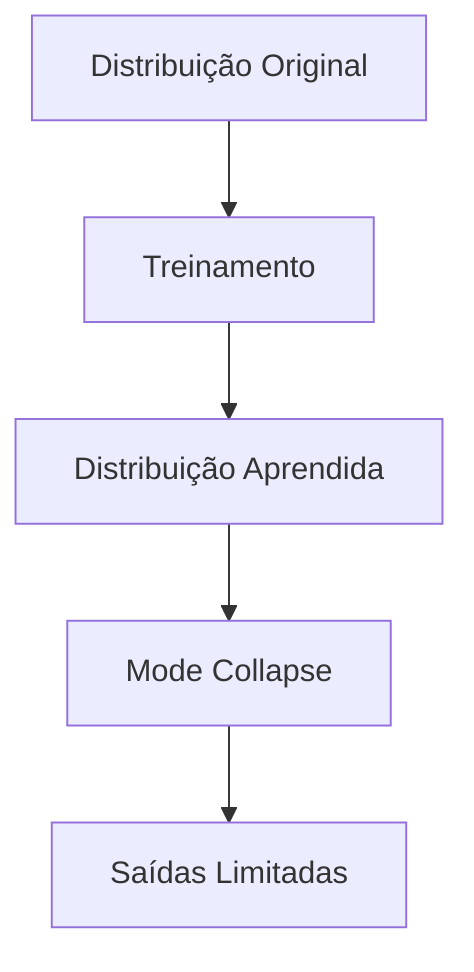

### Avaliação de Modelos Generativos

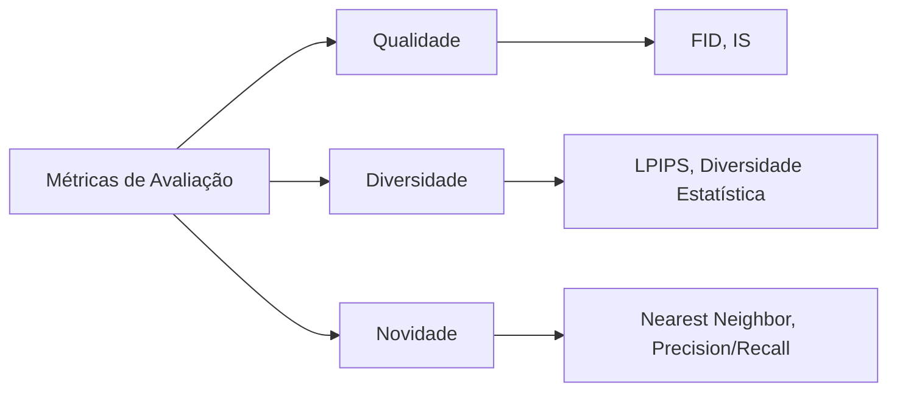

A avaliação de modelos generativos é complexa, envolvendo métricas quantitativas e avaliação humana.

## 🧠 Arquiteturas Avançadas e Técnicas

### Arquiteturas Avançadas de GANs

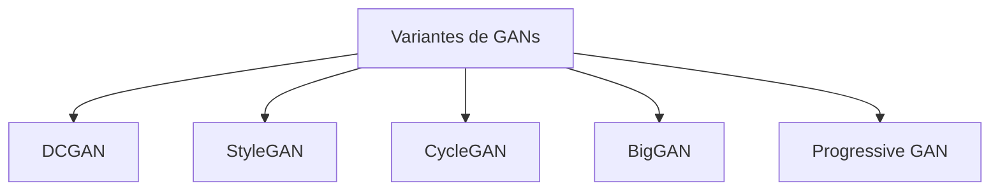

### Técnicas de Melhoria para VAEs

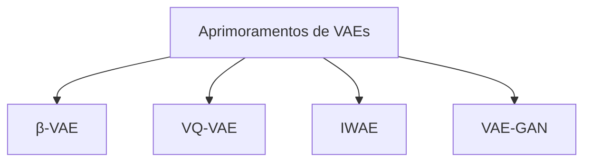

### Modelos de Difusão Modernos

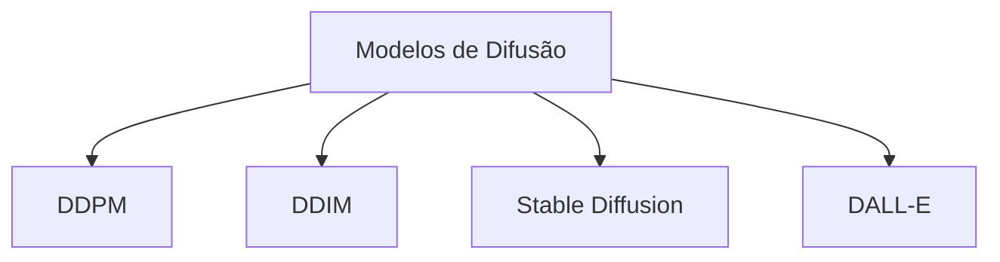

## 🔗 Casos de Uso

- [Geração de Imagens Sintéticas](./use-case-synthetic-images.md)
- [Geração de Texto Criativo](./use-case-text-generation.md)

## 🛠️ Frameworks e Ferramentas

- **PyTorch**: Framework flexível para implementação de modelos generativos
- **TensorFlow/Keras**: Alternativa robusta com alto nível de abstração
- **JAX**: Framework focado em diferenciação automática e computação acelerada
- **Hugging Face Diffusers**: Biblioteca para modelos de difusão estado-da-arte
- **StyleGAN3**: Implementação oficial do StyleGAN3 para geração de imagens
- **Stable Diffusion**: Modelos de difusão latente para geração de imagens
- **GPT/LLaMA**: Modelos de grande escala para geração de texto

## 🌟 Tendências Recentes

- **Modelos Multimodais**: Integração de múltiplas modalidades (texto-imagem)
- **Controle Semântico**: Direcionamento preciso do processo generativo
- **Eficiência Computacional**: Modelos mais compactos e rápidos
- **Geração 3D**: Expansão para domínios tridimensionais
- **Modelos Foundation**: Modelos pré-treinados adaptáveis a múltiplas tarefas
- **Difusão Latente**: Aplicação de modelos de difusão em espaços latentes

## 🔬 Pesquisa e Inovação

- **Geração Compositional**: Criação de conteúdo com elementos combinatórios
- **Interpretabilidade**: Compreensão dos processos internos de geração
- **Edição Semântica**: Manipulação de atributos específicos em conteúdo gerado
- **Avaliação Perceptual**: Métricas alinhadas com percepção humana
- **Continual Learning**: Adaptação contínua a novos dados e domínios