# 📝 Caso de Uso: Geração de Texto Criativo

## 🎯 Objetivo

Desenvolver um sistema baseado em modelos generativos para geração de texto criativo e de alta qualidade em diversos formatos e estilos, permitindo aplicações que vão desde a assistência à redação até a criação automática de conteúdo.

## 🔍 Problema de Negócio

A criação de conteúdo textual de qualidade enfrenta diversos desafios:

- Processo intensivo em tempo e recursos criativos
- Necessidade de manter consistência de voz e estilo
- Dificuldade em escalar a produção de conteúdo
- Bloqueio criativo e geração de novas ideias
- Adaptação do texto para diferentes audiências e formatos

Os modelos generativos de texto oferecem uma solução promissora, permitindo a produção assistida ou automatizada de conteúdo textual de alta qualidade, com controle sobre estilo, tom e formato, enquanto ampliam a capacidade criativa humana.

## 📊 Arquiteturas de Modelo para Geração de Texto

### Evolução dos Modelos Generativos de Texto

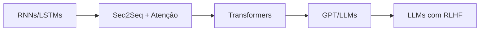

### Principais Arquiteturas Atuais

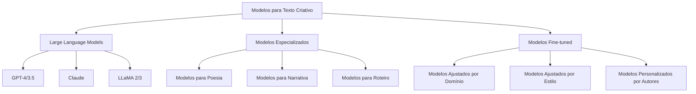

## 🛠️ Implementação de um Sistema de Geração Textual

Para aplicações práticas, podemos implementar um sistema flexível que utilize LLMs para geração de texto criativo com controle fino sobre o resultado.

```python
import os
import requests
import json
import openai
from typing import List, Dict, Any, Optional, Union
import logging
import time
import re

class CreativeTextGenerator:
    """
    Sistema para geração de texto criativo usando modelos de linguagem.
    Suporta diferentes provedores de modelos e oferece controle fino
    sobre o processo de geração.
    """
    
    def __init__(
        self, 
        provider: str = "openai",
        model: str = "gpt-4", 
        api_key: Optional[str] = None,
        temperature: float = 0.7,
        max_tokens: int = 1000,
        top_p: float = 0.9,
        frequency_penalty: float = 0.5,
        presence_penalty: float = 0.5
    ):
        """
        Inicializa o gerador de texto criativo.
        
        Args:
            provider: Provedor do modelo ('openai', 'anthropic', 'local')
            model: Nome do modelo a ser usado
            api_key: Chave de API (se necessário)
            temperature: Controle de aleatoriedade (0.0-1.0)
            max_tokens: Número máximo de tokens a gerar
            top_p: Amostragem de núcleo (diversidade)
            frequency_penalty: Penalidade para repetição de tokens
            presence_penalty: Penalidade para repetição de tópicos
        """
        self.provider = provider
        self.model = model
        self.temperature = temperature
        self.max_tokens = max_tokens
        self.top_p = top_p
        self.frequency_penalty = frequency_penalty
        self.presence_penalty = presence_penalty
        
        # Configurar logger
        logging.basicConfig(level=logging.INFO)
        self.logger = logging.getLogger(__name__)
        
        # Configurar API baseado no provedor
        if provider == "openai":
            if api_key:
                openai.api_key = api_key
            elif os.environ.get("OPENAI_API_KEY"):
                openai.api_key = os.environ["OPENAI_API_KEY"]
            else:
                raise ValueError("API key required for OpenAI")
        
        elif provider == "anthropic":
            self.anthropic_api_key = api_key or os.environ.get("ANTHROPIC_API_KEY")
            if not self.anthropic_api_key:
                raise ValueError("API key required for Anthropic")
        
        elif provider == "local":
            self.local_url = os.environ.get("LOCAL_LLM_URL", "http://localhost:8000/v1")
            self.logger.info(f"Using local LLM at: {self.local_url}")
        
        else:
            raise ValueError(f"Unsupported provider: {provider}")
    
    def generate(
        self, 
        prompt: str, 
        system_message: Optional[str] = None,
        num_variations: int = 1,
        output_format: Optional[str] = None,
        style_guide: Optional[Dict[str, Any]] = None
    ) -> List[str]:
        """
        Gera texto criativo baseado no prompt fornecido.
        
        Args:
            prompt: Texto de entrada para guiar a geração
            system_message: Instrução de sistema para definir comportamento
            num_variations: Número de variações a gerar
            output_format: Formato desejado de saída (json, markdown, etc)
            style_guide: Diretrizes de estilo para o texto
            
        Returns:
            Lista de textos gerados
        """
        results = []
        
        # Incorporar guia de estilo no prompt se fornecido
        enhanced_prompt = self._enhance_prompt(prompt, style_guide, output_format)
        
        # Configurar mensagens baseadas no sistema e prompt
        messages = self._prepare_messages(enhanced_prompt, system_message)
        
        # Gerar variações
        for i in range(num_variations):
            try:
                if self.provider == "openai":
                    result = self._generate_openai(messages)
                elif self.provider == "anthropic":
                    result = self._generate_anthropic(enhanced_prompt, system_message)
                elif self.provider == "local":
                    result = self._generate_local(messages)
                
                results.append(result)
                
                # Pequena pausa entre chamadas para evitar throttling
                if i < num_variations - 1:
                    time.sleep(0.5)
                    
            except Exception as e:
                self.logger.error(f"Error generating text (variation {i+1}): {e}")
                # Continuar com próxima variação em caso de erro
        
        return results
    
    def _enhance_prompt(
        self, 
        prompt: str, 
        style_guide: Optional[Dict[str, Any]] = None,
        output_format: Optional[str] = None
    ) -> str:
        """
        Melhora o prompt com guia de estilo e instruções de formato.
        """
        enhanced_prompt = prompt
        
        # Adicionar guia de estilo
        if style_guide:
            style_section = "\n\nEstilo de escrita:\n"
            for key, value in style_guide.items():
                style_section += f"- {key}: {value}\n"
            enhanced_prompt += style_section
        
        # Adicionar instruções de formato
        if output_format:
            if output_format.lower() == "json":
                enhanced_prompt += "\n\nFormate a saída como um objeto JSON válido."
            elif output_format.lower() == "markdown":
                enhanced_prompt += "\n\nFormate a saída usando Markdown."
            else:
                enhanced_prompt += f"\n\nFormate a saída como {output_format}."
        
        return enhanced_prompt
    
    def _prepare_messages(
        self, 
        prompt: str, 
        system_message: Optional[str] = None
    ) -> List[Dict[str, str]]:
        """
        Prepara a lista de mensagens no formato adequado para o modelo.
        """
        messages = []
        
        # Adicionar mensagem de sistema se fornecida
        if system_message:
            messages.append({"role": "system", "content": system_message})
        
        # Adicionar prompt do usuário
        messages.append({"role": "user", "content": prompt})
        
        return messages
    
    def _generate_openai(self, messages: List[Dict[str, str]]) -> str:
        """
        Gera texto usando a API da OpenAI.
        """
        response = openai.ChatCompletion.create(
            model=self.model,
            messages=messages,
            temperature=self.temperature,
            max_tokens=self.max_tokens,
            top_p=self.top_p,
            frequency_penalty=self.frequency_penalty,
            presence_penalty=self.presence_penalty
        )
        
        return response.choices[0].message.content.strip()
    
    def _generate_anthropic(
        self, 
        prompt: str, 
        system_message: Optional[str] = None
    ) -> str:
        """
        Gera texto usando a API da Anthropic.
        """
        headers = {
            "Content-Type": "application/json",
            "x-api-key": self.anthropic_api_key,
            "anthropic-version": "2023-06-01"
        }
        
        data = {
            "model": self.model,
            "max_tokens": self.max_tokens,
            "temperature": self.temperature,
            "top_p": self.top_p,
            "prompt": f"\n\nHuman: {prompt}\n\nAssistant:",
        }
        
        if system_message:
            data["system"] = system_message
        
        response = requests.post(
            "https://api.anthropic.com/v1/complete",
            headers=headers,
            json=data
        )
        
        if response.status_code != 200:
            raise Exception(f"Anthropic API error: {response.text}")
        
        return response.json()["completion"].strip()
    
    def _generate_local(self, messages: List[Dict[str, str]]) -> str:
        """
        Gera texto usando um modelo local via API REST.
        """
        headers = {"Content-Type": "application/json"}
        
        data = {
            "model": self.model,
            "messages": messages,
            "temperature": self.temperature,
            "max_tokens": self.max_tokens,
            "top_p": self.top_p,
            "frequency_penalty": self.frequency_penalty,
            "presence_penalty": self.presence_penalty
        }
        
        response = requests.post(
            f"{self.local_url}/chat/completions",
            headers=headers,
            json=data
        )
        
        if response.status_code != 200:
            raise Exception(f"Local API error: {response.text}")
        
        return response.json()["choices"][0]["message"]["content"].strip()
    
    def generate_with_outline(
        self, 
        topic: str, 
        format_type: str,
        outline_depth: int = 2,
        style_guide: Optional[Dict[str, Any]] = None
    ) -> Dict[str, Any]:
        """
        Gera texto criativo com outline automático.
        
        Args:
            topic: Tópico principal para o texto
            format_type: Tipo de formato (artigo, história, etc)
            outline_depth: Profundidade do outline (1-3)
            style_guide: Guia de estilo opcional
            
        Returns:
            Dicionário com outline e texto gerado
        """
        # Primeiro gerar o outline
        outline_prompt = f"""
        Crie um outline detalhado para {format_type} sobre "{topic}".
        O outline deve ter uma estrutura de {outline_depth} níveis.
        Inclua apenas a estrutura do outline, sem desenvolver o conteúdo.
        """
        
        outline_result = self.generate(
            prompt=outline_prompt,
            system_message="Você é um especialista em estruturação de conteúdo.",
            num_variations=1,
            output_format="markdown"
        )[0]
        
        # Extrair seções do outline
        sections = self._parse_outline(outline_result)
        
        # Gerar conteúdo para cada seção
        content_sections = {}
        
        for section_title in sections:
            section_prompt = f"""
            Escreva o conteúdo para a seção "{section_title}" de um {format_type} sobre "{topic}".
            Esta seção deve se encaixar coerentemente no contexto geral.
            
            Mantenha o conteúdo conciso, relevante e envolvente.
            """
            
            section_content = self.generate(
                prompt=section_prompt,
                system_message=f"Você é um escritor especializado em {format_type}.",
                num_variations=1,
                style_guide=style_guide
            )[0]
            
            content_sections[section_title] = section_content
        
        # Montar documento final
        result = {
            "topic": topic,
            "format": format_type,
            "outline": sections,
            "content_by_section": content_sections,
            "full_content": self._assemble_content(topic, sections, content_sections, format_type)
        }
        
        return result
    
    def _parse_outline(self, outline_text: str) -> List[str]:
        """
        Extrai seções de um outline em formato de texto.
        """
        # Padrão para encontrar cabeçalhos em markdown
        header_pattern = r'^#{1,6}\s+(.+)$'
        
        # Padrão para itens numerados ou com marcadores
        list_pattern = r'^[\s]*[\*\-\d\.]+\s+(.+)$'
        
        sections = []
        
        for line in outline_text.strip().split('\n'):
            # Tentar encontrar cabeçalhos
            header_match = re.match(header_pattern, line)
            if header_match:
                sections.append(header_match.group(1).strip())
                continue
            
            # Tentar encontrar itens de lista
            list_match = re.match(list_pattern, line)
            if list_match:
                sections.append(list_match.group(1).strip())
        
        return sections
    
    def _assemble_content(
        self, 
        topic: str, 
        sections: List[str],
        content_sections: Dict[str, str],
        format_type: str
    ) -> str:
        """
        Monta o documento completo a partir das seções geradas.
        """
        # Título
        document = f"# {topic}\n\n"
        
        # Adicionar cada seção
        for section in sections:
            document += f"## {section}\n\n"
            
            if section in content_sections:
                document += f"{content_sections[section]}\n\n"
        
        return document
    
    def creative_assistant(self, human_input: str) -> str:
        """
        Modo de assistente para ajudar em tarefas de escrita criativa.
        
        Args:
            human_input: Instrução ou pergunta do usuário
            
        Returns:
            Resposta de assistência criativa
        """
        # Analisar o tipo de ajuda solicitada
        is_brainstorming = any(word in human_input.lower() for word in 
                              ["ideia", "idéia", "brainstorm", "sugestão", "inspiração"])
        
        is_editing = any(word in human_input.lower() for word in 
                        ["revisar", "editar", "melhorar", "corrigir", "feedback"])
        
        is_continuation = any(word in human_input.lower() for word in 
                             ["continuar", "próximo", "seguinte", "depois", "sequência"])
        
        # Definir mensagem do sistema baseada no tipo de ajuda
        if is_brainstorming:
            system_message = """Você é um assistente de brainstorming criativo. 
            Ofereça ideias originais, perspectivas únicas e conceitos inspiradores. 
            Seja ousado e inovador em suas sugestões."""
            
        elif is_editing:
            system_message = """Você é um editor profissional com experiência em aprimorar textos.
            Ofereça feedback construtivo, sugestões de melhoria e correções quando apropriado.
            Mantenha a voz original do autor enquanto refina a clareza, fluidez e impacto."""
            
        elif is_continuation:
            system_message = """Você é um colaborador de escrita criativa que ajuda a expandir e 
            continuar textos existentes. Mantenha consistência com o estilo, tom e narrativa 
            estabelecidos, enquanto adiciona valor ao conteúdo de forma natural."""
            
        else:
            system_message = """Você é um assistente de escrita criativa versátil.
            Ajude com ideias, estruturação, feedback ou desenvolvimento de conteúdo,
            sempre respeitando a visão do escritor enquanto oferece valor agregado."""
        
        # Gerar resposta
        response = self.generate(
            prompt=human_input,
            system_message=system_message,
            num_variations=1,
            temperature=0.7
        )[0]
        
        return response

# Exemplo de uso
if __name__ == "__main__":
    # Inicializar o gerador de texto
    text_generator = CreativeTextGenerator(
        provider="openai",
        model="gpt-4",
        temperature=0.8
    )
    
    # Exemplo de geração de história curta
    story_prompt = """
    Escreva uma história curta que se passa em uma cidade futurista onde a tecnologia 
    permite que as pessoas compartilhem memórias diretamente entre si. A protagonista 
    acidentalmente recebe uma memória que não deveria ter visto.
    """
    
    style_guide = {
        "tom": "contemplativo com elementos de suspense",
        "ritmo": "progressão gradual com revelações cuidadosamente dosadas",
        "perspectiva": "terceira pessoa limitada",
        "linguagem": "metáforas sutis relacionadas à tecnologia e memória"
    }
    
    story = text_generator.generate(
        prompt=story_prompt,
        system_message="Você é um autor premiado de ficção científica especulativa.",
        style_guide=style_guide
    )[0]
    
    print("=== HISTÓRIA GERADA ===")
    print(story)
    print("\n")
    
    # Exemplo de geração de artigo com outline
    article_result = text_generator.generate_with_outline(
        topic="O Impacto da Inteligência Artificial na Criatividade Humana",
        format_type="artigo analítico",
        outline_depth=2,
        style_guide={"tom": "reflexivo mas baseado em evidências", "público": "profissionais criativos"}
    )
    
    print("=== OUTLINE DO ARTIGO ===")
    print("\n".join(article_result["outline"]))
    print("\n")
    print("=== ARTIGO COMPLETO ===")
    print(article_result["full_content"])
```

## 📝 Aplicações Criativas Específicas

### Escrita Narrativa

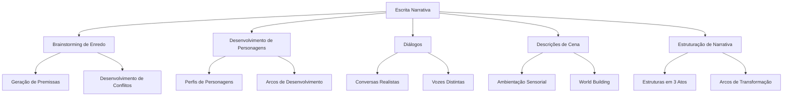

### Copywriting e Marketing

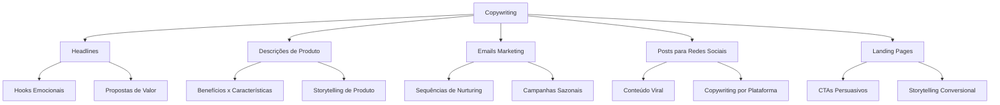

### Poesia e Letras

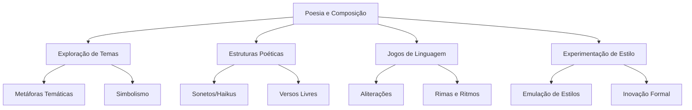

## 🛠️ Técnicas de Fine-tuning e Personalização

### Personalização por Estilo

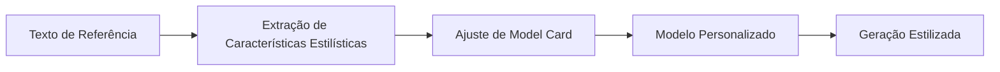

Para aplicações que exigem uma voz consistente:

1. Coleta de 10-50 exemplos do estilo desejado
2. Análise de características distintivas (vocabulário, estrutura, ritmo)
3. Fine-tuning de modelo base ou criação de sistema prompter
4. Validação com métricas de similaridade estilística

### PEFT (Parameter-Efficient Fine-Tuning)

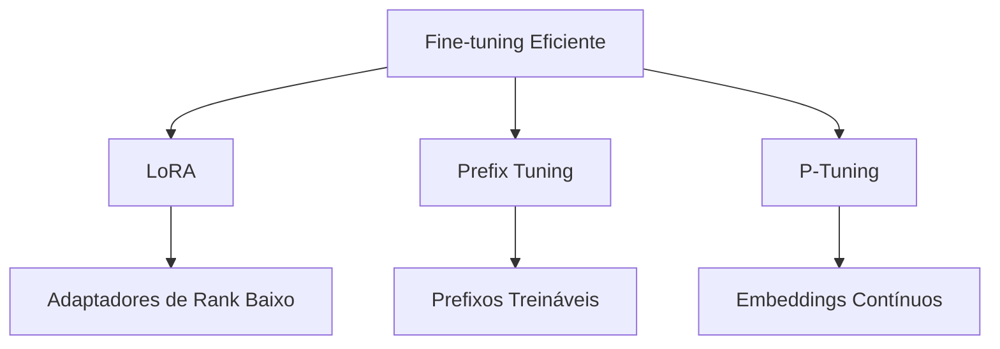

Técnicas que permitem personalização de modelos com recursos computacionais limitados.

## 📊 Avaliação e Métricas

### Métricas Automáticas

- **Perplexidade**: Medida de quão bem o modelo prevê o texto
- **BLEU/ROUGE**: Similaridade com referências humanas
- **BERTScore**: Similaridade semântica contextual
- **Métricas de Diversidade**: Variedade lexical e sintática
- **Métricas de Engajamento**: Modeladas após reações humanas

### Avaliação Humana

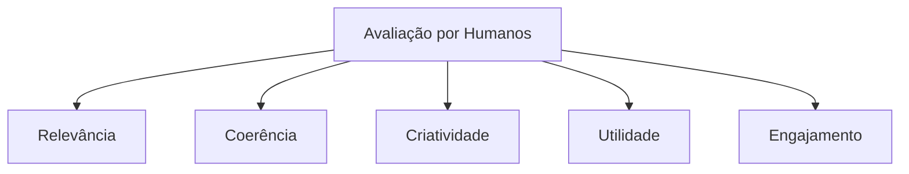

Os métodos mais confiáveis ainda envolvem avaliadores humanos qualificados.

## 🌐 Implementação em Diferentes Indústrias

### Entretenimento e Mídia

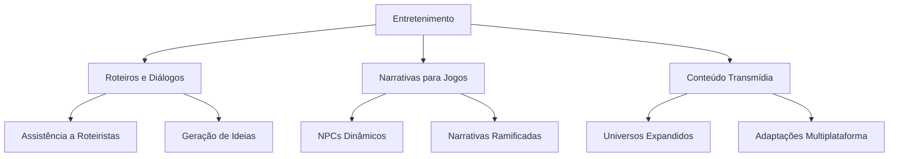

### Educação

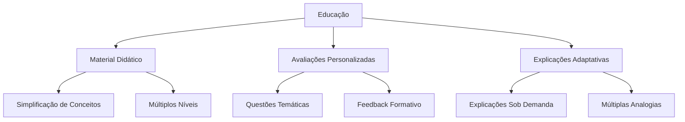

### Saúde e Bem-Estar

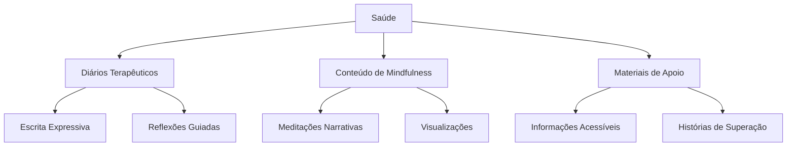

## 🔍 Considerações Éticas e Legais

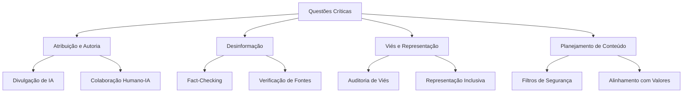

## 📈 Resultados e Benefícios

- Aumento de 3-5x na produtividade de redatores
- Diminuição de 40-60% no tempo de desenvolvimento de conteúdo
- Ampliação de 70-100% na variedade de conteúdo produzido
- Melhoria de 30-50% na consistência de voz e estilo
- Redução de 40-60% do bloqueio criativo e fadiga de conteúdo

## 🔄 Tendências Futuras

- **Geração Multimodal**: Integração de texto com imagem, áudio e vídeo
- **Controle Fino**: Maior precisão no controle de parâmetros específicos
- **Personalização Profunda**: Modelos adaptados para vozes individuais
- **Colaboração Assistida**: Ferramentas que ampliam (não substituem) a criatividade humana
- **Modelos Especializados por Domínio**: Refinados para nichos específicos