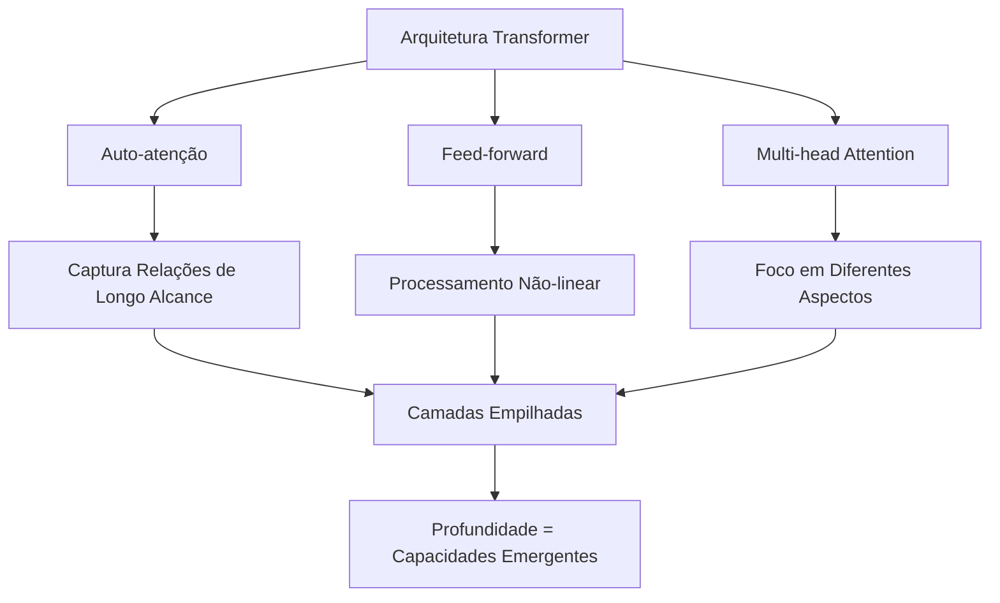
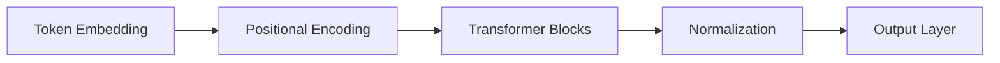
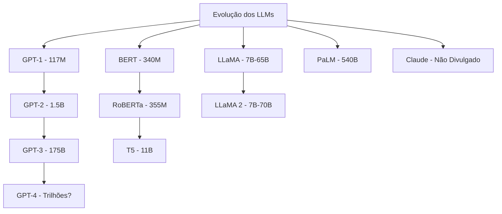
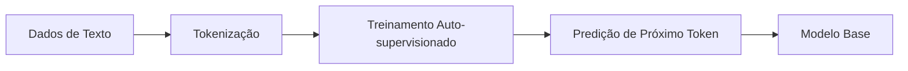
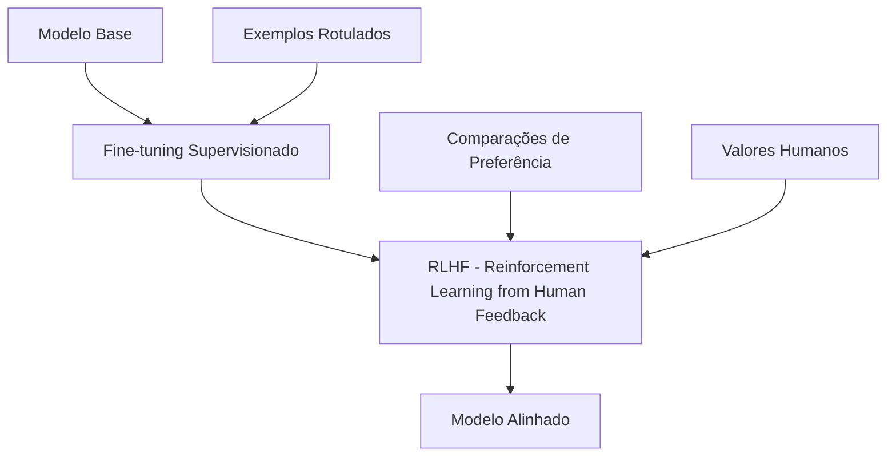
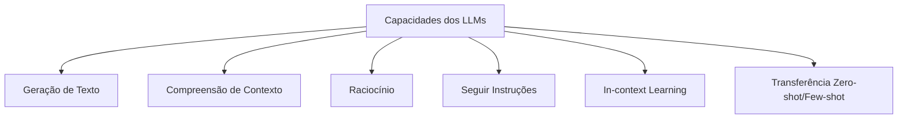
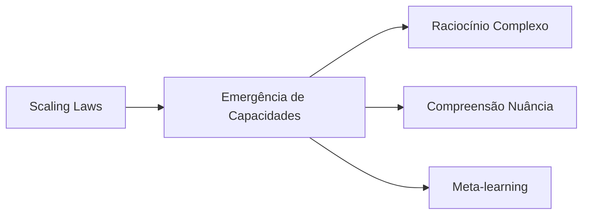
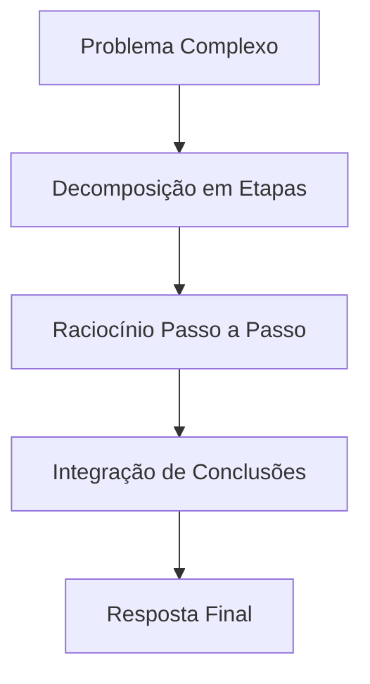
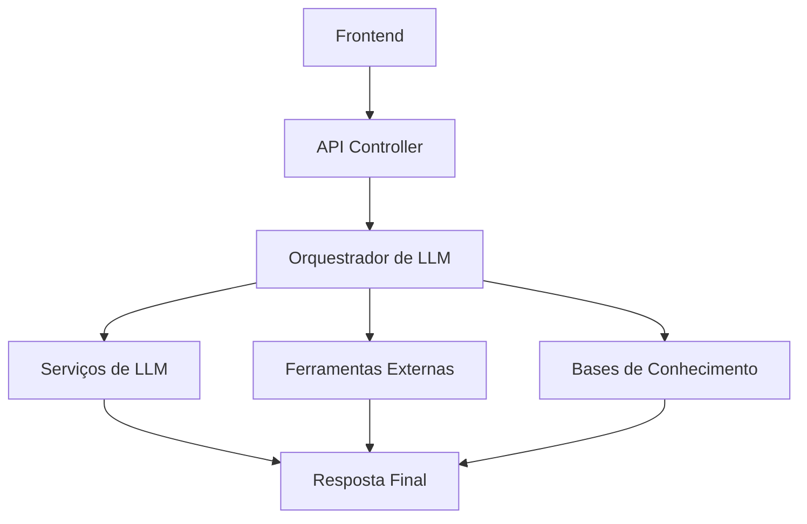
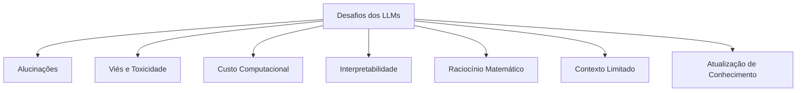

# 🐳 Large Language Models (LLMs)

Large Language Models (LLMs) são modelos de IA avançados treinados em vastos volumes de texto com bilhões de parâmetros, capazes de compreender, gerar e manipular linguagem de formas incrivelmente sofisticadas e contextuais.

## 📑 Definição

LLMs são modelos neurais de grande escala treinados em quantidades massivas de dados textuais utilizando técnicas de aprendizado auto-supervisionado. Eles são projetados para prever a próxima palavra ou token em uma sequência, o que os permite gerar texto coerente e contextualmente relevante, bem como realizar uma ampla variedade de tarefas linguísticas.

## 🧠 Arquitetura e Funcionamento

Os LLMs são tipicamente baseados na arquitetura Transformer, introduzida em 2017, que permitiu o treinamento eficiente de modelos cada vez maiores.

### Componentes Principais

### Escala e Parâmetros

A escala dos modelos é um fator crucial para o surgimento de novas capacidades.

## 🔄 Treinamento e Fine-tuning

### Processo de Pré-treinamento

O pré-treinamento é realizado em corpora massivos de texto da internet, livros, artigos e outras fontes textuais.

### Fine-tuning e Alinhamento

- **SFT (Supervised Fine-Tuning)**: Ajusta o modelo para seguir instruções
- **RLHF**: Refina o modelo com base no feedback humano
- **Constitutional AI**: Estabelece diretrizes para comportamento seguro

## 🛠️ Capacidades e Aplicações

### Capacidades Fundamentais

### Aplicações Práticas

- **Assistentes conversacionais**: Interação natural em linguagem humana
- **Geração de conteúdo**: Textos, resumos, traduções, etc.
- **Análise e extração de informações**: Resumo, classificação, extração de entidades
- **Programação assistida**: Geração e explicação de código
- **Educação personalizada**: Tutoria adaptativa e explicações
- **Criatividade aumentada**: Brainstorming, escrita criativa, ideação
- **Busca semântica**: Compreensão da intenção por trás das consultas

## 🔬 Fenômenos Emergentes

### Emergência de Capacidades

Em certos pontos de escala, os LLMs demonstram habilidades que não foram explicitamente treinadas.

### Chain-of-Thought

Técnica que melhora o raciocínio ao solicitar que o modelo "pense" passo a passo.

## 🧩 Integração e Deployment

### Arquitetura de Sistema

### Técnicas de Otimização

- **Quantização**: Redução da precisão de parâmetros
- **Pruning**: Remoção de conexões redundantes
- **Distillation**: Transferência de conhecimento para modelos menores
- **Sharding**: Distribuição do modelo em múltiplos dispositivos
- **KV Cache**: Técnicas de cache para inferência mais eficiente

## 🔗 Casos de Uso

- [Assistente de Programação com LLMs](./use-case-coding-assistant.md)
- [Retrieval-Augmented Generation (RAG)](./use-case-rag.md)

## 🛡️ Desafios e Limitações

- **Alucinações**: Geração de informações falsas mas plausíveis
- **Viés**: Reprodução de preconceitos presentes nos dados de treinamento
- **Custo**: Recursos computacionais significativos
- **Contexto**: Limitações na quantidade de texto que pode ser processado de uma vez
- **Temporalidade**: Conhecimento limitado a dados de treinamento

## 🔭 Tendências Futuras

- **Multimodalidade**: Integração de texto com imagem, áudio e vídeo
- **Agentes Autônomos**: LLMs como controladores de sistemas mais complexos
- **Modelos Especializados**: Customização para domínios específicos
- **Raciocínio Melhorado**: Superação de limitações atuais em lógica e matemática
- **Eficiência**: Modelos menores com desempenho comparável
- **Personalização**: Adaptação a preferências e necessidades individuais