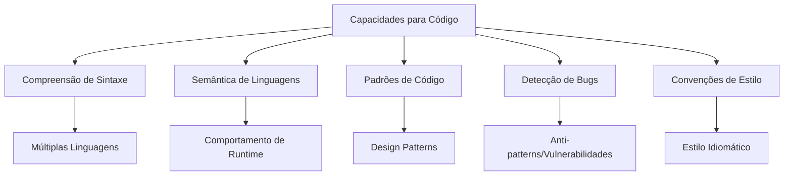
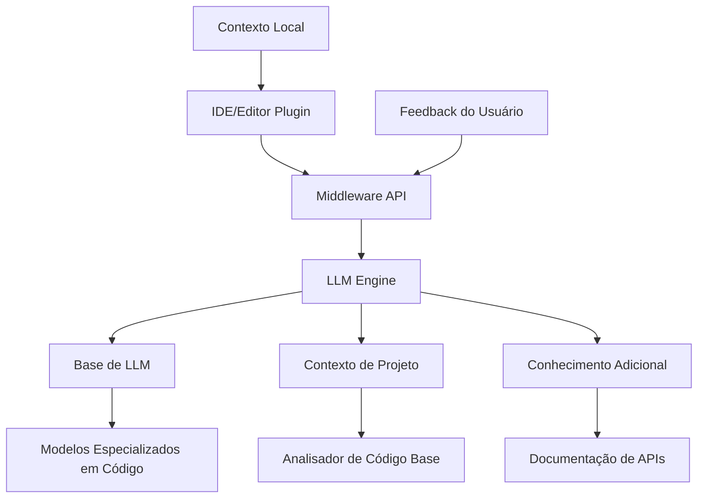
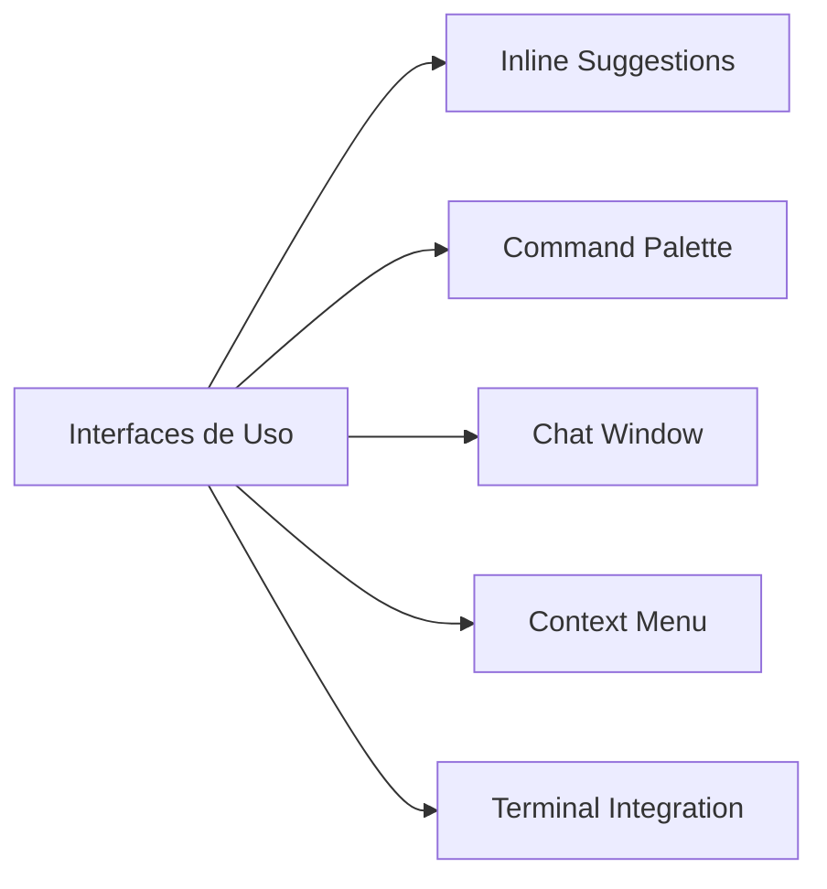
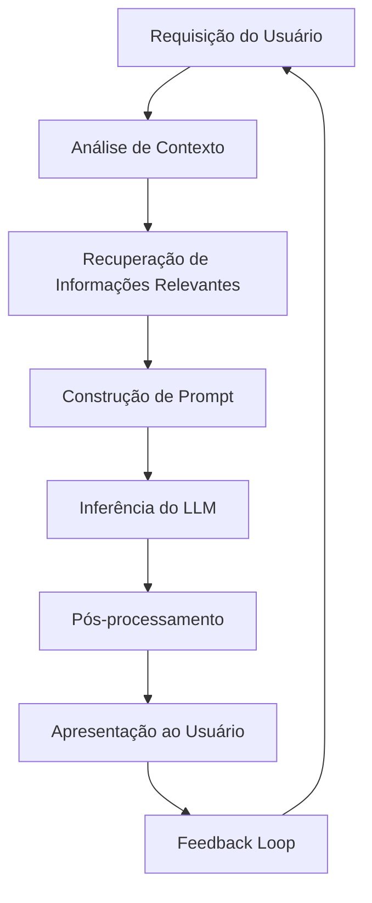
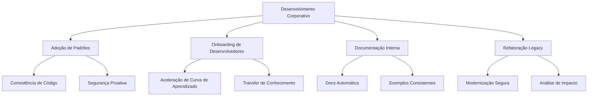
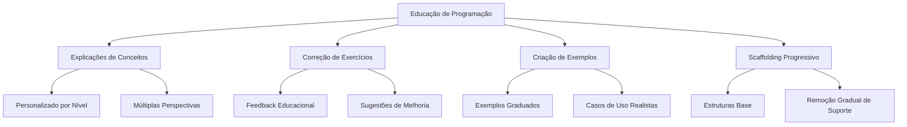
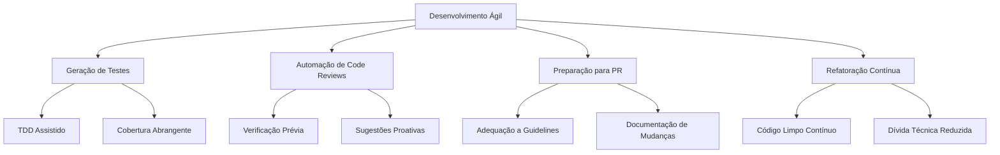
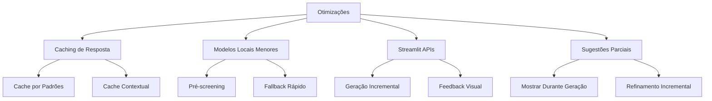
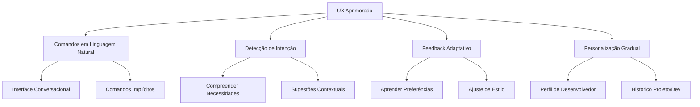
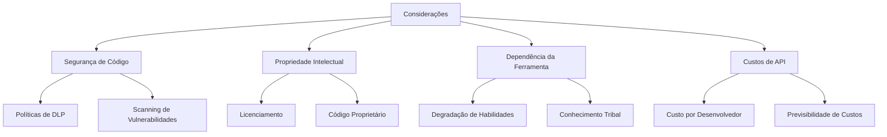

# 💻 Caso de Uso: Assistente de Programação com LLMs

## 🎯 Objetivo

Desenvolver um assistente de programação inteligente baseado em LLMs que aumente a produtividade dos desenvolvedores, auxiliando em tarefas como escrita de código, debugging, refatoração, documentação e explicação de conceitos técnicos.

## 🔍 Problema de Negócio

O desenvolvimento de software enfrenta diversos desafios que impactam a produtividade:

- Complexidade crescente de codebases e ecossistemas tecnológicos
- Tempo significativo gasto em tarefas repetitivas ou boilerplate
- Curva de aprendizado íngreme para novas tecnologias e frameworks
- Debugging demorado e trabalhoso
- Dificuldade em manter documentação atualizada e de qualidade
- Inconsistências de estilo e qualidade de código entre equipes

Um assistente de programação alimentado por LLMs pode reduzir significativamente esses desafios, permitindo que desenvolvedores foquem no pensamento de alto nível e soluções criativas, enquanto as tarefas mais mecânicas são auxiliadas pelo sistema.

## 🧠 Capacidades Fundamentais dos LLMs para Programação



Os LLMs modernos são particularmente adequados para tarefas de programação devido ao seu treinamento em vastos repositórios de código aberto e documentação.

## 🛠️ Implementação e Arquitetura

### Componentes do Sistema



### Interfaces de Usuário



### Fluxo de Processamento



## 💻 Exemplo de Implementação

Aqui está uma implementação em Python de um assistente de programação baseado em LLMs:

```python
import os
import re
import json
import openai
from typing import List, Dict, Any, Optional, Union, Tuple
import logging
from pathlib import Path
import tiktoken
import requests

class CodingAssistant:
    """Assistente de programação baseado em LLMs para auxiliar desenvolvedores"""
    
    def __init__(
        self, 
        model_name: str = "gpt-4",
        api_key: Optional[str] = None,
        max_tokens: int = 8192,
        temperature: float = 0.2,
        project_root: Optional[str] = None,
        supported_languages: Optional[List[str]] = None
    ):
        """
        Inicializa o assistente de programação
        
        Args:
            model_name: Nome do modelo LLM a ser usado
            api_key: Chave de API (se necessário)
            max_tokens: Tamanho máximo de contexto
            temperature: Controle de criatividade (0.0-1.0)
            project_root: Diretório raiz do projeto
            supported_languages: Lista de linguagens com suporte especial
        """
        # Configuração do modelo
        self.model_name = model_name
        self.max_tokens = max_tokens
        self.temperature = temperature
        
        # Configurar API
        if api_key:
            openai.api_key = api_key
        elif os.environ.get("OPENAI_API_KEY"):
            openai.api_key = os.environ["OPENAI_API_KEY"]
        else:
            raise ValueError("API key required")
        
        # Inicializar tokenizador para controle de comprimento de contexto
        self.tokenizer = tiktoken.encoding_for_model(model_name)
        
        # Configuração do projeto
        self.project_root = Path(project_root) if project_root else None
        
        # Linguagens suportadas
        self.supported_languages = supported_languages or [
            "python", "javascript", "typescript", "java", "c#", "ruby", 
            "go", "rust", "php", "swift", "kotlin", "c++", "html", "css", "sql"
        ]
        
        # Cache de contexto do projeto
        self.project_context = {}
        
        # Logger
        logging.basicConfig(level=logging.INFO)
        self.logger = logging.getLogger(self.__class__.__name__)
        
        # Inicializar cache de contexto se o diretório do projeto foi fornecido
        if self.project_root:
            self.scan_project()
    
    def scan_project(self):
        """Analisa a estrutura do projeto para construir contexto"""
        if not self.project_root or not self.project_root.exists():
            self.logger.warning(f"Project root not found: {self.project_root}")
            return
        
        self.logger.info(f"Scanning project at {self.project_root}")
        
        # Estrutura de arquivos
        file_structure = []
        ignored_patterns = self._get_ignored_patterns()
        
        # Encontrar arquivos de código e configuração relevantes
        for path in self.project_root.glob("**/*"):
            # Verificar se deve ignorar
            if any(re.match(pattern, str(path.relative_to(self.project_root))) for pattern in ignored_patterns):
                continue
                
            if path.is_file():
                lang = self._detect_language(path)
                if lang:
                    file_structure.append({
                        "path": str(path.relative_to(self.project_root)),
                        "language": lang,
                        "size": path.stat().st_size
                    })
        
        # Encontrar arquivos importantes de configuração
        config_files = [
            "package.json", "requirements.txt", "Gemfile", "pom.xml",
            "build.gradle", "Cargo.toml", "composer.json", ".gitignore",
            "tsconfig.json", "pyproject.toml", "setup.py"
        ]
        
        important_configs = {}
        for config in config_files:
            config_path = self.project_root / config
            if config_path.exists():
                with open(config_path, 'r', encoding='utf-8') as f:
                    important_configs[config] = f.read()
        
        # Analisar dependências de projetos
        dependencies = {}
        for file_name, content in important_configs.items():
            if file_name == "package.json":
                try:
                    pkg_data = json.loads(content)
                    if "dependencies" in pkg_data:
                        dependencies["npm"] = pkg_data["dependencies"]
                    if "devDependencies" in pkg_data:
                        dependencies["npm_dev"] = pkg_data["devDependencies"]
                except json.JSONDecodeError:
                    pass
            elif file_name == "requirements.txt":
                pip_deps = {}
                for line in content.splitlines():
                    line = line.strip()
                    if line and not line.startswith('#'):
                        # Simplificado, não lida com todos os formatos possíveis
                        parts = re.split(r'[=<>]', line)
                        pip_deps[parts[0].strip()] = line
                dependencies["pip"] = pip_deps
        
        # Armazenar contexto
        self.project_context = {
            "file_structure": file_structure,
            "important_configs": important_configs,
            "dependencies": dependencies
        }
        
        self.logger.info(f"Project scan complete. Found {len(file_structure)} code files")
    
    def _get_ignored_patterns(self) -> List[str]:
        """Retorna padrões de arquivos a serem ignorados na análise"""
        # Verificar se existe .gitignore
        gitignore_path = self.project_root / ".gitignore"
        patterns = [
            r"node_modules/.*", r"\.git/.*", r"\.venv/.*", r"__pycache__/.*",
            r"\.DS_Store", r"\.idea/.*", r"\.vscode/.*", r"\.pytest_cache/.*",
            r"dist/.*", r"build/.*", r"\.cache/.*"
        ]
        
        if gitignore_path.exists():
            with open(gitignore_path, 'r') as f:
                for line in f:
                    line = line.strip()
                    if line and not line.startswith('#'):
                        # Converter padrão gitignore para regex (simplificado)
                        pattern = line.replace('.', r'\.').replace('*', '.*').replace('?', '.')
                        if not pattern.endswith('/'):
                            pattern = pattern + '/?.*'
                        patterns.append(pattern)
        
        return patterns
    
    def _detect_language(self, file_path: Path) -> Optional[str]:
        """Detecta a linguagem de programação com base na extensão"""
        ext_map = {
            ".py": "python",
            ".js": "javascript",
            ".ts": "typescript",
            ".jsx": "javascript",
            ".tsx": "typescript",
            ".java": "java",
            ".cs": "csharp",
            ".rb": "ruby",
            ".go": "go",
            ".rs": "rust",
            ".php": "php",
            ".swift": "swift",
            ".kt": "kotlin",
            ".cpp": "cpp",
            ".c": "c",
            ".h": "c",
            ".hpp": "cpp",
            ".html": "html",
            ".css": "css",
            ".sql": "sql"
        }
        
        return ext_map.get(file_path.suffix.lower())
    
    def _detect_language_from_content(self, code: str) -> str:
        """Tenta detectar a linguagem de programação com base no conteúdo"""
        # Implementação simplificada - na prática seria mais sofisticado
        # Poderia usar bibliotecas como 'pygments' para detecção mais robusta
        if "def " in code and ":" in code and "import " in code:
            return "python"
        elif "function" in code and "{" in code and "}" in code:
            if "export" in code or "interface" in code or ":" in code:
                return "typescript"
            else:
                return "javascript"
        elif "public class" in code or "private void" in code:
            return "java"
        elif "<html" in code or "<div" in code:
            return "html"
        elif "package main" in code and "func" in code:
            return "go"
        else:
            return "unknown"
    
    def _build_code_context(
        self, 
        language: str,
        current_file: Optional[str],
        current_code: Optional[str],
        related_files: Optional[List[str]]
    ) -> str:
        """Constrói o contexto relevante para a geração de código"""
        context_parts = []
        
        # Linguagem alvo
        context_parts.append(f"Linguagem de programação: {language}")
        
        # Código atual
        if current_code:
            if len(current_code) > 1000:
                # Truncar código muito longo
                context_parts.append(f"Código atual (truncado):\n```{language}\n{current_code[:1000]}...\n```")
            else:
                context_parts.append(f"Código atual:\n```{language}\n{current_code}\n```")
        
        # Arquivos relacionados
        if related_files and self.project_root:
            for file_path in related_files[:3]:  # Limitar para não sobrecarregar o contexto
                content = self.read_file_content(file_path)
                if content:
                    file_lang = self._detect_language(Path(file_path))
                    # Truncar conteúdo muito longo
                    if len(content) > 500:
                        content = content[:500] + "..."
                    context_parts.append(f"Arquivo relacionado ({file_path}):\n```{file_lang or language}\n{content}\n```")
        
        # Adicionar informações do projeto se disponíveis
        if self.project_context and "dependencies" in self.project_context:
            if language == "javascript" or language == "typescript":
                if "npm" in self.project_context["dependencies"]:
                    deps = self.project_context["dependencies"]["npm"]
                    context_parts.append(f"Dependências do projeto: {', '.join(deps.keys())}")
            elif language == "python":
                if "pip" in self.project_context["dependencies"]:
                    deps = self.project_context["dependencies"]["pip"]
                    context_parts.append(f"Dependências do projeto: {', '.join(deps.keys())}")
        
        return "\n\n".join(context_parts)
    
    def _call_llm(self, prompt: str, system_message: str) -> str:
        """Faz uma chamada ao LLM com o prompt e mensagem de sistema"""
        try:
            # Contar tokens para evitar exceder limites
            token_count = len(self.tokenizer.encode(prompt)) + len(self.tokenizer.encode(system_message)) + 100  # margem
            if token_count > self.max_tokens:
                self.logger.warning(f"Prompt excede limite de tokens ({token_count} > {self.max_tokens})")
                # Truncar prompt se necessário
                max_prompt_tokens = self.max_tokens - len(self.tokenizer.encode(system_message)) - 100
                prompt_tokens = self.tokenizer.encode(prompt)[:max_prompt_tokens]
                prompt = self.tokenizer.decode(prompt_tokens)
            
            # Chamar API do modelo
            response = openai.ChatCompletion.create(
                model=self.model_name,
                messages=[
                    {"role": "system", "content": system_message},
                    {"role": "user", "content": prompt}
                ],
                temperature=self.temperature,
                max_tokens=min(4096, self.max_tokens - token_count)  # Ajustar para evitar erros
            )
            
            return response.choices[0].message.content
            
        except Exception as e:
            self.logger.error(f"Error calling LLM: {e}")
            return f"Erro ao processar a requisição: {str(e)}"
    
    def _extract_code_blocks(self, text: str, language: str) -> List[str]:
        """Extrai blocos de código de uma resposta em markdown"""
        # Padrão para capturar blocos de código em markdown
        code_pattern = r"```(?:" + language + r")?(.+?)```"
        matches = re.findall(code_pattern, text, re.DOTALL)
        
        if not matches:
            # Tentar encontrar sem especificação de linguagem
            code_pattern = r"```(.+?)```"
            matches = re.findall(code_pattern, text, re.DOTALL)
        
        # Limpar espaços em branco extras
        return [block.strip() for block in matches]
    
    def _get_default_test_framework(self, language: str) -> str:
        """Retorna o framework de teste padrão para uma linguagem"""
        frameworks = {
            "python": "pytest",
            "javascript": "jest",
            "typescript": "jest",
            "java": "junit",
            "csharp": "xunit",
            "ruby": "rspec",
            "go": "go test",
            "rust": "rust test",
            "php": "phpunit"
        }
        
        return frameworks.get(language, "unittest")
    
    def generate_test_code(
        self, 
        code: str,
        language: Optional[str] = None,
        test_framework: Optional[str] = None
    ) -> str:
        """
        Gera código de teste para uma implementação
        
        Args:
            code: Código a ser testado
            language: Linguagem do código
            test_framework: Framework de teste
            
        Returns:
            Código de teste gerado
        """
        if not language:
            language = self._detect_language_from_content(code)
            
        if not test_framework:
            test_framework = self._get_default_test_framework(language)
            
        system_message = (
            f"Você é um especialista em testes de software para {language} usando {test_framework}. "
            f"Gere testes abrangentes, incluindo casos básicos, casos de borda e casos negativos. "
            f"Forneça apenas o código de teste, sem explicações adicionais."
        )
        
        prompt = f"Gere código de teste usando {test_framework} para o seguinte código em {language}:\n\n```{language}\n{code}\n```"
        
        response = self._call_llm(prompt, system_message)
        
        test_code = self._extract_code_blocks(response, language)
        if test_code:
            return test_code[0]
            
        return response
    
    def refactor_code(
        self, 
        code: str,
        refactor_type: str,
        language: Optional[str] = None
    ) -> Dict[str, str]:
        """
        Refatora código de acordo com um padrão específico
        
        Args:
            code: Código a ser refatorado
            refactor_type: Tipo de refatoração (design pattern, performance, etc)
            language: Linguagem do código
            
        Returns:
            Dicionário com código refatorado e explicação
        """
        if not language:
            language = self._detect_language_from_content(code)
            
        system_message = (
            f"Você é um especialista em refatoração de código para {language}. "
            f"Seu objetivo é melhorar a estrutura do código sem alterar seu comportamento externo. "
            f"Aplique as melhores práticas de refatoração para o tipo '{refactor_type}'."
        )
        
        prompt = f"Refatore o seguinte código em {language} aplicando o padrão de refatoração '{refactor_type}':\n\n```{language}\n{code}\n```"
        
        response = self._call_llm(prompt, system_message)
        
        refactored_code = self._extract_code_blocks(response, language)
        
        # Extrair explicação
        explanation = response
        for block in refactored_code:
            explanation = explanation.replace(f"```{language}\n{block}\n```", "")
            explanation = explanation.replace(f"```\n{block}\n```", "")
            
        return {
            "refactored_code": refactored_code[0] if refactored_code else code,
            "explanation": explanation.strip()
        }
    
    def answer_programming_question(
        self, 
        question: str,
        language: Optional[str] = None,
        include_code_examples: bool = True
    ) -> str:
        """
        Responde a uma pergunta técnica sobre programação
        
        Args:
            question: Pergunta técnica
            language: Linguagem de programação relacionada
            include_code_examples: Se deve incluir exemplos de código
            
        Returns:
            Resposta detalhada para a pergunta
        """
        ctx = f" em {language}" if language else ""
        system_message = (
            f"Você é um mentor especializado em programação{ctx}. "
            f"Seu objetivo é fornecer explicações claras, precisas e educativas "
            f"para conceitos técnicos e questões de programação."
        )
        
        prompt = question
        if include_code_examples:
            prompt += "\nIncluir exemplos de código para ilustrar os conceitos."
            
        return self._call_llm(prompt, system_message)
    
    def complete_code(
        self, 
        code_snippet: str,
        language: Optional[str] = None,
        description: Optional[str] = None
    ) -> str:
        """
        Completa um trecho de código parcial
        
        Args:
            code_snippet: Trecho de código a ser completado
            language: Linguagem de programação
            description: Descrição adicional do que o código deve fazer
            
        Returns:
            Código completado
        """
        if not language:
            language = self._detect_language_from_content(code_snippet)
            
        system_message = (
            f"Você é um programador especializado em {language}. "
            f"Seu objetivo é completar trechos de código de maneira idiomática, "
            f"eficiente e seguindo as melhores práticas da linguagem."
        )
        
        prompt = f"Complete o seguinte trecho de código em {language}:"
        prompt += f"\n\n```{language}\n{code_snippet}\n```"
        
        if description:
            prompt += f"\n\nO código deve: {description}"
            
        response = self._call_llm(prompt, system_message)
        
        completed_code = self._extract_code_blocks(response, language)
        if completed_code:
            return completed_code[0]
            
        return response
    
    def integrate_with_editor(self, editor_api):
        """
        Integra o assistente com um editor de código
        
        Args:
            editor_api: API de integração com o editor
        """
        # Implementação dependeria da API específica do editor
        pass
```

## 📝 Casos de Uso Específicos

### Desenvolvimento de Software Corporativo



### Desenvolvimento Educacional



### Desenvolvimento Ágil e CI/CD



## 🔧 Otimizações para Performance e UX

### Redução de Latência



### Interação Natural



## 📈 Métricas de Sucesso

- **Tempo economizado**: Redução média de 30-50% no tempo para completar tarefas comuns
- **Satisfação do desenvolvedor**: Aumento de 40-60% na satisfação com ferramentas
- **Qualidade de código**: Melhoria de 20-40% em métricas de qualidade (cobertura, complexidade)
- **Consistência**: Aumento de 50-70% na consistência entre diferentes bases de código
- **Onboarding**: Redução de 40-60% no tempo para novos desenvolvedores serem produtivos

## 🔍 Desafios e Considerações

### Limitações Técnicas

- **Precisão do código**: Nem sempre 100% correto, especialmente em lógicas complexas
- **Conhecimento atualizado**: Pode não estar familiarizado com as tecnologias mais recentes
- **Contexto limitado**: Dificuldade com bases de código muito grandes
- **Performance**: Latência pode afetar a experiência do usuário
- **Compatibilidade**: Integração com diferentes IDEs e ferramentas

### Considerações Organizacionais



## 🚀 Evolução Futura

- **Agentes autônomos**: Assistentes capazes de realizar tarefas completas com mínima supervisão
- **Compreensão semântica**: Entendimento mais profundo da intenção e contexto do desenvolvedor
- **Múltiplas fontes de conhecimento**: Integração com documentação, Stack Overflow, GitHub
- **Colaboração em equipe**: Facilitação de trabalho entre múltiplos desenvolvedores
- **Explicabilidade**: Melhor comunicação das razões por trás das sugestões de código