# 🔍 Caso de Uso: Retrieval-Augmented Generation (RAG)

## 🎯 Objetivo

Desenvolver um sistema de Retrieval-Augmented Generation (RAG) que melhore a precisão, atualidade e confiabilidade das respostas de LLMs, combinando os modelos de linguagem com a capacidade de buscar e incorporar informações de fontes externas.

## 🔍 Problema de Negócio

Os LLMs enfrentam limitações significativas que impactam sua utilidade em cenários empresariais:

- Conhecimento limitado ao período de treinamento, sem acesso a informações recentes
- Tendência a "alucinar" ou fabricar informações quando confrontados com perguntas fora de seu domínio
- Dificuldade em citar fontes precisas para suas respostas
- Incapacidade de acessar informações proprietárias ou específicas de uma organização
- Limitações na recência e relevância de informações para domínios em rápida evolução

O RAG resolve esses problemas ao permitir que os LLMs acessem bases de conhecimento externas em tempo real, melhorando drasticamente a precisão, atualidade e confiabilidade das respostas, especialmente para casos de uso empresariais que exigem informações específicas e verificáveis.

## 🧩 Como Funciona o RAG

```mermaid
graph TD
    A[Pergunta do Usuário] --> B[Processamento de Consulta]
    B --> C[Busca em Base de Conhecimento]
    C --> D[Recuperação de Documentos Relevantes]
    D --> E[Reranking e Filtragem]
    E --> F[Construção de Prompt Aumentado]
    F --> G[Inferência do LLM]
    G --> H[Pós-processamento]
    H --> I[Resposta Final]
```



### Componentes Principais

```mermaid
graph TD
    A[Componentes RAG] --> B[Base de Conhecimento]
    A --> C[Sistema de Recuperação]
    A --> D[LLM]
    A --> E[Orquestrador]
    
    B --> B1[Indexação de Documentos]
    B --> B2[Embeddings Vetoriais]
    B --> B3[Metadados e Filtragem]
    
    C --> C1[Busca Semântica]
    C --> C2[Busca por Palavras-chave]
    C --> C3[Reranking]
    
    D --> D1[Geração de Resposta]
    D --> D2[Chain-of-Thought]
    
    E --> E1[Construção de Contexto]
    E --> E2[Gerenciamento de Fontes]
```



## 🛠️ Arquitetura de um Sistema RAG

### Diagrama de Arquitetura

```mermaid
graph TD
    subgraph "Fase de Indexação"
        A1[Documentos Brutos] --> A2[Extração de Texto]
        A2 --> A3[Chunking/Segmentação]
        A3 --> A4[Geração de Embeddings]
        A4 --> A5[Armazenamento em Vector Store]
    end
    
    subgraph "Fase de Consulta"
        B1[Consulta do Usuário] --> B2[Processamento de Consulta]
        B2 --> B3[Embedding de Consulta]
        B3 --> B4[Busca Semântica]
        A5 -.-> B4
        B4 --> B5[Reranking de Resultados]
        B5 --> B6[Construção de Prompt]
        B6 --> B7[Chamada ao LLM]
        B7 --> B8[Formatação de Resposta]
    end
```



### Pipeline de Processamento de Documentos


## 💻 Implementação

Aqui está uma implementação básica de um sistema RAG usando Python e bibliotecas populares:

```python
import os
import time
from typing import List, Dict, Any, Optional
import logging

# Processamento de documentos
from langchain.document_loaders import PyPDFLoader, WebBaseLoader, TextLoader
from langchain.text_splitter import RecursiveCharacterTextSplitter
from langchain.schema import Document

# Embeddings e armazenamento vetorial
from langchain.embeddings import OpenAIEmbeddings
from langchain.vectorstores import Chroma

# LLM
from langchain.chat_models import ChatOpenAI
from langchain.prompts import ChatPromptTemplate

# Utils
import numpy as np

class RAGSystem:
    """Sistema de Retrieval-Augmented Generation (RAG)"""
    
    def __init__(
        self,
        api_key: Optional[str] = None,
        embedding_model: str = "text-embedding-ada-002",
        llm_model: str = "gpt-4",
        vector_store_path: str = "./vector_store",
        chunk_size: int = 1000,
        chunk_overlap: int = 200
    ):
        """
        Inicializa o sistema RAG
        
        Args:
            api_key: Chave de API para o provedor do LLM
            embedding_model: Modelo para geração de embeddings
            llm_model: Modelo de linguagem para geração de respostas
            vector_store_path: Caminho para o armazenamento vetorial
            chunk_size: Tamanho dos chunks de texto
            chunk_overlap: Sobreposição entre chunks adjacentes
        """
        # Configuração de API
        if api_key:
            os.environ["OPENAI_API_KEY"] = api_key
        elif os.environ.get("OPENAI_API_KEY") is None:
            raise ValueError("API key required")
        
        # Configuração do logger
        logging.basicConfig(level=logging.INFO)
        self.logger = logging.getLogger("RAGSystem")
        
        # Embeddings e Vector Store
        self.embeddings = OpenAIEmbeddings(model=embedding_model)
        self.vector_store_path = vector_store_path
        self.vector_store = None
        
        # Configuração de Chunking
        self.text_splitter = RecursiveCharacterTextSplitter(
            chunk_size=chunk_size,
            chunk_overlap=chunk_overlap,
            length_function=len
        )
        
        # LLM para geração
        self.llm = ChatOpenAI(model=llm_model, temperature=0.2)
        
        # Estado do sistema
        self.is_vector_store_loaded = False
        self.document_sources = {}
        
        # Template de prompts
        self.qa_template = """
        Você é um assistente AI preciso que responde perguntas baseadas em fontes confiáveis.
        Use as informações fornecidas no CONTEXTO abaixo para responder à PERGUNTA.
        Se o CONTEXTO não contiver informações suficientes, diga que não tem informações suficientes.
        Não invente ou fabrique informações que não estão no CONTEXTO.
        Sempre cite as fontes usadas na sua resposta.
        
        CONTEXTO:
        {context}
        
        PERGUNTA:
        {question}
        
        RESPOSTA:
        """
    
    def load_document(self, document_path: str, document_type: str = "auto", metadata: Optional[Dict] = None) -> List[Document]:
        """
        Carrega um documento para processamento
        
        Args:
            document_path: Caminho ou URL do documento
            document_type: Tipo de documento ('pdf', 'web', 'text' ou 'auto')
            metadata: Metadados adicionais para o documento
            
        Returns:
            Lista de documentos carregados
        """
        # Determinar automaticamente o tipo se necessário
        if document_type == "auto":
            if document_path.startswith("http"):
                document_type = "web"
            elif document_path.endswith(".pdf"):
                document_type = "pdf"
            elif document_path.endswith(".txt"):
                document_type = "text"
            else:
                document_type = "text"  # default
        
        # Carregar documento com o loader apropriado
        try:
            if document_type == "pdf":
                loader = PyPDFLoader(document_path)
            elif document_type == "web":
                loader = WebBaseLoader(document_path)
            elif document_type == "text":
                loader = TextLoader(document_path)
            else:
                raise ValueError(f"Unsupported document type: {document_type}")
            
            documents = loader.load()
            self.logger.info(f"Loaded document: {document_path} ({len(documents)} pages/sections)")
            
            # Adicionar metadados
            if metadata:
                for doc in documents:
                    doc.metadata.update(metadata)
            
            # Adicionar fonte ao registro
            doc_id = str(len(self.document_sources) + 1)
            self.document_sources[doc_id] = {
                "path": document_path,
                "type": document_type,
                "num_sections": len(documents)
            }
            
            # Adicionar ID de documento aos metadados
            for doc in documents:
                doc.metadata['doc_id'] = doc_id
            
            return documents
            
        except Exception as e:
            self.logger.error(f"Error loading document {document_path}: {e}")
            return []
    
    def process_documents(self, documents: List[Document]) -> List[Document]:
        """
        Processa documentos dividindo-os em chunks menores
        
        Args:
            documents: Lista de documentos a processar
            
        Returns:
            Lista de chunks de documento
        """
        try:
            chunks = self.text_splitter.split_documents(documents)
            self.logger.info(f"Split {len(documents)} documents into {len(chunks)} chunks")
            return chunks
        except Exception as e:
            self.logger.error(f"Error processing documents: {e}")
            return []
    
    def add_documents_to_index(self, documents: List[Document], create_new: bool = False) -> bool:
        """
        Adiciona documentos ao índice vetorial
        
        Args:
            documents: Lista de documentos a adicionar
            create_new: Se deve criar um novo índice (apagando o existente)
            
        Returns:
            True se adicionado com sucesso, False caso contrário
        """
        try:
            # Processar documentos
            chunks = self.process_documents(documents)
            if not chunks:
                return False
            
            # Criar ou atualizar vector store
            if create_new or not self.is_vector_store_loaded:
                # Criar novo vector store
                self.vector_store = Chroma.from_documents(
                    documents=chunks,
                    embedding=self.embeddings,
                    persist_directory=self.vector_store_path
                )
                self.is_vector_store_loaded = True
                self.logger.info(f"Created new vector store with {len(chunks)} chunks")
            else:
                # Adicionar a vector store existente
                self.vector_store.add_documents(chunks)
                self.logger.info(f"Added {len(chunks)} chunks to existing vector store")
            
            # Persistir alterações
            if hasattr(self.vector_store, '_persist'):
                self.vector_store._persist()
            
            return True
            
        except Exception as e:
            self.logger.error(f"Error adding documents to index: {e}")
            return False
    
    def load_vector_store(self) -> bool:
        """
        Carrega um vector store existente
        
        Returns:
            True se carregado com sucesso, False caso contrário
        """
        try:
            self.vector_store = Chroma(
                persist_directory=self.vector_store_path,
                embedding_function=self.embeddings
            )
            self.is_vector_store_loaded = True
            collection_count = self.vector_store._collection.count()
            self.logger.info(f"Loaded vector store with {collection_count} entries")
            return True
        except Exception as e:
            self.logger.error(f"Error loading vector store: {e}")
            return False
    
    def retrieve_relevant_chunks(
        self, 
        query: str, 
        top_k: int = 5,
        filter_criteria: Optional[Dict[str, Any]] = None
    ) -> List[Document]:
        """
        Recupera chunks relevantes para uma consulta
        
        Args:
            query: Consulta do usuário
            top_k: Número de resultados a retornar
            filter_criteria: Critérios de filtragem (metadados)
            
        Returns:
            Lista de documentos relevantes
        """
        if not self.is_vector_store_loaded:
            if not self.load_vector_store():
                self.logger.error("No vector store available for retrieval")
                return []
        
        try:
            results = self.vector_store.similarity_search(
                query=query,
                k=top_k,
                filter=filter_criteria
            )
            
            self.logger.info(f"Retrieved {len(results)} chunks for query: {query}")
            return results
        except Exception as e:
            self.logger.error(f"Error retrieving chunks: {e}")
            return []
    
    def generate_answer(
        self, 
        query: str, 
        retrieved_docs: List[Document],
        max_context_length: int = 3800
    ) -> Dict[str, Any]:
        """
        Gera uma resposta baseada nos documentos recuperados
        
        Args:
            query: Consulta do usuário
            retrieved_docs: Documentos recuperados
            max_context_length: Comprimento máximo de contexto
            
        Returns:
            Dicionário com resposta e metadados
        """
        if not retrieved_docs:
            return {
                "answer": "Não tenho informações suficientes para responder a essa pergunta.",
                "sources": [],
                "has_answer": False
            }
        
        # Preparar contexto
        context_str = ""
        used_docs = []
        
        for doc in retrieved_docs:
            doc_str = f"Fonte {doc.metadata.get('doc_id', 'desconhecida')}"
            
            if 'source' in doc.metadata:
                doc_str += f" ({doc.metadata['source']})"
            
            doc_str += f": {doc.page_content}\n\n"
            
            # Verificar se adicionar este doc excederia o limite
            if len(context_str) + len(doc_str) > max_context_length:
                break
            
            context_str += doc_str
            used_docs.append(doc)
        
        # Verificar se temos algum contexto
        if not context_str:
            return {
                "answer": "O contexto é muito grande para processar. Por favor, refine sua pergunta.",
                "sources": [],
                "has_answer": False
            }
        
        # Criar prompt completo
        prompt = ChatPromptTemplate.from_template(self.qa_template)
        messages = prompt.format_messages(context=context_str, question=query)
        
        # Gerar resposta
        try:
            start_time = time.time()
            response = self.llm(messages)
            gen_time = time.time() - start_time
            
            # Extrair fontes usadas
            sources = []
            for doc in used_docs:
                source_info = {
                    "doc_id": doc.metadata.get('doc_id', 'unknown'),
                    "source": doc.metadata.get('source', self.document_sources.get(doc.metadata.get('doc_id', ''), {}).get('path', 'unknown'))
                }
                
                # Adicionar metadados adicionais relevantes
                for key, value in doc.metadata.items():
                    if key not in ['doc_id', 'source'] and not key.startswith('_'):
                        source_info[key] = value
                
                sources.append(source_info)
            
            return {
                "answer": response.content,
                "sources": sources,
                "generation_time": gen_time,
                "has_answer": True,
                "num_docs_used": len(used_docs),
                "num_docs_retrieved": len(retrieved_docs)
            }
            
        except Exception as e:
            self.logger.error(f"Error generating answer: {e}")
            return {
                "answer": "Ocorreu um erro ao gerar a resposta.",
                "sources": [],
                "error": str(e),
                "has_answer": False
            }
    
    def answer_query(
        self, 
        query: str, 
        top_k: int = 5,
        filter_criteria: Optional[Dict[str, Any]] = None
    ) -> Dict[str, Any]:
        """
        Processa uma consulta e gera uma resposta usando RAG
        
        Args:
            query: Consulta do usuário
            top_k: Número de documentos a recuperar
            filter_criteria: Filtros a aplicar na recuperação
            
        Returns:
            Resposta e metadados
        """
        self.logger.info(f"Processing query: {query}")
        
        # Recuperar documentos relevantes
        retrieved_docs = self.retrieve_relevant_chunks(query, top_k, filter_criteria)
        
        # Gerar resposta
        result = self.generate_answer(query, retrieved_docs)
        
        return result
    
    def index_directory(
        self, 
        directory_path: str, 
        file_types: List[str] = ['.pdf', '.txt'],
        recursive: bool = True,
        metadata: Optional[Dict] = None
    ) -> int:
        """
        Indexa todos os documentos em um diretório
        
        Args:
            directory_path: Caminho do diretório
            file_types: Extensões de arquivo a indexar
            recursive: Se deve buscar em subdiretórios
            metadata: Metadados a aplicar aos documentos
            
        Returns:
            Número de documentos indexados
        """
        indexed_count = 0
        
        try:
            import os
            
            # Caminhos a percorrer
            paths_to_walk = []
            if recursive:
                for root, _, files in os.walk(directory_path):
                    paths_to_walk.append((root, files))
            else:
                paths_to_walk.append((directory_path, os.listdir(directory_path)))
            
            # Indexar cada arquivo relevante
            all_documents = []
            
            for root, files in paths_to_walk:
                for file in files:
                    if any(file.endswith(ext) for ext in file_types):
                        file_path = os.path.join(root, file)
                        
                        # Definir tipo de documento
                        doc_type = "auto"
                        if file.endswith('.pdf'):
                            doc_type = "pdf"
                        elif file.endswith('.txt'):
                            doc_type = "text"
                        
                        # Carregar documento
                        docs = self.load_document(file_path, doc_type, metadata)
                        if docs:
                            all_documents.extend(docs)
                            indexed_count += 1
            
            # Adicionar todos os documentos ao índice
            if all_documents:
                self.add_documents_to_index(all_documents)
            
            self.logger.info(f"Indexed {indexed_count} documents from {directory_path}")
            return indexed_count
            
        except Exception as e:
            self.logger.error(f"Error indexing directory {directory_path}: {e}")
            return indexed_count

# Exemplo de uso
if __name__ == "__main__":
    # Inicializar sistema RAG
    rag_system = RAGSystem()
    
    # Indexar documentos
    rag_system.load_document("example_docs/company_policy.pdf", "pdf", {"category": "policy"})
    rag_system.load_document("example_docs/product_manual.pdf", "pdf", {"category": "manual"})
    
    # Adicionar documentos ao índice
    rag_system.add_documents_to_index(rag_system.document_sources.values())
    
    # Testar uma consulta
    result = rag_system.answer_query("Qual é a política de devolução da empresa?")
    
    print(f"Resposta: {result['answer']}")
    print("\nFontes utilizadas:")
    for source in result['sources']:
        print(f"- {source['source']}")
```

## 📊 Otimizações Avançadas

### Chunking Estratégico

```mermaid
graph LR
    A[Estratégias de Chunking] --> B[Por Tamanho Fixo]
    A --> C[Por Semântica]
    A --> D[Por Estrutura]
    A --> E[Hierárquico]
    
    B --> B1[Tokens]
    B --> B2[Caracteres]
    
    C --> C1[Parágrafos]
    C --> C2[Tópicos]
    
    D --> D1[HTML/XML]
    D --> D2[Markdown]
    
    E --> E1[Parent-Child]
    E --> E2[Recursivo]
```



### Reranking e Fusão


### Feedback Humano e Avaliação

```mermaid
graph TD
    A[Ciclo de Feedback] --> B[Uso do Sistema]
    B --> C[Avaliação de Resposta]
    C --> D[Coleta de Feedback]
    D --> E[Análise de Qualidade]
    E --> F[Ajustes no Sistema]
    F --> B
```



## 🌐 Casos de Uso Específicos

### Assistente de Conhecimento Corporativo

```mermaid
graph TD
    A[Fontes Corporativas] --> A1[Políticas Internas]
    A --> A2[Documentação Técnica]
    A --> A3[Base de Conhecimento]
    A --> A4[Emails e Comunicações]
    
    A1 & A2 & A3 & A4 --> B[Sistema RAG]
    
    B --> C[Atendimento ao Colaborador]
    B --> D[Suporte Técnico Interno]
    B --> E[Onboarding]
    B --> F[Consulta de Normas]
```



### Suporte ao Cliente Avançado

```mermaid
graph TD
    A[Fontes de Suporte] --> A1[Manuais de Produto]
    A --> A2[FAQs]
    A --> A3[Tickets Anteriores]
    A --> A4[Fóruns de Discussão]
    
    A1 & A2 & A3 & A4 --> B[Sistema RAG]
    
    B --> C[Chatbot de Suporte]
    B --> D[Agentes de Suporte]
    B --> E[Self-service]
    B --> F[Análise de Problemas]
```



### Pesquisa e Análise Legal

```mermaid
graph TD
    A[Documentos Legais] --> A1[Legislação]
    A --> A2[Jurisprudência]
    A --> A3[Contratos]
    A --> A4[Pareceres]
    
    A1 & A2 & A3 & A4 --> B[Sistema RAG]
    
    B --> C[Análise de Contratos]
    B --> D[Due Diligence]
    B --> E[Pesquisa Jurídica]
    B --> F[Avaliação de Riscos]
```



## 📏 Métricas de Avaliação

- **Precisão**: Acurácia factual das respostas geradas
- **Relevância**: Alinhamento da resposta com a consulta do usuário
- **Completude**: Cobertura de todos os aspectos relevantes da consulta
- **Citação**: Precisão e validade das fontes citadas
- **Tempo de Resposta**: Latência total do sistema
- **Taxa de Hallucination**: Frequência de informações fabricadas

## 🛡️ Considerações Importantes

### Limitações e Desafios

- **Dependência da Qualidade dos Dados**: O sistema só é tão bom quanto as fontes indexadas
- **Interpretação de Consultas**: Entender corretamente a intenção do usuário
- **Latência**: O processo de recuperação adiciona overhead ao tempo de resposta
- **Manutenção da Base de Conhecimento**: Necessidade de atualização contínua
- **Escalabilidade de Armazenamento**: Desafios com bases de conhecimento muito grandes

### Privacidade e Segurança

```mermaid
graph TD
    A[Considerações] --> B[Dados Sensíveis]
    A --> C[Controle de Acesso]
    A --> D[Confidencialidade]
    A --> E[Auditoria]
    
    B --> B1[PII/PHI]
    B --> B2[IP Proprietário]
    
    C --> C1[RBAC]
    C --> C2[Filtragem Contextual]
    
    D --> D1[Encriptação]
    D --> D2[Acesso Baseado em Necessidade]
    
    E --> E1[Logs de Uso]
    E --> E2[Rastreabilidade]
```



## 🔄 Tendências Futuras

- **RAG Multi-hop**: Consultas encadeadas para raciocínio mais complexo
- **Alucinação Controlada**: Melhores técnicas para mitigar fabricação de informações
- **LLM Fine-tuning para RAG**: Modelos especializados em integrar conteúdo externo
- **RAG Multimodal**: Incorporação de informações de imagens, áudio e vídeo
- **Geração e Atualização Automática de Conhecimento**: Bases de conhecimento auto-atualizáveis