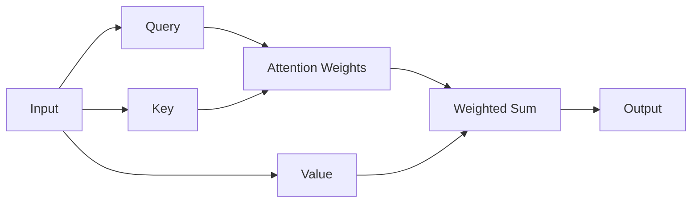
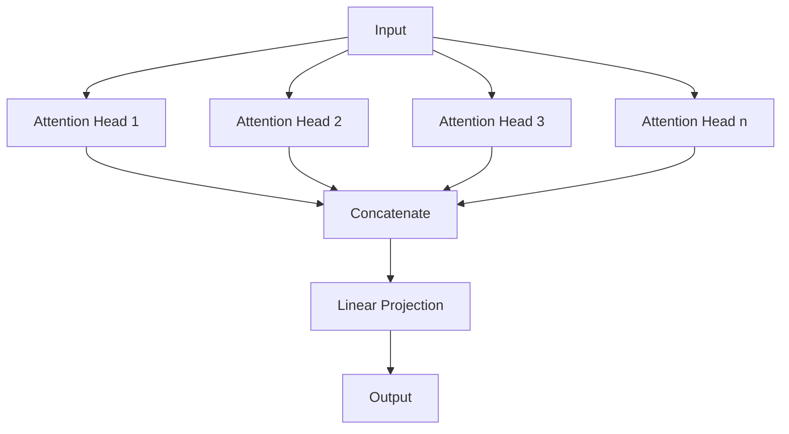
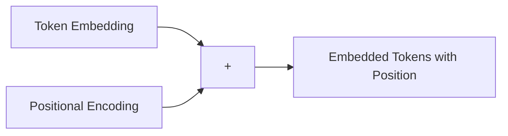
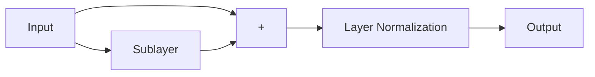
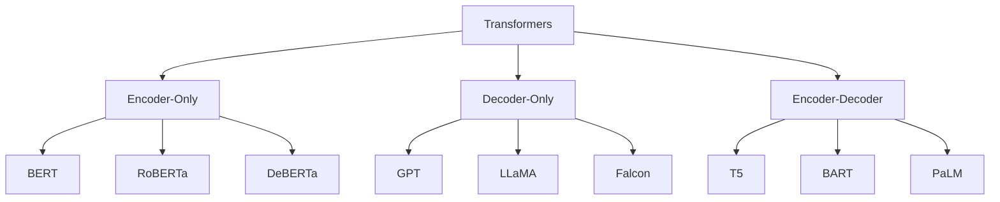
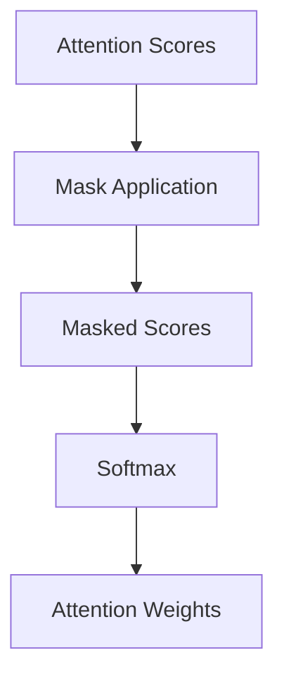

# 🔄 Transformers

Transformers são uma arquitetura de rede neural que revolucionou o processamento de linguagem natural e, mais recentemente, outras modalidades como visão computacional e dados de séries temporais. Sua inovação principal é o mecanismo de self-attention, que permite processar sequências de dados com eficiência sem comprometer a capacidade de capturar dependências de longo alcance.

## 📑 Definição

A arquitetura Transformer, introduzida no artigo "Attention is All You Need" (2017), é um modelo baseado somente em mecanismos de atenção, eliminando as estruturas recorrentes e convolucionais previamente dominantes. Essa abordagem permite processamento paralelo de sequências inteiras, resultando em treinamento mais rápido e desempenho superior em tarefas de sequência.

## 🧠 Arquitetura do Transformer

```mermaid
graph TD
    subgraph "Transformer"
        A[Input Embedding + Positional Encoding] --> B[Encoder]
        A --> C[Decoder]
        B --> C
        C --> D[Output Probabilities]
    end
    
    subgraph "Encoder Block"
        E[Multi-Head Self-Attention] --> F[Add & Norm]
        F --> G[Feed Forward Network]
        G --> H[Add & Norm]
    end
    
    subgraph "Decoder Block"
        I[Masked Multi-Head Self-Attention] --> J[Add & Norm]
        J --> K[Multi-Head Attention over Encoder]
        K --> L[Add & Norm]
        L --> M[Feed Forward Network]
        M --> N[Add & Norm]
    end
```

## 🧩 Componentes Fundamentais

### Self-Attention

O mecanismo de self-attention permite que cada elemento em uma sequência "preste atenção" a todos os outros elementos, capturando relações complexas:

1. Para cada posição, o modelo calcula três vetores:
   - **Query (Q)**: O que a posição atual está "procurando"
   - **Key (K)**: O que cada posição "oferece"
   - **Value (V)**: A informação de cada posição

2. As pontuações de atenção são calculadas como o produto escalar entre Query e todas as Keys, resultando em um "mapa de atenção"

3. Essas pontuações são normalizadas e usadas para criar uma média ponderada dos Values

### Multi-Head Attention

Multi-Head Attention permite que o modelo capture diferentes tipos de relações simultaneamente, usando múltiplos conjuntos de matrizes de projeção Q, K e V.

### Positional Encoding

Como o Transformer processa tokens em paralelo (sem ordem sequencial), informações posicionais são adicionadas explicitamente às embeddings através de funções seno e cosseno de diferentes frequências.

### Layer Normalization & Residual Connections

Estas técnicas ajudam a estabilizar o treinamento de redes profundas:
- **Residual Connections**: Adicionam a entrada original à saída de cada sublayer
- **Layer Normalization**: Normaliza as ativações em cada camada

## 🔄 Variantes de Transformers

### Encoder-Only
Focados em entender o contexto completo de uma sequência, ótimos para classificação, extração de informações e outras tarefas de compreensão.

### Decoder-Only
Especializados em geração de texto, utilizados em LLMs como GPT, Claude e outros modelos generativos.

### Encoder-Decoder
Combinam as vantagens de ambos, ideal para tarefas que requerem tanto compreensão quanto geração, como tradução e resumo.

## 🛠️ Aplicações dos Transformers

- **Processamento de Linguagem Natural**:
  - Tradução automática
  - Geração de texto
  - Classificação de texto
  - Resposta a perguntas
  - Sumarização
  
- **Visão Computacional**:
  - Classificação de imagens
  - Detecção de objetos
  - Segmentação
  - Visão-linguagem (CLIP, GPT-4V)
  
- **Áudio e Fala**:
  - Reconhecimento de fala
  - Geração de fala
  - Música e áudio

- **Multimodal**:
  - Processamento conjunto de texto, imagem, áudio
  - Entendimento multimodal

## 🔍 Técnicas Avançadas

### Attention Masks

Permitem controlar quais tokens podem atender a quais outros, cruciais para:
- Treinamento com batches de sequências de diferentes comprimentos (padding mask)
- Prevenir "olhar para o futuro" em decoders (causal/autoregressive mask)

### Efficient Attention Mechanisms

- **Sparse Attention**: Limitam a atenção a um subconjunto de tokens
- **Linear Attention**: Reduzem a complexidade computacional
- **Local Attention**: Focam em contextos locais
- **Longformer/Big Bird**: Combinam atenção local com atenção global seletiva

## 🔗 Casos de Uso

- [NLP Avançado com Transformers](./use-case-advanced-nlp.md)
- [Visão Computacional com Vision Transformers](./use-case-vision-transformers.md)

## 💻 Frameworks e Bibliotecas

- **Hugging Face Transformers**: Biblioteca abrangente com implementações estado-da-arte
- **PyTorch**: Framework flexível para desenvolvimento e pesquisa
- **TensorFlow**: Alternativa robusta com alto nível de abstração
- **JAX**: Framework focado em diferenciação automática e computação acelerada

## 🚀 Tendências e Desenvolvimentos Recentes

- **Scaling Laws**: Como o desempenho melhora com mais parâmetros e dados
- **Sparse Expertise**: Modelos com trilhões de parâmetros usando MoE (Mixture of Experts)
- **Efficient Transformers**: Arquiteturas que reduzem requisitos computacionais
- **Multimodal Transformers**: Integração de diferentes modalidades de dados
- **Specialized Transformers**: Adaptações para domínios específicos